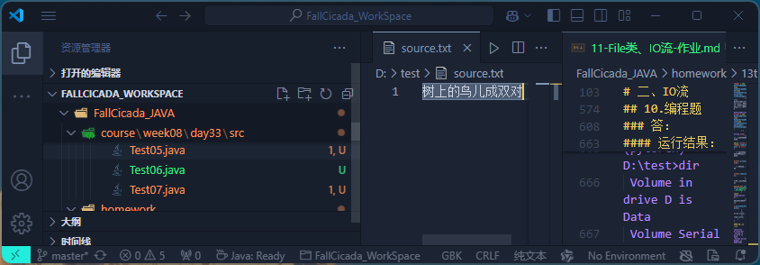
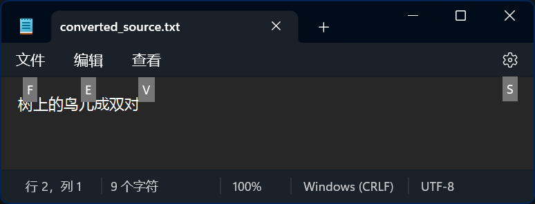
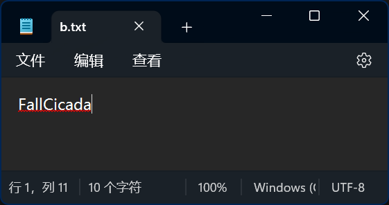

## 第十一章  File类、IO流-作业

# 一、File 类

## 1.基础问答

以下方法都来自于**java.io.File**类，请简述它们的作用。

```java
public String getAbsolutePath(); 
public String getPath(); 
public String getName(); 
public long length();
public boolean exists();
public boolean isFile();
public boolean isDirectory();
public boolean createNewFile(); 
public boolean mkdir(); 
public boolean mkdirs(); 
public boolean delete();
```
### 答：
1. `getAbsolutePath()`：返回此File对象表示的文件或目录的绝对路径名。
2. `getPath()`：返回此File对象表示的文件或目录的路径名。
3. `getName()`：返回此File对象表示的文件或目录的名称。
4. `length()`：返回此File对象表示的文件的长度，以字节为单位。
5. `exists()`：判断此File对象表示的文件或目录是否存在。
6. `isFile()`：判断此File对象表示的文件是否是一个文件。
7. `isDirectory()`：判断此File对象表示的是否是一个目录。
8. `createNewFile()`：创建此File对象表示的文件。
9. `mkdir()`：创建此File对象表示的目录。
10. `mkdirs()`：创建此File对象表示的目录，包括所有必需的父目录。
11. `delete()`：删除此File对象表示的文件或目录。


## 2.编程题

请根据注释中的功能要求和提示补全代码，实现功能。

```java
import java.io.File;

public class Test012_ListFiles {
    public static void main(String[] args) {
        // 目录路径
        String path = "D:/";
        // 创建目录对象
        File dir = new File(path);
		// 请在此处补全代码，列出D盘根目录下所有后缀为txt或doc的文件
        // 注意：1、排除掉目录；2、显示出每个文件的绝对路径
        
    }
}
```
### 答：
#### 代码：
```java
    import java.io.File;
    import java.io.FilenameFilter;

    public class Test012_ListFiles {
        public static void main(String[] args) {
            // 目录路径
            String path = "D:/";
            // 创建目录对象
            File dir = new File(path);
            if (dir.isDirectory()) {
                // 获取目录下的所有文件
                File[] files = dir.listFiles();
                // 遍历文件数组
                for (File file : files) {
                    // 判断文件是否为目录
                    if (!file.isDirectory()) {
                        //判断，如果文件后缀为 .txt或者.docx则输出文件名
                        if (file.getName().endsWith(".txt") || file.getName().endsWith(".docx")) {
                            if(file.getName().endsWith(".txt")){
                                System.out.println("文本文件：" + file.getName());
                            }else{  
                                System.out.println("Word文件：" + file.getName());
                            }
                        }
                    }
                }
            }
        }
    }
```
#### 运行结果
```
(pytorch) D:\WorkSpace\FallCicada_WorkSpace\FallCicada_JAVA\homework\13th\src>javac -d ../out Test012_ListFiles.java
Picked up JAVA_TOOL_OPTIONS: -Dfile.encoding=UTF-8

(pytorch) D:\WorkSpace\FallCicada_WorkSpace\FallCicada_JAVA\homework\13th\src>java -cp ../out/ Test012_ListFiles    
Picked up JAVA_TOOL_OPTIONS: -Dfile.encoding=UTF-8
Word文件：新建 Microsoft Word 文档.docx
文件绝对路径：D:\新建 Microsoft Word 文档.docx
=============================
文本文件：新建 Text Document.txt
文件绝对路径：D:\新建 Text Document.txt
=============================
```

# 二、IO流

## 1.基础问答

根据数据的流向，可以将流分为哪些类型？简述它们的特点。

### 答：
- 根据数据的流向分为：输入流和输出流
  - 输入流 ：把数据从其他设备上读取到程序中的流
  - 输出流 ：把数据从程序中写出到其他设备上的流
- 根据数据的类型分为：字节流和字符流
  - 字节流 ：以字节为单位（byte），读写数据的流
  - 字符流 ：以字符为单位（char），读写数据的流

## 2.基础问答

根据每次处理数据的单位，可以将流分为哪些类型？简述它们的特点。

### 答：
- 根据每次处理数据的单位，分为：字节流和字符流
- 字节流：以字节为单位（byte），读写数据的流
- 字符流：以字符为单位（char），读写数据的流
- input   输入  文件、内存或者网络 流向程序
- output  输出  程序流向 文件、内存或者网络
- 字节输入流  InputStream 是所有字节输入流的抽象父类
- 字节输出流  OutputStream是所有字节输出流的抽象父类

## 3.基础问答

JDK 为每种类型的流提供了抽象类以定义标准和规范，请说出他们分别是哪些类？

### 答：

- 字节流
  - `java.io.InputStream`：所有字节输入流的抽象基类。
  - `java.io.OutputStream`：所有字节输出流的抽象基类。
- 字符流
  - `java.io.Reader`：所有字符输入流的抽象基类。
  - `java.io.Writer`：所有字符输出流的抽象基类。

## 4.基础问答

InputStream类中定义了三个用于读取字节数据的方法，请回答以下问题：

-   1、简述每个方法的作用以及参数的含义
-   2、三个方法均为int类型返回值，这三种返回值代表的含义有何异同点？


```java
int read(); 
int read(byte b[]);
int read(byte b[], int off, int len);
```
### 答

1. 简述每个方法的作用以及参数的含义
    - `int read()`：从输入流中读取一个字节的数据。返回值是读取的字节数据，如果已到达流的末尾，则返回 -1。
    - `int read(byte b[])`：从输入流中读取一定数量的字节，并将其存储在缓冲区数组 `b` 中。返回值是读取的字节数，如果已到达流的末尾，则返回 -1。
    - `int read(byte b[], int off, int len)`：从输入流中读取最多 `len` 个字节的数据，并将其存储在缓冲区数组 `b` 中，从偏移量 `off` 开始存储。返回值是读取的字节数，如果已到达流的末尾，则返回 -1。

2. 三个方法均为 `int` 类型返回值，这三种返回值代表的含义有何异同点？
    - 相同点：三个方法的返回值都表示实际读取的字节数，如果已到达流的末尾，则返回 -1。

## 5.基础问答

请回答在什么情况下适合用字节流读写文件？什么情况下适合用字符流读写文件？

### 答：

- 字节流适用于所有类型的文件读写，尤其是二进制文件，如图片、音频、视频等，因为它们以字节为单位进行处理，不会丢失数据。
- 字符流适用于文本文件的读写，如 `.txt` 文件，因为它们以字符为单位进行处理，能够正确处理不同编码的字符数据。

## 6.基础问答

内存缓冲流的优势有哪些？

### 答：
- 缓冲流可以提高读写效率，因为缓冲流可以一次读取多个字节，从而减少文件系统调用次数，从而提高效率。
- 缓冲流可以减少文件读写时系统调用的次数，从而提高效率。
  
## 7.编程题

请按要求完成程序编写，部分代码已给出，请完成剩余部分。

-   将一张图片复制10份，放置在同目录下
-   源文件名为img.jpg，输出文件命名为img_copy1.jpg、img_copy2.jpg……img_copy10.jpg
-   选择合适的流对象实现功能，要求考虑到性能优化
-   严格遵循IO流的使用规范，进行资源的释放，避免内存泄漏

```java

import java.io.File;
import java.io.FileInputStream;
import java.io.FileOutputStream;
import java.io.IOException;
import java.io.InputStream;
import java.io.OutputStream;

public class Test027_MultipleCopy {

	public static void main(String[] args) {
		// 源文件所在路径
		String dirPath = "D:/test";
		// 源文件名称
		String fileName = "img.jpg";
		// 复制数量
		int number = 10;
		// 完成剩余代码编写
        // ...
	}
}
```

### 答：
#### 代码
```java
import java.io.File;
import java.io.FileInputStream;
import java.io.FileOutputStream;
import java.io.IOException;
import java.io.InputStream;
import java.io.OutputStream;

public class Test027_MultipleCopy {

    public static void main(String[] args) {
        // 源文件所在路径
        String dirPath = "D:/test";
        // 源文件名称
        String fileName = "img.jpg";
        // 复制数量
        int number = 10;

        // 创建源文件对象
        File sourceFile = new File(dirPath, fileName);

        // 循环复制文件
        for (int i = 1; i <= number; i++) {
            File destFile = new File(dirPath, "img_copy" + i + ".jpg");
            copyFile(sourceFile, destFile);
        }
    }

    private static void copyFile(File source, File dest) {
        try (InputStream in = new FileInputStream(source);
             OutputStream out = new FileOutputStream(dest)) {
            byte[] buffer = new byte[1024];
            int length;
            while ((length = in.read(buffer)) > 0) {
                out.write(buffer, 0, length);
            }
        } catch (IOException e) {
            e.printStackTrace();
        }
    }
}
```
#### 运行结果
```java
(pytorch) D:\test>dir
 Volume in drive D is Data
 Volume Serial Number is 0E06-9E63

 Directory of D:\test

2024/10/14  20:48    <DIR>          .
2024/09/10  20:26         2,323,239 img.jpg
               1 File(s)      2,323,239 bytes
               1 Dir(s)  204,937,293,824 bytes free

(pytorch) D:\test>cd D:\WorkSpace\FallCicada_WorkSpace\FallCicada_JAVA\homework\13th\src

(pytorch) D:\WorkSpace\FallCicada_WorkSpace\FallCicada_JAVA\homework\13th\src>javac -d ../out Test027_MultipleCopy.java 
Picked up JAVA_TOOL_OPTIONS: -Dfile.encoding=UTF-8

(pytorch) D:\WorkSpace\FallCicada_WorkSpace\FallCicada_JAVA\homework\13th\src>java -cp ../out/ Test027_MultipleCopy    
Picked up JAVA_TOOL_OPTIONS: -Dfile.encoding=UTF-8

(pytorch) D:\WorkSpace\FallCicada_WorkSpace\FallCicada_JAVA\homework\13th\src>cd D:\test\

(pytorch) D:\test>dir
 Volume in drive D is Data
 Volume Serial Number is 0E06-9E63

 Directory of D:\test

2024/10/14  20:51    <DIR>          .
2024/09/10  20:26         2,323,239 img.jpg
2024/10/14  20:51         2,323,239 img_copy1.jpg
2024/10/14  20:51         2,323,239 img_copy10.jpg
2024/10/14  20:51         2,323,239 img_copy2.jpg
2024/10/14  20:51         2,323,239 img_copy3.jpg
2024/10/14  20:51         2,323,239 img_copy4.jpg
2024/10/14  20:51         2,323,239 img_copy5.jpg
2024/10/14  20:51         2,323,239 img_copy6.jpg
2024/10/14  20:51         2,323,239 img_copy7.jpg
2024/10/14  20:51         2,323,239 img_copy8.jpg
2024/10/14  20:51         2,323,239 img_copy9.jpg
              11 File(s)     25,555,629 bytes
               1 Dir(s)  204,913,680,384 bytes free
```

## 8.编程题

编程实现：如果现在有一款只能试用10次的软件，超过10次之后就需要提醒用户购买正版软件。（程序运行一次，使用次数就要减一次）

> 提示：将试用的次数写到一个文件中，每次启动时对其进行读取并进行判断。

### 答：
#### 代码：
```java
import java.io.BufferedReader;
import java.io.File;
import java.io.FileReader;
import java.io.FileWriter;
import java.io.IOException;

/**
 * Test08
 */
public class Test08 {
    private static final String TRIAL_FILE = "trial_count.txt";
    private static final int INITIAL_TRIALS = 10;
    
    public static void main(String[] args) {
        File file = new File(TRIAL_FILE);
        int trialsLeft = INITIAL_TRIALS;
    
        // 如果文件不存在，创建文件并写入初始试用次数
        if (!file.exists()) {
            try (FileWriter writer = new FileWriter(file)) {
                writer.write(String.valueOf(INITIAL_TRIALS));
            } catch (IOException e) {
                e.printStackTrace();
            }
        }

        // 读取当前的试用次数
        try (BufferedReader reader = new BufferedReader(new FileReader(file))) {
            trialsLeft = Integer.parseInt(reader.readLine().trim());
        } catch (IOException e) {
            e.printStackTrace();
        }

        // 判断试用次数
        if (trialsLeft > 0) {
            trialsLeft--;
            try (FileWriter writer = new FileWriter(file)) {
                writer.write(String.valueOf(trialsLeft));
            } catch (IOException e) {
                e.printStackTrace();
            }
            System.out.println("您还有 " + trialsLeft + " 次试用机会。");
        } else {
            System.out.println("您的试用次数已用完，请购买正版软件。");
        }
    }
}   
```
#### 运行结果：
```java
(pytorch) D:\WorkSpace\FallCicada_WorkSpace\FallCicada_JAVA\homework\13th\src>java -cp ../out/ Test08

(pytorch) D:\WorkSpace\FallCicada_WorkSpace\FallCicada_JAVA\homework\13th\src>javac -d ../out Test08.java
Picked up JAVA_TOOL_OPTIONS: -Dfile.encoding=UTF-8

(pytorch) D:\WorkSpace\FallCicada_WorkSpace\FallCicada_JAVA\homework\13th\src>java -cp ../out/ Test08     
Picked up JAVA_TOOL_OPTIONS: -Dfile.encoding=UTF-8
您还有 9 次试用机会。

(pytorch) D:\WorkSpace\FallCicada_WorkSpace\FallCicada_JAVA\homework\13th\src>java -cp ../out/ Test08
Picked up JAVA_TOOL_OPTIONS: -Dfile.encoding=UTF-8
您还有 8 次试用机会。

(pytorch) D:\WorkSpace\FallCicada_WorkSpace\FallCicada_JAVA\homework\13th\src>java -cp ../out/ Test08
Picked up JAVA_TOOL_OPTIONS: -Dfile.encoding=UTF-8
您还有 7 次试用机会。

(pytorch) D:\WorkSpace\FallCicada_WorkSpace\FallCicada_JAVA\homework\13th\src>java -cp ../out/ Test08
Picked up JAVA_TOOL_OPTIONS: -Dfile.encoding=UTF-8
您还有 6 次试用机会。

(pytorch) D:\WorkSpace\FallCicada_WorkSpace\FallCicada_JAVA\homework\13th\src>java -cp ../out/ Test08
Picked up JAVA_TOOL_OPTIONS: -Dfile.encoding=UTF-8
您还有 5 次试用机会。

(pytorch) D:\WorkSpace\FallCicada_WorkSpace\FallCicada_JAVA\homework\13th\src>java -cp ../out/ Test08
Picked up JAVA_TOOL_OPTIONS: -Dfile.encoding=UTF-8
您还有 4 次试用机会。

(pytorch) D:\WorkSpace\FallCicada_WorkSpace\FallCicada_JAVA\homework\13th\src>java -cp ../out/ Test08
Picked up JAVA_TOOL_OPTIONS: -Dfile.encoding=UTF-8
您还有 3 次试用机会。

(pytorch) D:\WorkSpace\FallCicada_WorkSpace\FallCicada_JAVA\homework\13th\src>java -cp ../out/ Test08
Picked up JAVA_TOOL_OPTIONS: -Dfile.encoding=UTF-8
您还有 2 次试用机会。

(pytorch) D:\WorkSpace\FallCicada_WorkSpace\FallCicada_JAVA\homework\13th\src>java -cp ../out/ Test08
Picked up JAVA_TOOL_OPTIONS: -Dfile.encoding=UTF-8
您还有 1 次试用机会。

(pytorch) D:\WorkSpace\FallCicada_WorkSpace\FallCicada_JAVA\homework\13th\src>java -cp ../out/ Test08
Picked up JAVA_TOOL_OPTIONS: -Dfile.encoding=UTF-8
您还有 0 次试用机会。

(pytorch) D:\WorkSpace\FallCicada_WorkSpace\FallCicada_JAVA\homework\13th\src>java -cp ../out/ Test08
Picked up JAVA_TOOL_OPTIONS: -Dfile.encoding=UTF-8
您的试用次数已用完，请购买正版软件。
```

## 9.编程题 

编写两个方法，分别实现如下功能：

-   save()方法：创建三个Person类型对象，将它们使用序列化手段写入本地文件中持久化存储
-   load()方法：将save()方法中保存的Person对象读取出来，打印输出属性

```java
package com.briup.homework;

import java.io.FileInputStream;
import java.io.FileOutputStream;
import java.io.IOException;
import java.io.ObjectInputStream;
import java.io.ObjectOutputStream;
import java.io.Serializable;

public class Test029_ObjectStream {
	
	private final static String FILE_PATH = "D:/test/obj_file";

	public static void save() {
		// 补全代码
	}
	
	public static void load() {
		// 补全代码
	}
	
	public static void main(String[] args) {
		save();
		load();
	}
}

class Person implements Serializable {
	
	private static final long serialVersionUID = 4258798319750620830L;
	private String name;
	private String gender;
	public Person() {
	}
	public Person(String name, String gender) {
		this.name = name;
		this.gender = gender;
	}
	public String getName() {
		return name;
	}
	public void setName(String name) {
		this.name = name;
	}
	public String getGender() {
		return gender;
	}
	public void setGender(String gender) {
		this.gender = gender;
	}
	@Override
	public String toString() {
		return "Person [name=" + name + ", gender=" + gender + "]";
	}
}
```
### 答：
#### 代码
```java
import java.io.FileInputStream;
import java.io.FileOutputStream;
import java.io.IOException;
import java.io.ObjectInputStream;
import java.io.ObjectOutputStream;
import java.io.Serializable;

public class Test029_ObjectStream {
    
    private final static String FILE_PATH = "D:/test/obj_file.txt";

    public static void save() {
        Person p1 = new Person("Alice", "Female");
        Person p2 = new Person("Bob", "Male");
        Person p3 = new Person("Charlie", "Male");

        try (ObjectOutputStream oos = new ObjectOutputStream(new FileOutputStream(FILE_PATH))) {
            oos.writeObject(p1);
            oos.writeObject(p2);
            oos.writeObject(p3);
        } catch (IOException e) {
            e.printStackTrace();
        }
    }
    
    public static void load() {
        try (ObjectInputStream ois = new ObjectInputStream(new FileInputStream(FILE_PATH))) {
            Person p1 = (Person) ois.readObject();
			Person p2 = (Person) ois.readObject();
            Person p3 = (Person) ois.readObject();
            
            System.out.println(p1);
            System.out.println(p2);
            System.out.println(p3);
        } catch (IOException | ClassNotFoundException e) {
            e.printStackTrace();
        }
    }
    
    public static void main(String[] args) {
        save();
        load();
    }
}

class Person implements Serializable {
    
    private static final long serialVersionUID = 4258798319750620830L;
    private String name;
    private String gender;
    
    public Person() {
    }
    
    public Person(String name, String gender) {
        this.name = name;
        this.gender = gender;
    }
    
    public String getName() {
        return name;
    }
    
    public void setName(String name) {
        this.name = name;
    }
    
    public String getGender() {
        return gender;
    }
    
    public void setGender(String gender) {
        this.gender = gender;
    }
    
    @Override
    public String toString() {
        return "Person [name=" + name + ", gender=" + gender + "]";
    }
}
```
#### 运行结果：
```
(pytorch) D:\WorkSpace\FallCicada_WorkSpace\FallCicada_JAVA\homework\13th\src>javac -d ../out Test029_ObjectStream.java
Picked up JAVA_TOOL_OPTIONS: -Dfile.encoding=UTF-8

(pytorch) D:\WorkSpace\FallCicada_WorkSpace\FallCicada_JAVA\homework\13th\src>java -cp ../out/ Test029_ObjectStream     
Picked up JAVA_TOOL_OPTIONS: -Dfile.encoding=UTF-8
Person [name=Alice, gender=Female]
Person [name=Bob, gender=Male]
Person [name=Charlie, gender=Male]
```

## 10.编程题

编写程序，实现将一个文件从GBK编码转换为UTF-8编码。

```java
package com.briup.homework;

import java.io.File;
import java.io.FileInputStream;
import java.io.FileOutputStream;
import java.io.IOException;
import java.io.InputStreamReader;
import java.io.OutputStreamWriter;

public class Test0210_CharsetConvertion {
	
	public static void main(String[] args) {
		// 源文件编码格式
		String srcEncoding = "GBK";
		// 要转换的编码格式
		String distEncoding = "UTF-8";
		// 目录路径
		String dirPath = "D:/test";
		// 源文件名
		String fileName = "source.txt";
		// 创建目录对象
		File dir = new File(dirPath);
		// 创建源文件对象
		File source = new File(dir, fileName);
		// 补全代码，实现功能
        // ...
	}
}
```
### 答：
#### 代码：
```java
import java.io.File;
import java.io.FileInputStream;
import java.io.FileOutputStream;
import java.io.IOException;
import java.io.InputStreamReader;
import java.io.OutputStreamWriter;
import java.io.BufferedReader;
import java.io.BufferedWriter;

public class Test0210_CharsetConvertion {
    
    public static void main(String[] args) {
        // 源文件编码格式
        String srcEncoding = "GBK";
        // 要转换的编码格式
        String distEncoding = "UTF-8";
        // 目录路径
        String dirPath = "D:/test";
        // 源文件名
        String fileName = "source.txt";
        // 创建目录对象
        File dir = new File(dirPath);
        // 创建源文件对象
        File source = new File(dir, fileName);
        // 创建目标文件对象
        File target = new File(dir, "converted_" + fileName);

        try (
            // 创建BufferedReader对象，用于读取源文件，指定编码格式为GBK
            BufferedReader reader = new BufferedReader(new InputStreamReader(new FileInputStream(source), srcEncoding));
            // 创建BufferedWriter对象，用于写入目标文件，指定编码格式为UTF-8
            BufferedWriter writer = new BufferedWriter(new OutputStreamWriter(new FileOutputStream(target), distEncoding));
        ) {
            String line;
            // 按行读取源文件内容
            while ((line = reader.readLine()) != null) {
                // 将读取到的内容写入目标文件
                writer.write(line);
                // 写入换行符
                writer.newLine();
            }
            // 打印转换完成信息
            System.out.println("文件编码转换完成！");
        } catch (IOException e) {
            // 捕获并打印IO异常
            e.printStackTrace();
        }
        // write.close;
        // read.close;
    }
}
```
#### 运行结果：
```
(pytorch) D:\test>dir
 Volume in drive D is Data
 Volume Serial Number is 0E06-9E63

 Directory of D:\test

2024/10/15  16:32    <DIR>          .
2024/10/15  16:29                16 source.txt
               1 File(s)             16 bytes
               1 Dir(s)  204,857,671,680 bytes free

(pytorch) D:\test>cd D:\WorkSpace\FallCicada_WorkSpace\FallCicada_JAVA\homework\13th\src

(pytorch) D:\WorkSpace\FallCicada_WorkSpace\FallCicada_JAVA\homework\13th\src>javac -d ../out Test0210_CharsetConvertion.java
Picked up JAVA_TOOL_OPTIONS: -Dfile.encoding=UTF-8

(pytorch) D:\WorkSpace\FallCicada_WorkSpace\FallCicada_JAVA\homework\13th\src>java -cp ../out/ Test0210_CharsetConvertion    
Picked up JAVA_TOOL_OPTIONS: -Dfile.encoding=UTF-8
文件编码转换完成！

(pytorch) D:\WorkSpace\FallCicada_WorkSpace\FallCicada_JAVA\homework\13th\src>cd D:\test

(pytorch) D:\test>dir
 Volume in drive D is Data
 Volume Serial Number is 0E06-9E63

 Directory of D:\test

2024/10/15  16:33    <DIR>          .
2024/10/15  16:33                26 converted_source.txt
2024/10/15  16:29                16 source.txt
               2 File(s)             42 bytes
               1 Dir(s)  204,857,671,680 bytes free


```
##### 源文件

##### 转码文件


# 课堂作业
## 作业1：将a.txt的内容，拷贝到b.txt中
### 答：
#### 代码
```java
import java.io.FileInputStream;
import java.io.FileOutputStream;
import java.io.IOException;

/**
 * TestSing
 */
public class ClassWork01 {

    public static void main(String[] args) {
        // 路径名、目录（文件夹）,读取文件
        try{
            FileInputStream inputPath = new FileInputStream("D:\\WorkSpace\\FallCicada_WorkSpace\\FallCicada_JAVA\\homework\\13th\\file\\a.txt");
            FileOutputStream outputPath = new FileOutputStream("D:\\WorkSpace\\FallCicada_WorkSpace\\FallCicada_JAVA\\homework\\13th\\file\\b.txt");
            int r;
            while ((r = inputPath.read()) != -1) {
                outputPath.write(r);
                
            }
        } catch (IOException e) {
            e.printStackTrace();
        }
        System.out.println("执行完成");
    }
}

```
#### 运行结果：
```
(pytorch) D:\WorkSpace\FallCicada_WorkSpace\FallCicada_JAVA\homework\13th\file>cd D:\WorkSpace\FallCicada_WorkSpace\FallCicada_JAVA\homework\13th\file

(pytorch) D:\WorkSpace\FallCicada_WorkSpace\FallCicada_JAVA\homework\13th\file>dir
 Volume in drive D is Data
 Volume Serial Number is 0E06-9E63

 Directory of D:\WorkSpace\FallCicada_WorkSpace\FallCicada_JAVA\homework\13th\file

2024/10/15  16:54    <DIR>          .
2024/10/15  16:54    <DIR>          ..
2024/10/14  15:52               491 a.txt
               1 File(s)            491 bytes
               2 Dir(s)  204,977,483,776 bytes free

(pytorch) D:\WorkSpace\FallCicada_WorkSpace\FallCicada_JAVA\homework\13th\file>cd D:\WorkSpace\FallCicada_WorkSpace\FallCicada_JAVA\homework\13th\src

(pytorch) D:\WorkSpace\FallCicada_WorkSpace\FallCicada_JAVA\homework\13th\src>javac -d ../out ClassWork01.java    .md
Picked up JAVA_TOOL_OPTIONS: -Dfile.encoding=UTF-8

(pytorch) D:\WorkSpace\FallCicada_WorkSpace\FallCicada_JAVA\homework\13th\src>java -cp ../out/ ClassWork01    
Picked up JAVA_TOOL_OPTIONS: -Dfile.encoding=UTF-8
执行完成

(pytorch) D:\WorkSpace\FallCicada_WorkSpace\FallCicada_JAVA\homework\13th\src>cd D:\WorkSpace\FallCicada_WorkSpace\FallCicada_JAVA\homework\13th\file

(pytorch) D:\WorkSpace\FallCicada_WorkSpace\FallCicada_JAVA\homework\13th\file>dir
 Volume in drive D is Data
 Volume Serial Number is 0E06-9E63

 Directory of D:\WorkSpace\FallCicada_WorkSpace\FallCicada_JAVA\homework\13th\file

2024/10/15  17:00    <DIR>          .
2024/10/15  16:54    <DIR>          ..
2024/10/14  15:52               491 a.txt
2024/10/15  17:00               491 b.txt
               2 File(s)            982 bytes
               2 Dir(s)  204,977,483,776 bytes free
```


## 作业2：使用write(bytes, 0, 3)这个方法完成第1题
### 代码：
```java
import java.io.FileInputStream;
import java.io.FileOutputStream;
import java.io.IOException;

/**
 * TestSing
 */
public class ClassWork02 {

    public static void main(String[] args) {
        // 路径名、目录（文件夹）,读取文件
        try {
            FileInputStream inputPath = new FileInputStream("D:\\WorkSpace\\FallCicada_WorkSpace\\FallCicada_JAVA\\homework\\13th\\file\\a.txt");
            FileOutputStream outputPath = new FileOutputStream("D:\\WorkSpace\\FallCicada_WorkSpace\\FallCicada_JAVA\\homework\\13th\\file\\a_copy.txt");
            byte[] buffer = new byte[1024];
            int bytesRead;
            while ((bytesRead = inputPath.read(buffer)) != -1) {
                outputPath.write(buffer, 0, bytesRead);
            }
            inputPath.close();
            outputPath.close();
        } catch (IOException e) {
            e.printStackTrace();
        }
        System.out.println("执行完成");
    }
}

```
#### 运行结果
```

(pytorch) D:\WorkSpace\FallCicada_WorkSpace\FallCicada_JAVA\homework\13th\file>dir
 Volume in drive D is Data
 Volume Serial Number is 0E06-9E63

 Directory of D:\WorkSpace\FallCicada_WorkSpace\FallCicada_JAVA\homework\13th\file

2024/10/15  17:00    <DIR>          .
2024/10/15  16:54    <DIR>          ..
2024/10/14  15:52               491 a.txt
2024/10/15  17:00               491 b.txt
               2 File(s)            982 bytes
               2 Dir(s)  204,977,475,584 bytes free

(pytorch) D:\WorkSpace\FallCicada_WorkSpace\FallCicada_JAVA\homework\13th\file>cd D:\WorkSpace\FallCicada_WorkSpace\FallCicada_JAVA\homework\13th\src

(pytorch) D:\WorkSpace\FallCicada_WorkSpace\FallCicada_JAVA\homework\13th\src>javac -d ../out ClassWork02.java 
Picked up JAVA_TOOL_OPTIONS: -Dfile.encoding=UTF-8

(pytorch) D:\WorkSpace\FallCicada_WorkSpace\FallCicada_JAVA\homework\13th\src>java -cp ../out/ ClassWork02    
Picked up JAVA_TOOL_OPTIONS: -Dfile.encoding=UTF-8
执行完成

(pytorch) D:\WorkSpace\FallCicada_WorkSpace\FallCicada_JAVA\homework\13th\src>cd D:\WorkSpace\FallCicada_WorkSpace\FallCicada_JAVA\homework\13th\file

(pytorch) D:\WorkSpace\FallCicada_WorkSpace\FallCicada_JAVA\homework\13th\file>dir                                                                    
 Volume in drive D is Data
 Volume Serial Number is 0E06-9E63

 Directory of D:\WorkSpace\FallCicada_WorkSpace\FallCicada_JAVA\homework\13th\file

2024/10/15  17:10    <DIR>          .
2024/10/15  16:54    <DIR>          ..
2024/10/14  15:52               491 a.txt
2024/10/15  17:10               491 a_copy.txt
2024/10/15  17:00               491 b.txt
               3 File(s)          1,473 bytes
               2 Dir(s)  204,977,471,488 bytes free
```

## 作业3：
  1. 从键盘录入1行字符串，将其转换为byte[]
  2. 由byte[]构建一个内存输入流对象
  3. 从内存输入流中用小数组方式读取数据，并写入到 src\dir\b.txt 文件中
  4. 关闭流、释放资源
### 答：
#### 代码：
```java
import java.io.ByteArrayInputStream;
import java.io.FileOutputStream;
import java.io.IOException;
import java.util.Scanner;
/**
 * ClassWork03
 */
public class ClassWork03 {

    public static void main(String[] args) {
        Scanner scanner = new Scanner(System.in);
        System.out.println("请输入一行字符串：");
        String input = scanner.nextLine();
        scanner.close();

        byte[] byteArray = input.getBytes();

        try {
            ByteArrayInputStream byteArrayInputStream = new ByteArrayInputStream(byteArray);
            FileOutputStream fileOutputStream = new FileOutputStream("D:\\WorkSpace\\FallCicada_WorkSpace\\FallCicada_JAVA\\homework\\13th\\src\\dir\\b.txt");
             
            byte[] buffer = new byte[1024];
            int bytesRead;
            while ((bytesRead = byteArrayInputStream.read(buffer)) != -1) {
                fileOutputStream.write(buffer, 0, bytesRead);
            }
        } catch (IOException e) {
            e.printStackTrace();
        }
    }
}
```
#### 运行结果：
```
(pytorch) D:\WorkSpace\FallCicada_WorkSpace\FallCicada_JAVA\homework\13th\src\dir>dir
 Volume in drive D is Data
 Volume Serial Number is 0E06-9E63

 Directory of D:\WorkSpace\FallCicada_WorkSpace\FallCicada_JAVA\homework\13th\src\dir

2024/10/15  17:19    <DIR>          .
2024/10/15  17:16    <DIR>          ..
               0 File(s)              0 bytes
               2 Dir(s)  204,977,442,816 bytes free

(pytorch) D:\WorkSpace\FallCicada_WorkSpace\FallCicada_JAVA\homework\13th\src\dir>cd ..

(pytorch) D:\WorkSpace\FallCicada_WorkSpace\FallCicada_JAVA\homework\13th\src>javac -d ../out ClassWork03.java 
Picked up JAVA_TOOL_OPTIONS: -Dfile.encoding=UTF-8

(pytorch) D:\WorkSpace\FallCicada_WorkSpace\FallCicada_JAVA\homework\13th\src>java -cp ../out/ ClassWork03    
Picked up JAVA_TOOL_OPTIONS: -Dfile.encoding=UTF-8
请输入一行字符串：
FallCicada

(pytorch) D:\WorkSpace\FallCicada_WorkSpace\FallCicada_JAVA\homework\13th\src>cd dir

(pytorch) D:\WorkSpace\FallCicada_WorkSpace\FallCicada_JAVA\homework\13th\src\dir> dir   
 Volume in drive D is Data
 Volume Serial Number is 0E06-9E63

 Directory of D:\WorkSpace\FallCicada_WorkSpace\FallCicada_JAVA\homework\13th\src\dir

2024/10/15  17:20    <DIR>          .
2024/10/15  17:16    <DIR>          ..
2024/10/15  17:20                10 b.txt
               1 File(s)             10 bytes
               2 Dir(s)  204,977,442,816 bytes free
```
#### 文件内容


## 作业4：
  按照GBK编码读取 D:\\test\\File_GBK.txt 文件内容，然后写入UTF-8编码文件 D:\\test\\File_UTF8.txt 。
  注意拷贝效率，注意新文件中不要出现多余的空行。

### 答：
```java

```
## 作业5：
  将多个学生对象存放到集合中，然后执行序列化和反序列化操作