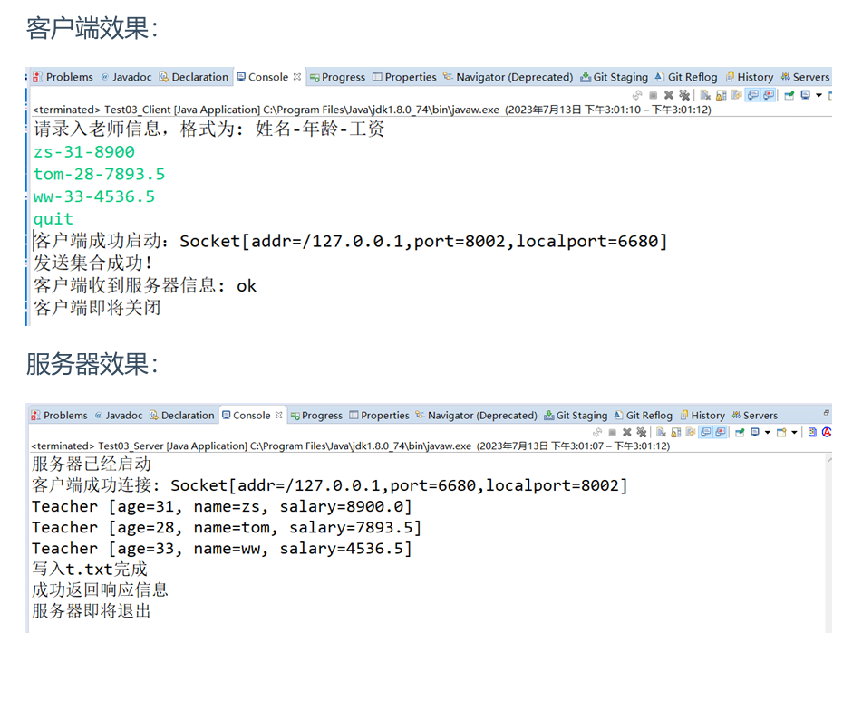
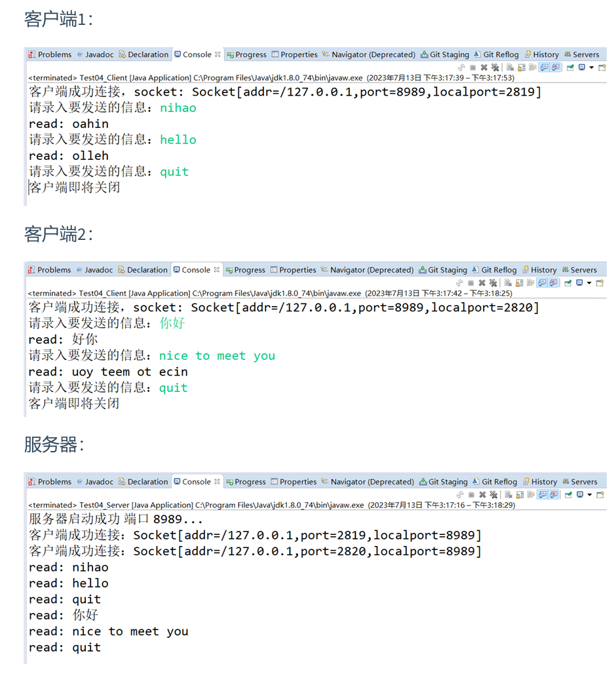

<!--
 * @Description: 
 * @Author: FallCicada
 * @Date: 2024-10-16 10:28:20
 * @LastEditors: FallCicada
 * @LastEditTime: 2024-10-16 20:39:08
 * @: 無限進步
-->
# 第12章：网络编程-作业

## 1、简述tcp的三次握手和四次挥手

> 考点：TCP的三次握手

### 答：

#### TCP的三次握手是指建立一个TCP连接时，需要客户端和服务器总共发送三个包以确认连接的建立。具体过程如下：

1. 第一次握手，客户端向服务器端发出连接请求，等待服务器确认
2. 第二次握手，服务器端向客户端回送一个响应，通知客户端收到了连接请求
3. 第三次握手，客户端再次向服务器端发送确认信息，确认连接

#### TCP的四次挥手是指断开一个TCP连接时，需要客户端和服务器总共发送四个包以确认连接的断开。具体过程如下：

1. 客户端发送一个FIN包（结束标志）给服务器，表示请求断开连接。
2. 服务器收到FIN包后，回复一个ACK包，表示确认断开请求。
3. 服务器再发送一个FIN包，表示同意断开连接。
4. 客户端收到FIN包后，回复一个ACK包，表示确认断开连接。

## 2、TCP协议和UDP协议的区别

> 考点：tcp和udp

### 答：

1. UDP，用户数据报协议(User Datagram Protocol)
   UDP是无连接通信协议，在数据传输时，数据的发送端和接收端不建立连接，也不能保证对方能接收成功。

   由于使用UDP协议消耗资源小，通信效率高，所以通常都会用于音频、视频和普通数据的传输，因为这种情况即使偶尔丢失一两个数据包，也不会对接收结果产生太大影响。

   但是在传输重要数据时，不建议使用UDP协议，因为它不能保证数据传输的完整性。
2. TCP，传输控制协议 (Transmission Control Protocol) （重要）

   TCP协议是面向连接的通信协议，即传输数据之前，在发送端和接收端建立连接，然后再传输数据，它提供了两台计算机之间可靠的、无差错的数据传输。

   在TCP连接中，将计算机明确划分为客户端与服务器端，并且由客户端向服务端发出连接请求，每次连接的创建都需要经过“三次握手”的过程，四次挥手断开连接。

## 3、按照一下作业描述，完成代码编写（IO流考核）

> 考点：TCP网络编程+IO流

```
1、搭建TCP客户端
    a.从键盘录入老师信息，录入格式：姓名-年龄-工资，遇quit结束录入
        zs-31-8900
        tom-28-7893.5
        ww-33-4536.5
        ...
        quit
    b.将每行信息封装成老师对象，全部发送到服务器
    c.发送成功后，收取从服务器返回的信息并输出
    d.最后关闭客户端
2、搭建TCP服务器，端口8002
    a.接收客户端发送的所有老师对象，遍历输出，并将老师信息全部写入本地文件 src/t.txt
    b.写入完成后，返回给客户端一个信息: "ok"
    c.最后关闭服务器
```

#### 源码实现

##### 基本类

```java
package com.briup.chap12;
import java.io.Serializable;
//基础类  必须实现序列化接口
public class Teacher {
    private String name;
    private int age;
    private double salary;
    //...补全代码
}
```

##### 服务器代码

```java
public class Test03_Server {
    public static void main(String[] args) throws Exception {
    //1.搭建TCP服务器
    int port = 8002;
    //2.接收客户端的连接
    //3.读取客户端传递的Teacher集合并遍历
    //  3.1 获取输入流并封装成对象流
    //  3.2 读取集合对象并遍历
    //4.将集合对象(含所有老师信息)写入本地文件t.txt，txt文件位置 src/t.txt
    // 4.1 定义文件输出流并封装成对象流
                
    // 4.2 向t.txt文件中写入数据
        
    //5.返回响应信息给客户端
    //  5.1 获取输出流并封装成缓冲流
        
        
    //  5.2 返回ok信息给客户端
        
    //6.关闭资源
    
    }
}
```

##### 客户端代码

```java
 //搭建TCP客户端
public class Test03_Client {
    public static void main(String[] args) throws Exception {
        //1.定义Scanner类和要录入的字符串
        Scanner sc = new Scanner(System.in);
    
        //2.定义集合存放老师信息
   
        //3.逐行录入老师信息，直到遇到quit结束录入
    
            //3.1 拆分录入的字符串
       
            //3.2 创建Teacher对象，并为对应属性赋值
        
            //3.3 将老师对象添加到集合中

            //4.搭建TCP客户端
            //5.发送集合对象
            //  5.1 获取输出流，并包装成对象流
            //  5.2 发送集合对象
            //6.从服务器接收数据
            //  6.1 获取输出流并包装成缓冲流
            //  6.2 读取信息并在控制台答应
            //7.关闭资源
    }
}
```
#### 运行效果

### 答：
1、搭建TCP客户端
```java
package Test03;

import java.io.BufferedReader;
import java.io.InputStreamReader;
import java.io.ObjectOutputStream;
import java.net.Socket;
import java.util.ArrayList;
import java.util.List;
import java.util.Scanner;

public class Test03_Client {
    public static void main(String[] args) throws Exception {
        // 1.定义Scanner类和要录入的字符串
        Scanner sc = new Scanner(System.in);

        // 2.定义集合存放老师信息
        List<Teacher> list = new ArrayList<>();

        // 3.逐行录入老师信息，直到遇到quit结束录入
        System.out.println("请输入老师信息,格式为：姓名-年龄-工资");
        while (true) {
            String str = sc.nextLine();
            if ("quit".equals(str)) {
                break;
            }
            // 3.1 拆分录入的字符串
            String[] strs = str.split("-");
            if (strs.length != 3) {
                System.out.println("输入格式错误，请重新输入");
                continue;
            }
            // 3.2 创建Teacher对象，并为对应属性赋值
            String name = strs[0];
            int age = Integer.parseInt(strs[1]);
            double salary = Double.parseDouble(strs[2]);
            Teacher t = new Teacher(name, age, salary);
            // 3.3 将老师对象添加到集合中
            list.add(t);
        }

        // 4.搭建TCP客户端
        try (Socket s = new Socket("127.0.0.1", 8002);
             ObjectOutputStream oos = new ObjectOutputStream(s.getOutputStream());
             BufferedReader br = new BufferedReader(new InputStreamReader(s.getInputStream()))) {

            // 5.发送集合对象
            oos.writeObject(list);
            System.out.println("集合发送成功！");
            //打印提示：客户端成功启动：Socket[addr = /127.0.0.1,port = 5000,localport = 5000]
            System.out.print("客户端启动成功" );
            System.out.println("Socket[addr = " + s.getInetAddress() + ",port = " + s.getPort() + ",localport = " + s.getLocalPort() + "]");
            // 6.从服务器接收数据
            String response = br.readLine();
            System.out.println("客户端：" + response);
        } catch (java.net.ConnectException e) {
            System.err.println("无法连接到服务器，请确保服务器已启动并在端口 8002 监听。");
        }
    }
}
```
2、搭建TCP服务器，端口8002
```java
package Test03;

import java.io.FileOutputStream;
import java.io.ObjectInputStream;
import java.io.ObjectOutputStream;
import java.io.OutputStreamWriter;
import java.net.ServerSocket;
import java.net.Socket;
import java.util.List;

public class Test03_Server {
    public static void main(String[] args) throws Exception {
        // 1.搭建TCP服务器
        int port = 8002;
        ServerSocket serverSocket = new ServerSocket(port);
        System.out.println("服务器已启动，等待客户端连接...");

        // 2.接收客户端的连接
        Socket socket = serverSocket.accept();
        System.out.println("客户端已连接" + socket);

        // 3.读取客户端传递的Teacher集合并遍历
        // 3.1 获取输入流并封装成对象流
        ObjectInputStream ois = new ObjectInputStream(socket.getInputStream());

        // 3.2 读取集合对象并遍历
        @SuppressWarnings("unchecked")
        List<Teacher> teacherList = (List<Teacher>) ois.readObject();
        for (Teacher teacher : teacherList) {
            System.out.println("接收到老师信息: " + teacher.toString());
        }

        // 4.将集合对象(含所有老师信息)写入本地文件t.txt，txt文件位置 src/t.txt
        // 4.1 定义文件输出流并封装成对象流
        FileOutputStream fos = new FileOutputStream("D:\\WorkSpace\\FallCicada_WorkSpace\\FallCicada_JAVA\\homework\\14th\\src\\t.txt");
        ObjectOutputStream oos = new ObjectOutputStream(fos);

        // 4.2 向t.txt文件中写入数据
        oos.writeObject(teacherList);
        oos.close();
        System.out.println("老师信息已写入文件");

        // 5.返回响应信息给客户端
        // 5.1 获取输出流并封装成缓冲流
        OutputStreamWriter osw = new OutputStreamWriter(socket.getOutputStream());

        // 5.2 返回ok信息给客户端
        osw.write("ok");
        osw.flush();
        System.out.println("已返回响应信息给客户端");

        // 6.关闭资源
        ois.close();
        socket.close();
        serverSocket.close();
        System.out.println("服务器已关闭");
    }
}

```
4. 服务器端相应输出
```
(pytorch) D:\WorkSpace\FallCicada_WorkSpace\FallCicada_JAVA\homework\14th\src>dir
 Volume in drive D is Data
 Volume Serial Number is 0E06-9E63

 Directory of D:\WorkSpace\FallCicada_WorkSpace\FallCicada_JAVA\homework\14th\src

2024/10/16  20:03    <DIR>          .
2024/10/16  14:44    <DIR>          ..
2024/10/16  18:33    <DIR>          Test03
               0 File(s)              0 bytes
               3 Dir(s)  195,344,613,376 bytes free

(pytorch) D:\WorkSpace\FallCicada_WorkSpace\FallCicada_JAVA\homework\14th\src>javac -d ../out Test03/Test03_Server.java
Picked up JAVA_TOOL_OPTIONS: -Dfile.encoding=UTF-8

(pytorch) D:\WorkSpace\FallCicada_WorkSpace\FallCicada_JAVA\homework\14th\src>java -cp ../out/ Test03.Test03_Server     
Picked up JAVA_TOOL_OPTIONS: -Dfile.encoding=UTF-8
服务器已启动，等待客户端连接...
客户端已连接Socket[addr=/127.0.0.1,port=9042,localport=8002]
接收到老师信息: Teacher [name=zs, age=23, salary=3598.0]
接收到老师信息: Teacher [name=ls, age=22, salary=2583.0]
接收到老师信息: Teacher [name=ww, age=24, salary=8325.0]
老师信息已写入文件
已返回响应信息给客户端
服务器已关闭

(pytorch) D:\WorkSpace\FallCicada_WorkSpace\FallCicada_JAVA\homework\14th\src>dir
 Volume in drive D is Data
 Volume Serial Number is 0E06-9E63

 Directory of D:\WorkSpace\FallCicada_WorkSpace\FallCicada_JAVA\homework\14th\src

2024/10/16  20:04    <DIR>          .
2024/10/16  14:44    <DIR>          ..
2024/10/16  20:04               195 t.txt
2024/10/16  18:33    <DIR>          Test03
               1 File(s)            195 bytes
               3 Dir(s)  195,344,613,376 bytes free
```

5. 客户端相应输出
```
D:\WorkSpace\FallCicada_WorkSpace\FallCicada_JAVA\homework\14th\src>javac -d ../out Test03/Test03_Client.java
Picked up JAVA_TOOL_OPTIONS: -Dfile.encoding=UTF-8

D:\WorkSpace\FallCicada_WorkSpace\FallCicada_JAVA\homework\14th\src>java -cp ../out/ Test03.Test03_Client
Picked up JAVA_TOOL_OPTIONS: -Dfile.encoding=UTF-8
请输入老师信息,格式为：姓名-年龄-工资
zs-23-3598
ls-22-2583
ww-24-8325
quit
集合发送成功！
客户端启动成功Socket[addr = /127.0.0.1,port = 8002,localport = 9042]
客户端：ok
```

>考点：TCP网络编程+多线程
## 4、按照以下作业描述，完成代码编写（多线程考核）

```
搭建一个多线程服务器，端口为8989，要求如下
1.接收客户端发送的聊天信息并显示
如果收到的是quit，则结束读取，关闭服务器
2.服务器将收取的字符串进行反转，再返回给客户端
搭建一个客户端，要求如下:
 1.接收键盘录入信息然后发给服务器
如果录入的字符串是quit，则发送后结束录入，关闭客户端
2.客户端收取服务器返回的数据并输出显式
功能实现以后，启动服务器，然后同时启动多个客户端测试上述功能
```
### 服务器代码：
```java
public class Test04_Server {
 public static void main(String[] args) throws IOException {
            // 1.搭建TCP服务器，指定端口
            // 2.接收客户端的连接
            while (true) {
            // 3.单独分离子线程为当前客户端提供服务
            //  子线程种逐行读取客户端发送的信息并处理
            //3.1 输出读取内容
            //如果收到quit则跳出循环，结束当前子线程

            //3.2 反转字符串
            //3.3 将反转的字符串返回给客户端
            // 4.关闭资源
                                
                        
            // 开启线程
            thread.start();
        }
    }
}
```

### 客户端代码
```java
public class Test04_Client {
    public static void main(String[] args) throws IOException {
        // 1.搭建TCP客户端
       
        // 2.封装得到IO流
       
        // 3.1 逐行读取键盘信息
        // 3.2 发送信息给服务器
        // 如果遇到quit则结束录入
        //3.3 读取服务器返回信息并显式
        //4.关闭资源
    }
}
```
### 运行效果

### 答:
#### 客户端代码:
```java
package Test04;
import java.io.BufferedReader;
import java.io.IOException;
import java.io.InputStreamReader;
import java.io.OutputStreamWriter;
import java.io.PrintWriter;
import java.net.Socket;
import java.net.UnknownHostException;

public class Test04_Client {
    public static void main(String[] args) {
        try {
            // 1.搭建TCP客户端
            Socket socket = new Socket("localhost", 8989);
            
            // 2.封装得到IO流
            BufferedReader keyboardInput = new BufferedReader(new InputStreamReader(System.in));
            PrintWriter out = new PrintWriter(new OutputStreamWriter(socket.getOutputStream()), true);
            BufferedReader in = new BufferedReader(new InputStreamReader(socket.getInputStream()));
            
            String userInput;
            while (true) {
                // 3.1 逐行读取键盘信息
                userInput = keyboardInput.readLine();
                
                // 3.2 发送信息给服务器
                out.println(userInput);
                
                // 如果遇到quit则结束录入
                if ("quit".equalsIgnoreCase(userInput)) {
                    break;
                }
                
                // 3.3 读取服务器返回信息并显式
                String serverResponse = in.readLine();
                System.out.println("服务器: " + serverResponse);
            }
            
            // 4.关闭资源
            in.close();
            out.close();
            keyboardInput.close();
            socket.close();
        } catch (UnknownHostException e) {
            System.err.println("不知道主机: localhost");
            System.exit(1);
        } catch (IOException e) {
            System.err.println("无法获取I/O连接到: localhost");
            System.exit(1);
        }
    }
}
```

#### 服务器代码
```java
package Test04;

import java.io.BufferedReader;
import java.io.IOException;
import java.io.InputStreamReader;
import java.io.PrintWriter;
import java.net.ServerSocket;
import java.net.Socket;

public class Test04_Server {
    public static void main(String[] args) throws IOException {
        // 1.搭建TCP服务器，指定端口
        ServerSocket serverSocket = new ServerSocket(8989);
        System.out.println("服务器启动，等待客户端连接...");

        while (true) {
            // 2.接收客户端的连接
            Socket clientSocket = serverSocket.accept();
            System.out.println("客户端连接成功：" + clientSocket.getInetAddress());

            // 3.单独分离子线程为当前客户端提供服务
            new Thread(() -> {
                try (
                    BufferedReader in = new BufferedReader(new InputStreamReader(clientSocket.getInputStream()));
                    PrintWriter out = new PrintWriter(clientSocket.getOutputStream(), true)
                ) {
                    String inputLine;
                    while ((inputLine = in.readLine()) != null) {
                        // 3.1 输出读取内容
                        System.out.println("read: " + inputLine);

                        // 如果收到quit则跳出循环，结束当前子线程
                        if ("quit".equalsIgnoreCase(inputLine)) {
                            System.out.println("客户端请求断开连接");
                            System.exit(0);
                            break;
                        }

                        // 3.2 反转字符串
                        String reversedString = new StringBuilder(inputLine).reverse().toString();

                        // 3.3 将反转的字符串返回给客户端
                        out.println(reversedString);
                    }
                } catch (IOException e) {
                    e.printStackTrace();
                } finally {
                    try {
                        // 4.关闭资源
                        clientSocket.close();
                    } catch (IOException e) {
                        e.printStackTrace();
                    }
                }
            }).start();
        }
    }
}
```

#### 运行效果
##### 服务器
```
(pytorch) D:\WorkSpace\FallCicada_WorkSpace\FallCicada_JAVA\homework\14th\src>java -cp ../out/ Test04.Test04_Server
Picked up JAVA_TOOL_OPTIONS: -Dfile.encoding=UTF-8
服务器启动，等待客户端连接...
客户端连接成功：/127.0.0.1
客户端连接成功：/127.0.0.1
read: hello
read: hello
read: sb
read: nihao
read: quit
read: quit
客户端请求断开连接
```
##### 用户1
```
D:\WorkSpace\FallCicada_WorkSpace\FallCicada_JAVA\homework\14th\src>java -cp ../out/ Test04.Test04_Client
Picked up JAVA_TOOL_OPTIONS: -Dfile.encoding=UTF-8
hello
服务器: olleh
sb
服务器: bs
nihao
服务器:  oahin
quit

```
##### 用户2
```
PS D:\WorkSpace\FallCicada_WorkSpace\FallCicada_JAVA\homework\14th\src> java -cp ../out/ Test04.Test04_Client
Picked up JAVA_TOOL_OPTIONS: -Dfile.encoding=UTF-8
hello
服务器: olleh
quit
```

