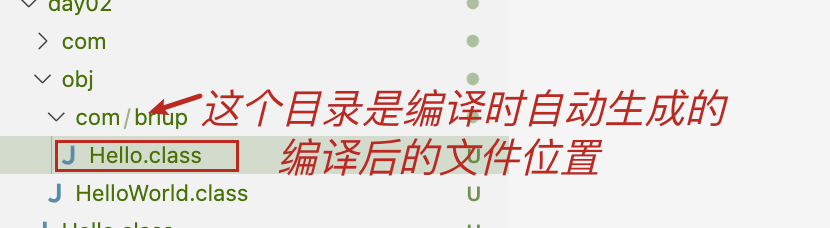
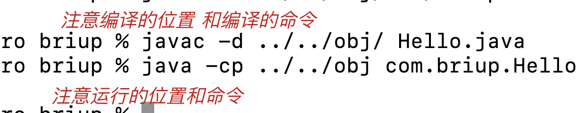
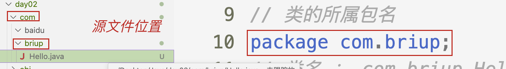

# 2024年秋季Java基础课用笔记

# Java基础

## 基础知识准备

**1、安装软件**

**配置java开发环境**

**配置git环境**

**创建git仓库**

**Java基础**

  **编程语言**

    编码
      idea、vscode、vim、文本文档写代码
    编译
      使用 javac 去编译
      javac HelloWorld.java
      会生成同名的字节码文件
    运行
      使用 java 命令 去运行
      java HelloWorld
      注意：不需要加.class
    1991年**相对路径**

    .

**绝对路径**

    C:
    D:
    /

**跨平台**

  高级编程语言的编码运行步骤

    编码
    编译
    运行**高级语言的编译方式分为三种**

    编译型

    使用专门的编译器，针对特定的操作系统，将源代码 "翻译"成为机器码，并包装成该平台能识别的
      可执行程序（生成新文件）
      C C++

    解释型
      有专门的解释器，将源码解释成特定平台的机器码，并且立即执行，不会生成新文件
      就是将编译型语言的编译和执行结合成一步同时进行
      缺点：效率低
      Python、Shell等

    混合型
      编译+解释
      源码要经过编译，生成与平台无关的字节码.class文件，不是可执行程序
      需要jvm去解释执行（java为不同的操作系统提供了不同的虚拟机）
      Java

- **2Java跨平台的原理**

  Write Once , Run any Where

### Java开发基础知识准备

- **常用命令**

  - **javac 编译命令**

    格式 `javac [-d 目录路径] 文件名.java\` 作用 编译源码文件，获得字节码文件可选：将字节码文件存放到 `-d`后面指定的位置

    - **使用**

  ```js
      javac HelloWorld.java // 不指定目录.class存放到当前文件
      javac -d obj/ HelloWorld.java
      // 将编译后的.class存放到obj目录下
  ```

  

  - **java运行的命令**

    格式 java [-cp .class文件目录路径] 类名作用 运行字节码文件 可选： 从指定路径查找到运行文件

    - **使用:**

    ```js
    java HelloWorld
    java -cp obj/ HelloWorld
    ```

 

- ***package*****包名**

  包名一般是公司域名反写
  Table类
  Table类
  定义格式：
  `package` 包名;
  包名一般是公司域名反写

  - 要求：

    > package语句必须是程序的第一条可执行到代码
    > package语句在一个Java文件中最多有一条
    > package语句在一个Java文件中可以没有
    > 这个包名的代码package com.briup;
    > 编译后，会在com目录下生成briup目录briup目录下生成Table.class文件
    >



- 场景

  ```js
    教务系统
      学生管理
          新增  修改  删除  查询
      教师管理
          新增  修改  删除  查询
    package 按角色去分模块;
        com.brian.student;
          AddStudent;
          EdtStudent;
          DeleteStudent;
          UpdataStudent;
        com.brian.teacher;
          AddTeacher;
          EdtTeacher;
          DeleteTeacher;
          UpdataTeacher;
    package 按功能去分模块;
        com.brian.add;
          AddStudent;
          AddTeacher;
        com.brian.edit;
          EdtStudent;
          EdtTeacher;
        com.brian.delete;
          DeleteStudent;
          DeleteTeacher;
        com.brian.updata;
          UpdataStudent;
          UpdataTeacher;

  ```
- **导包**

  import 包名.类名;不需要导包就可以使用：`java.lang`包下的类[Java官方API文本](https://tool.oschina.net/uploads/apidocs/jdk-zh/java/lang/package-summary.html)
- ***JVM***

  垃圾回收机制

# 建议

- **注意：**

  1. 修改改环境变量
  2. 三个确定按钮都要点
  3. 重新打开cmd、vscode
  4. 编码
  5. 先保存
  6. 先编译 再运行
  7. 中文乱码
  8. 找不到主类
  9. 字节码文件生成没有
  10. java HelloWorld 命令对不对 文件名对不对
  11. CLASSPATH 不要写错 可以不写 或者写 "."
- **练习打字**

  1. 键位 指法（金山打字通）
  2. 多打字（聊天、打一些熟悉的文章）
