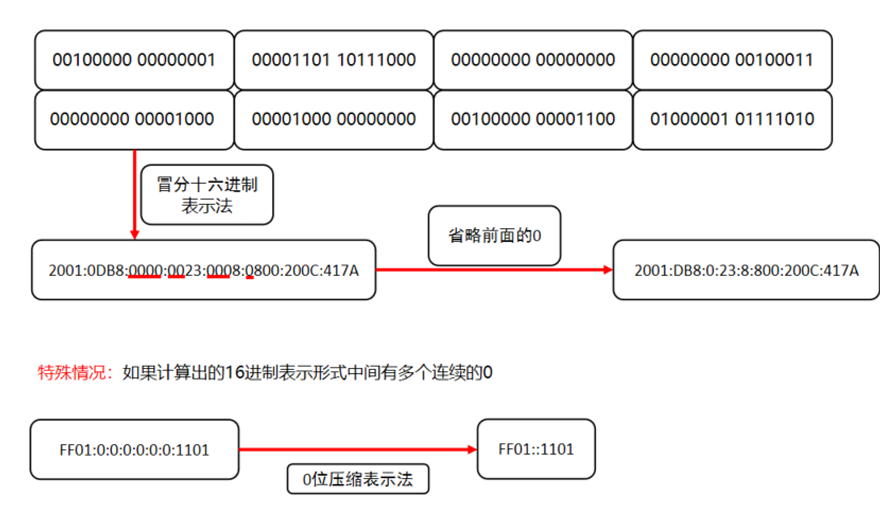
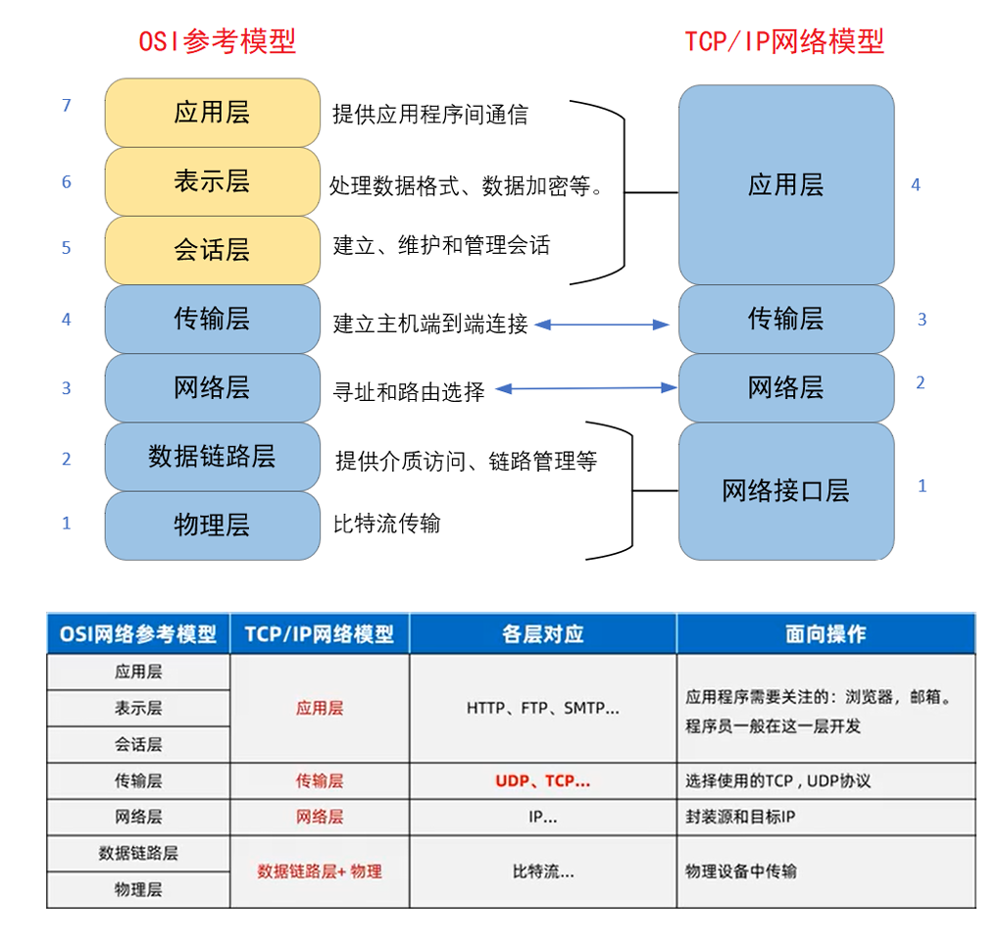

<!--
 * @Description: 
 * @Author: FallCicada
 * @Date: 2024-10-17 09:00:32
 * @LastEditors: FallCicada
 * @LastEditTime: 2024-10-17 10:11:35
 * @: 無限進步
-->

# 2024年秋季Java基础课用笔记

# 网络编程

## 基础概念

### 计算机网络

也称计算机通信网，其是利用通信线路将地理上分散的、具有独立功能的计算机系统和通信设备按不同的形式连接起来，以功能完善的网络软件及协议实现资源共享和信息传递的系统。最简单的计算机网络就只有两台计算机和连接它们的一条链路，即两个节点和一条链路。

通过编程的方式，使得计算机网络中不同计算机上的应用程序间能够进行数据的传输，这就是网络编程要做的事情。

### 软件结构

常见的软件结构有C/S和B/S

* Client/Server（C/S结构），表示 客户端/服务器 的软件结构，例如QQ、微信、百度网盘客户端等，只要是需要我们下载安装，并且和服务器通信的这一类软件，都属于C/S的软件结构。

  

* Browser/Server（B/S结构），表示 浏览器/服务器 的软件结构，例如淘宝网、新浪新闻、凤凰网等，只要是需要使用浏览器，并且和服务器通信的这一类软件，都属于B/S的软件结构
* 

#### C/S和B/S对比：

* C/S在图形的表现能力上以及运行的速度上肯定是强于B/S的
* C/S/需要运行专门的客户端，并且它不能跨平台，用c++在windows下写的程序肯定是不能在linux下运行
* B/S不需要专门的客户端，只要系统中安装了浏览器即可访问，方便用户的使用。
* B/S是基于网页语言的、与操作系统无关，所以跨平台也是它的优势

随着网页技术以及浏览器的进步，B/S在表现能力上的处理以及运行的速度上会越来越快，所以现在越来越多的C/S结构的软件，也推出了对应B/S的版本，例如webQQ，在线文档工具、在线画图工具等。同时也包括很多网页版的游戏，也是随着前端技术的发展，慢慢出现的。

> 无论是C/S结构的软件，还是B/S结构的软件，都必须依赖网络编程。

### 通信三要素

如果两台计算机上的应用程序能够实现通信，那么必须解决3个问题，找到对方计算机，找到对方应用程序，采用相同的通信协议。

* IP地址

  可认为IP地址是个标识号，通过这个标识号能够找到网络世界中唯一的那个计算机。
* 端口

  端口号可以用来标识计算机中唯一的那个应用程序。网络的通信，本质上是两个应用程序的通信。每台计算机都有很多的应用程序，在网络通信时，就采用端口号进行区分这些应用程序。
* 协议

  当我们和其他人沟通交流的时候都要使用互相能听懂的语言。计算机也一样，计算机与计算机通过网络进行数据和信息交换的时候，也要使用同样的“语言”，这个语言被称为网络通讯协议。

  网络通信协议对数据的传输格式、传输速率、传输步骤等做了统一规定，通信双方必须同时遵守才能完成数据交换。常见的协议有UDP协议和TCP协议

## IP地址

全称”互联网协议地址”，也称IP地址。是分配给上网设备的数字标签。常见的IP分类为：ipv4和ipv6

IPv4：共32位，表示范围43亿左右，一般使用点分4段表示法

IPv6：共128位，表示范围更大，号称可以为地球上每一粒沙子分配一个IP

### IP域名

本质上也是一个IP地址，可读性更好，更容易记忆，需要使用dns域名解析服务器解析。

### 公网、内网IP：

* 公网IP，是可以连接互联网的IP地址
* 内网IP，也叫局域网IP，只能组织机构内部使用

  192.168.开头的就是常见的局域网地址，范围即为192.168.0.0--192.168.255.255，专门为组织机构内部使用

### DOS常用命令：

* ipconfig：查看本机IP地址
* ping IP地址：检查网络是否连通

### 特殊IP地址：

* 127.0.0.1：是回送地址，可以代表本机地址，一般用来测试使用

## 端口号

端口号用来标记正在计算机设备上运行的应用程序，其范围是0~65535。其中，0~1023之间的端口号用于系统内部的使用，我们自己普通的应用程序要使用1024以上的端口号即可，同时也要避免和一些知名应用程序默认的端口冲突，例如：oracle启动后默认占用端口号1521，mysql启动后默认占用端口号3306，redis启动后默认占用端口号6379，tomcat启动后默认占用端口号8080。

> 程序1，在客户端电脑中的内存中运行着，并且占用了端口号8899
>
> 程序2，在服务器端电脑中的内存中运行着，并且占用了端口号8888
>
> 俩个程序，通过IP+端口号的方式，找到对方进行通信，传输信息

### 端口分类：

* 周知端口

  0~1023，被预先定义的知名应用占用，如: HTTP占用80，FTP占用21，MySQL占用3306
* 注册端口

  1024~49151，分配给用户进程或某些应用程序
* 动态端口

  49152到65535，之所以称为动态端口，是因为它 一般不固定分配某种进程，而是动态分配

### 注意事项：

* ``自己开发的程序一般选择使用注册端口 ``
* ``同一时刻一个设备中两个程序的端口号不能重复，否则出错 ``

## 通讯协议

计算机网络中，不同设备进行连接和通信的规则被称为网络通信协议。通信协议，对俩台计算机之间所传输数据的传输格式、传输步骤等做了统一规定要求，通信双方必须同时遵守才能完成数据交换

OSI（Open System Interconnect），即开放式网络互连标准。 一般叫OSI参考模型，是ISO（国际标准化组织）在1985年研究的网络互连模型，它共包含七层，具体可参考下图。

疑问：为什么要分层？

要解决计算机网络中数据的传输，涉及的问题很多很复杂，分层可以将大问题拆分成小问题，更利于问题的解决。

TCP/IP网络模型，是事实上的国际标准，它被简化为了四个层，从下到上分别依次是应用层、传输层、网络层、网络接口层。

* 应用层：主要负责应用程序的协议，例如HTTP协议、FTP协议等。
* 传输层：主要使网络程序进行通信，在进行网络通信时，可以采用TCP协议，也可以采用UDP协议。
* 网络层：网络层是整个TCP/IP协议的核心，它主要用于将传输的数据进行分组，将分组数据发送到目标计算机或者网络。
* 链路层：链路层是用于定义物理传输通道，通常是对某些网络连接设备的驱动协议，例如针对光纤、网线提供的驱动。

## TCP和UDP

虽然完整的通信过程比较复杂，但是JavaAPI中把这些通信实现的细节进行了封装，使得我们可以直接使用相应的类和接口，来进行网络程序开发，而不用考虑通信的细节。

`java.net`包中对常见的俩种通信协议进行了封装和支持：UDP和TCP

* UDP，用户数据报协议(User Datagram Protocol) （**了解**）

  UDP是**无连接通信协议**，在数据传输时，数据的发送端和接收端不建立连接，也不能保证对方能接收成功。

  例如，当一台计算机向另外一台计算机发送数据时（UDP），发送端不会确认接收端是否存在，就会直接发出数据，同样接收端在收到数据时，也不会向发送端反馈是否收到数据。

  由于使用UDP协议消耗资源小，**通信效率高**，所以通常都会用于音频、视频和普通数据的传输，因为这种情况即使偶尔丢失一两个数据包，也不会对接收结果产生太大影响。

  但是在传输重要数据时，不建议使用UDP协议，因为它**不能保证数据传输的完整性**。
* TCP，传输控制协议 (Transmission Control Protocol) （**重要**）

  TCP协议是**面向连接**的通信协议，即传输数据之前，在发送端和接收端建立连接，然后再传输数据，它提供了两台计算机之间**可靠的、无差错**的数据传输。

  在TCP连接中，将计算机明确划分为客户端与服务器端，并且由客户端向服务端发出连接请求，每次连接的创建都需要经过“三次握手”的过程，四次挥手断开连接。

### TCP的三次握手：

TCP协议中，在发送数据的准备阶段，客户端与服务器之间的三次交互，以保证连接的可靠

* 第一次握手，客户端向服务器端发出连接请求，等待服务器确认
* 第二次握手，服务器端向客户端回送一个响应，通知客户端收到了连接请求
* 第三次握手，客户端再次向服务器端发送确认信息，确认连接

> 完成上述的三次握手后，客户端和服务器端的连接就已经建立了，在这个安全的、可靠的连接基础之上，就可以开始进行数据传输了。
>
> TCP协议应用的十分广泛，例如下载文件、浏览网页、远程登录等。

### TCP的四次挥手：

用于断开连接

## TCP网络编程

### 概述

在TCP通信协议下，计算机网络中不同设备上的应用程序之间可以通信，通信时需严格区分客户端（Client）与服务器端（Server）。

在Java中，对于这样基于TCP协议下连接通信的客户端和服务端，分别进行了抽象：

* `java.net.ServerSocket` 类表示服务端
* `java.net.Socket` 类表示客户端
  使用 `Socket`和 `ServerSocket`进行的编程，也称为套接字编程。

### 通信流程

TCP客户端和服务器进行通信，其通信流程是固定的，具体如下：

#### 服务器端

* 创建ServerSocket（需绑定端口，方便客户端连接）
* 调用ServerSocket对象的accept()方法接收一个客户端请求，得到一个Socket
* 调用Socket的getInputStream()和getOutputStream()方法获取和客户端相连的IO流

  输入流可以读取客户端发送过来的数据

  输出流可以发送数据到客户端
* 操作完成，关闭资源

##### 构造方法

| 方法名                  | 说明                             |
| ----------------------- | -------------------------------- |
| ServletSocket(int port) | 创建绑定到指定端口的服务器套接字 |

##### 相关方法

| 方法名          | 说明                           |
| --------------- | ------------------------------ |
| Socket accept() | 监听要连接到此的套接字并接受它 |

注意：accept方法是阻塞的，作用是等待客户端连接，如果有客户端连接则立马返回，如果没有客户端连接则一致阻塞等待。

#### 客户端：

* 创建Socket连接服务端（需指定服务器ip地址、端口），找对应的服务器进行连接
* 调用Socket的getInputStream()和getOutputStream()方法获取和服务端相连的IO流

  输入流可以读取服务端输出流写出的数据

  输出流可以写出数据到服务端的输入流
* 操作完成，关闭资源

> 注意，在整个过程中，服务端不能主动连接客户端，必须由客户端先行发起接才行

##### 构造方法

| 方法名                                | 说明                                           |
| ------------------------------------ | --------------------------------------------- |
| Socket(InetAddress address,int port) | 创建流套接字并将其连接到指定IP指定端口号       |
| Socket(String host, int port)         | 创建流套接字并将其连接到指定主机上的指定端口号 |

##### 相关方法

| 方法名   | 说明    |
| ------------------ | ------------------ |
| InputStream getInputStream()| 返回此套接字的输入流|
| OutputStream getOutputStream()| 返回此套接字的输出流|

### 基础案例

搭建TCP客户端，发送信息到服务器

