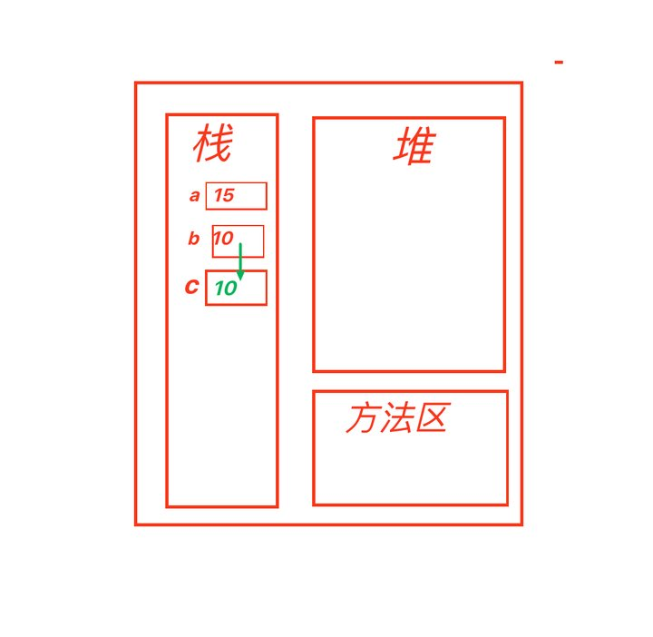

# 2024年秋季 - Java基础课用笔记
# **笔记-数据类型**
## 1. ***Java注释***
   ```Java
   
   // 单行注释
   // 操作： 
   //      1.在所需要注释的代码前加//
   //      2.选中需要注释的代码，Crtl+/

   /*
   内部可以放置多行注释
   多行注释一般用于大段业务描述
   注意：
        1.多行注释不能嵌套
   
   */

   /**
     文档注释
     内部放置文档 
    */

   ```
- ***编程习惯 - 编程规范***
    - 注释内容要写的尽量详细
      - 最起码一行代码一行注释
      - 或者一行代码多行注释
    - 增加代码可读性
    - 编译时编译器会忽略注释内容
    - 初学者写代码时，可先把思路用注释写下来，然后再补充代码
  - ***关键字***
    - 定义：被Java语言赋予了特殊含义的单词 
    - 常用IDE(编译器)对常见关键字进行高亮显示
  - ***保留字***
    - 定义：
        暂时还没有被赋予特定含义的单词\
        将来可能\
        或者已经被其他编程语言设置为关键字
    - c比如onst、在JavaScripy中是关键字
## 2. ***标识符***

- **命名规则**：\
            1.  不能是关键字和保留字\
            2.  由字母、数字、下划线、美元符号$组成\
            3. 不能以数字开头\
            4. 大小写敏感、区分大小写\
            5. 长度没有限制\
- ***编码习惯 - 编程规范***
  - 命名规范
    - 类和接口
       1. 类和接口
       2. 每个单词
    - 方法和变量
      - 首字母小写，第二个单词每个首字母大写(小驼峰)
        1. int num；
        2. getStudentById();
    - 常量
      - 全词大写 多个单词之间用_分割
      - LIGHT_COLOR
      - MAX_NUM
    - 临时变量一般用下划线开头 
      - int _num;
      - int _a;
      - $尽量不用
- 思考？ ：
  - _和$和_可以单独作为变量名使用吗？
  - int _ = 10;
  - int $ = 10;
- 变量和常量的定义
  - 常量：
    - **定义：** 在程序运行时，他的值不能改变的量\
           除了null其他常量可以直接用输出语句输出
    - **分类：**
      1. 字面值常量
         1. 用""括起来的0个、1个或者多个字符\
         2. ""
         3. "0"
         4. "hello"
         5. "a"
      2. 整数常量
      3. 小数常量
      4. 字符常量
      5. 布尔常量
      6. 空常量
         - null
  - 声明final关键字
    ```Java
    final int NUM_A = 10;
    //类的常量应声明在main方法的外部
    ```
  - 变量：
    - 定义：用于储存值的容器，声明变量需要指定他的的数据类型
    - 强类型语言中：比如在Java中 声明变量需要指定他的数据类型，并且这个类型不能更改
  ```Java
  int a 
  a = 10;
  a = 10.5;//报错
  ```
    - 弱类型语言中：比如在JavaScript中声明变量不需要指定数据类型，并且这个类型可以更改
  ```JavaScript
      let a;
      a = 10;
      a = 10.1;
      a = true;
      a = {name:"张三",age:12};
      a = [1,2,3,4,5,6,7,{name:"张三",age:12},[],true]
  ```
  - 声明：
  ```Java
  int a = 10;//声明和初始化
  //或者
  int a;//先声明
  a = 10;//再初始化
  ```

  - 注意：
    - Java变量一定要先声明 再赋值 再使用
    ```Java
    Syste.out.println(a);//报错  a?
    int a = 10;
    ```
## 3. ***数据类型***
- 数据类型
  - 基本数据类型
    - 整数类型\
      ``` byte ```1字节 -8~7\
      ``` short ```2字节 -16~15\
      ``` int ```4字节 -32~31\
      ``` long ```8字节 -64~63
    - 浮点类型\
      ``` float ```4字节 -32~31\
      ``` double ```8字节 -64~63
    - 字符类型\
     ``` char ```2字节 -16~15
    - 布尔类型\
    ``` boolean ```1字节 -8~7
  - 引用数据类型
- 字节
  - bit(比特位)：bit 二进制 0 1
  - byte 8bit(字节)：是计算机分配内存的最小单位 通常用B表示
  ``1B = 8bit``

| 数据类型 | 中文名称 | 所占内存大小 |
|----------|----------|--------------|
| `byte`   | 字节     | 1字节        |
| `short`  | 短整型   | 2字节        |
| `int`    | 整型     | 4字节        |
| `long`   | 长整型   | 8字节        |
| `float`  | 浮点型   | 4字节        |
| `double` | 双精度浮点型 | 8字节        |
| `char`   | 字符     | 2字节        |
| `boolean`| 布尔     | 通常认为是1字节（实际实现可能不同） |

```java
    public class Java_Datatype_1{

    public static void main(String[] args) {
        String name = "zhangsan";
        // TODO 基本數據类型

        // TODO 1.整数类型
        //  byte : 8位
        //  short : 16位
        //  int : 32位
        //  long : 64位
        Long l = 100000000l;// 结尾+字母l或L都可以，不加也可以，一般用大写，小写容易和数字1混淆

        //TODO 2.浮点类型:含有小数点的数据类型
        // 根据计算精度分为
        // 默认情况下 : 小数点的数据会被识别为精度较高的双精度double类型
        // floot : 单精度浮点类型，数据需要使用F或f结尾
        float f = 1.0f;// 结尾字母f或F都可以，不可以不加
        // double : 双精度浮点类型
        double d = 2.0d;//结尾+字母d或D都可以，不加也可以

        //TODO 3.字符类型
        // 所谓字符类型 : 其实就是用符号来表示文字类型
        char c = '@';

        //TODO 4.布尔类型‘
        // true,false,标识判断条件是否成立，如果成立，取值true，反之，那么取值false
        boolean bln = true;
    }
}
```
- 转义字符
  ```java
  \
  \n 换行 
  \t 制表符
  \\ 反斜杠
  \' 单引号
  \" 双引号
  ```
- 进制
  - 二进制     由0和1组成\
  `0~1`
  ```
    0b1  0B0 
    0：0b0
    1：0b1
    2：0b10
    3：0b11
    4：0b100 
  ```
  - 八进制     由0到7组成\
  `0~7`
  ```
    00 07 
    7:07
    8:010
    9:011
  ```
  - 十进制     由0到9组成\
  `0~9` 
  ```
     9     
   8+1 = 9 
   9+1 = 10 
  ```
  - 十六进制   由0到9和A到F(不区分大小写)组成
  `0~9,A~F`
```
    10:0x0a
    11:0x0b
    17:0x11
    18:0x12
```

- 进制转换
  ```
  十进制转二进制 除二取余法
  十进制转八进制 除八取余法
  十进制转十六进制 除十六取余法
  ```
      20
  - 二进制   ： 
  ```
  1. 20 ÷ 2 = 10 ... 0
  2. 10 ÷ 2 = 5  ... 0
  3.  5 ÷ 2 = 2  ... 1
  4.  2 ÷ 2 = 1  ... 0
  5.  1 ÷ 2 = 0  ... 1
  结束 0b10100
  ```
  - 八进制   ：
  ```
  1. 20 ÷ 8 = 2 ... 4
  2.  2 ÷ 8 = 0 ... 2
  3. 结束 024
  ```
  - 十六进制 ：
  ```
  1. 20 ÷ 16 = 1 ... 4
  2.  1 ÷ 16 = 0 ... 1
  3. 结束 0x14
  ```
  - 0x99 转为十进制\
    9 × 16 1次方 144\
    9 × 16 0次方 9\
    144+9
- 数据类型转换
  - 数据类型表示范围\
    `double`>`float`>`long`>`int`>`short`>`byte`
  - 隐式类型转换\
    在赋值过程中，小数据类型的值或者变量可以直接赋值给大数据类型的变量，系统会自动进行类型转换\
    大类型赋值给小类型可能会丢失精度 所以编译不通过\
    byte\short\char类型在做算术运算时，系统会自动进行类型转换，然后做运算

  - 显式类型转换
    - 定义\
      赋值过程中如果大类型的值赋值给小类型变量，编译报错，可以使用强制类型转换
    - 格式
  ```
      float float1 = (float)3.14;
      float float2 = (float)((byte1 - 5) * short1 + double1);
  ```
    - 强制类型转换的时候 注意值的一个问题

        

### 随课代码

```Java    
/*
 * @Description: Test类
 * @Author: FallCicada
 * @Date: 2024-08-29 08:55:07
 * @LastEditors: rendc
 * @LastEditTime: 2024-08-29 19:41:06
 */
public class Test{
    public static void main(String[] args){
      System.out.println("Test-Hello");
      // 进制
      byte b1 = 0b01100001;
      byte b2 = 0141;
      byte b3 = 97;
      byte b4 = 0x61;
      System.out.println("b1: " + b1);
      System.out.println("b2: " + b2);
      System.out.println("b3: " + b3);
      System.out.println("b4: " + b4);
      // 数据类型转换
      // int类型值 赋值给 long类型
      long num = 10;
      System.out.println("num: " + num);
  
      // 小类型赋值给大类型
      double price = 8.0F;
      System.out.println("price: " + price);
  
      // 大类型赋值给小类型 - 报错
      // int length = 10.5;
      // System.out.println("length: " + length);
      // byte\short\char类型在做算术运算时
      // 会自动提升为int类型 然后再参与计算
      byte b = 10;
      short s = 5;
      // short sum = b + s;
      // 从int转换到short可能会有损失
      // System.out.println("sum: " + sum);
      int sum = b + s;
      System.out.println("sum: " + sum);
      // 
      byte byte1 = 10;
      short short1 = 5;
      double double1 = 1.0;
      double t = (byte1 - 5) * short1 + double1;
      System.out.println("t: " + t);
      // 强制类型转换（显式类型转换）
      float float1 = (float)3.14;
      float float2 = (float)((byte1 - 5) * short1 + double1);
      System.out.println("float1: " + float1);
      System.out.println("float2: " + float2);
    }
  }
```    


# 总结学习过程中遇到的所有报错
## 编译型错误
- ***``Javac``***
## 运行时错误
- ***``Java``***