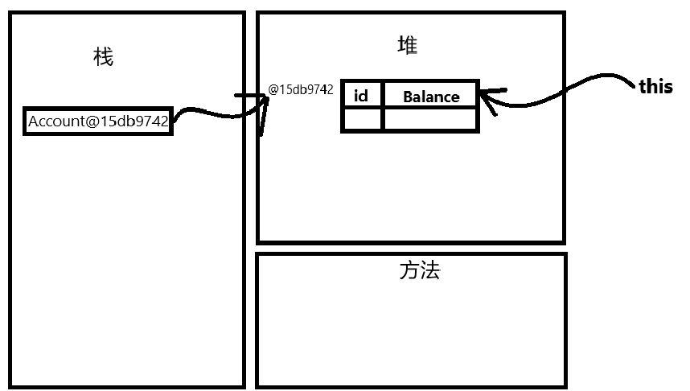
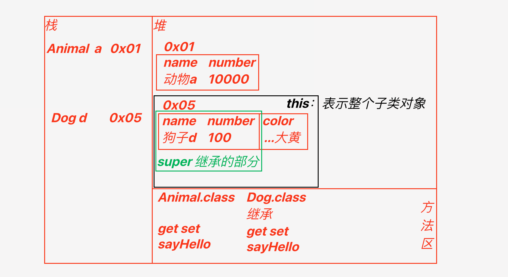

<!--
 * @Description: 
 * @Author: FallCicada
 * @Date: 2024-09-06 08:38:30
 * @LastEditors: FallCicada
 * @LastEditTime: 2024-09-19 15:03:52
-->

# 2024年秋季 - Java基础课用笔记

# 面向过程

  强调按步骤实现功能，先分析解决问题要经过的步骤，然后定义方法实现，每个步骤的功能，然后依次调用方法，去解决问题

# 面向对象

  将大问题拆分成小问题，借助不同对象去解决，最终实现功能

- 面向对象的语言特征
- 面向对象语言的三大特征
  - 继承、封装、多态

## 对象的理解

- 任何事物都是一个对象（object）
- 对象由对象组成
- 每个对象都有属性
- 具有相同属性和行为的对象可以归为一类

# 类

## 类的定义

- 具有相似属性和行为的对象可以归为一类，类在java中是一种数据类型

### 类的组成

- 属性

  - 这类事务的静态特征
- 行为（方法）

  - 事物所具有的动态功能
    ***类***是对现实生活中，具有共同属性和行为的事物的抽象
    **类**是**对象**的数据类型
    **类**是对象的抽象，而**对象**是类的实例
    **类**是抽象的，而**对象**是具体的
    ***对象***是类在程序中创建的实例
- 类的定义格式

  ```java

  public 权限修饰符 class 数据类型 Test 类名{
    // 属性
    权限修饰符 数据类型 变量名；
    public int a;
    // 功能（方法、行为）
    权限修饰符 返回值数据类型 方法名(形参列表){
      // 方法体语句
    }
    // 构造器、构造方法 创建对象需要用到
  }
  ```

  - 变量类型
  - 成员变量
    - 定义在类中，方法外；
    - 在堆内存
    - 成员变量具有默认值
    - 生命周期：随着对象的存在而存在
  - 局部变量
    - 定义在方法中，或者方法的形参列表上；
    - 在栈内存
    - 没有默认值
    - 生命周期：随着方法的调用而生成，方法调用完毕消失

## 封装

- 是面向对象语言的三大特征，另外两个是继承和多态
- 封装

  - 隐藏对象的属性和实现的细节 仅对外提供公共的访问方式
  - 提高安全性
  - 用户不需要知道内部具体复杂的实现。只需要使用对应的功能即可
- 封装的原则

  - 把不需要对外提供的内容隐藏起来
  - 把属性隐藏掉，提供方法来修改，保证数据的安全
    - 属性：

  ```
    - 余额
    stu1.name = "张三";
    card.balance = 10000;
  ```
- 封装的实现

  1. 用 private 修饰成员属性（成员变量）
  2. 提供对应的公开的 public set和public get方法
- this关键字

  - this关键字可以用来区分局部变量和成员变量
    ```
    public void setId(String id){
      this.id = id; // this.id 就是成员变量
    }
    public void setId(String newId){
      id = newId; // id 就是成员变量
    }
    ```
- 构造函数（构造方法）

  - 构造方法可以对对象进行初始化操作
  - 当为对象开辟内存空间时，就给对象的成员变量赋初始值
  - 在创建对象的时候，每创建一次对象就会执行一次构造方法
  - 构造方法不能手动调用
  - 用户如果没有写无参构造器，那么系统会默认提供一个；
  - 当用户有写无参构造器，系统不提供了。
  - 在构造方法中，可以借助this调用其他构造方法，
  - 必须放到构造方法中的第一行有效代码上
- 构造方法的格式

  ```java
  public class Test{
    //无参构造方法
    public Test(){
      System.out.println("无参构造方法");
    }

    //有参构造方法
    public Test(String name, int age){
      this.name = name;
      this.age = age;
      System.out.println("有参构造方法");
    }
  }
  ```

  - 随课笔记

  ```java
          public class Account {
          private String id;//卡号
          private double balance;//余额
          private String userName;

          // 构造方法 - 无参 - 无参构造器
          public Account(){
              System.out.println("调用了Account的无参构造器");
          }

          //构造方法 - 有参 - 有参构造器
          public Account(String id, double balance){
              this.id = id;
              this.balance = balance;
          }

          public Account(String userName ,String id ,double balance) {
              //必须是第一行有效代码
              this(id,balance);
              this.userName = userName;
          }

          public void setUserName(String userName) {
              this.userName = userName;
          }

          public String getUserName() {
              return userName;
          }

          public void setId(String id) {
              this.id = id;
          }

          public void setBalance(double balance) {
              this.balance = balance;
          }

          public String getId(){
              return id;
          } 

          public double getBalance(){
              return balance;
          }

      }
  ```

#### 内存图

  

## 类继承

### **继承**

- 继承是属于类与类之间的关系
- 继承是面向对象的三大特征之一，另外两个是封装和多态
- Java中，继承是单继承的，可以有多个父类的子类一个子类只能继承一个父类，
- Java中，接口是多实现的，一个类或者可以同时实现多个接口（师 徒）
- 语法:

  ```
    public class 子类名 extends 父类名{

    }
  ```
- 多层继承

  - 子类A继承父类B，
  - 父类可以继承爷爷类C
  - `A extends B{}`
  - `B extends C{}`
- java中接口是多实现，一个接口能实现多个接口(老师、师傅)
- 动物类

  - 狗类
  - 猫
  - 熊猫
  - 鳄鱼
- Person类

  - Teacher类
  - Student类
- 继承的实现

  ```java

  [public] class 子类名 extends 父类名{
    // 可以直接继承父类的属性和方法
    // 实现子类的新增内容
  }
  ```
- 父类：也称为基类、超类
- 子类：派生类
- 子类能够继承父类的属性，但是如果父类的属性是私有的，那么子类无法直接访问
- 子类只能继承父类的所有非私有的成员变量和成员方法
- 官方文档：

  - 从继承的概念来说，`private`修饰的成员不被继承，
  - 但是，如果超类中具有访问其私有字段的非私有（公开、受保护）方法，那么子类也可以使用这些方法
  - 子类如何访问父类中的私有成员变量？
  - 父类 ： 基类、超类
  - 子类 ： 派生类
- 重载

  - 类中 同名方法 参数列表（数量、类型都算）不同，与返回值类型无关
- 重写

  - 继承关系中,当子类需要父类的功能,而继承的方法不能完全满足需求,可以重写父类的方法,这样既沿袭了父类的功能,又定义(拓展)了子类特有的功能
  - 特点
    - 子类和父类有名的方法,参数列表要完全相同
    - 返回值类型可以相同,可以不同(先按相同处理,不同情况,后续补充)
  - 异常抛出的范围可以缩小不能扩大
  - 权限修饰符可以扩大不可以缩小
  - 子类继承父类时,在调用方法时,如果子类中有重写,那么就用重写后的方法
  - 如果没有重写,就用父类的方法
  - 父类中的私有方法,不能被子类重写
  - 静态成员属性不能被子类重写

  ```java
     //TODO Java中的访问权限主要分为四种:
      // 1,private : 私有的 , 同一类中可以使用,可暂时理解为局部变量与全局变量的区别
      // 2,(default) : (defult不是一个修饰符)默认权限 , 当不设定任何权限时 , JVM会默认提供权限 , 称之为包(路径)权限，当前类、子类可以访问
      // 3,protected : 受保护的权限,当前类、同包中其他类、子类可以访问
      // 4,public : 公共的 , 任意使用
      // 访问权限范围由 1 -> 4 逐步增大
  ```

#### ***object类***

- java中如果没有指明继承的父类,那么默认继承object类
    `public class Aniaml{}` => 编译后 => `public class Animal extends Object{}`
- Object类中没有成员属性,只有方法
    - 常用的就是 `toString()`,`equals()`
    - Object是java继承体系中最顶层的父类
    - 继承的优点和缺点
    - 优点
    - 提高代码的复用率
    - 提高代码的维护性,小问题的话,修改父类处即可,不需要到每个子类中修改
    - 缺点
    - 代码与代码之间存在关联,这种关系叫耦合继承,让类与类之间产生耦合,降低代码灵活性,父类如果有变化,子类不得不适应
    高内聚, 低耦合

#### `super`

- 父类非private的成员属性重名，如何区分？
- `super`表示子类从父类中继承的那部分引用
- 在子类方法中访问一个变量，根据就近原则
- 局部变量 子类的成员变量 父类的成员变量
- 如果非要访问指定的变量 ` this`或者 `super`去指定
  

#### 构造方法

- 子类对象成员包含两类
  - 继承部分
    ```java
      this.number = number;
    // this.name = name;  setXXX();
    ```
  - 新增部分
    ```java
       this.number = number;
    ```
- 如果参数比较少，可以直接赋值 如果是私有属性，可以调用父类的非私有的set方法，如果属性非常多，那么要用构造器
  - 子类构造器中如果调用父类构造器，必须为第一行有效代码
  - 子类构造器中如果调用父类构造器，父类中必须提供，否则会编译错误

#### `static`成员变量或方法

- 访问性：
- 如果子类中定义了与父类同名的成员变量或方法，那么子类访问的是自己的静态变量和方法
- 虽然静态成员

#### `@Override` 注解

- 作用及注意

1. 代码层面提醒程序员注意编程规范:重写\接口实现
2. 编译器检查 检查是否是重写 有助于今早发现错误
3. 重写 `toString()`方法，重写 `equals()`方法，重写 `hashCode()`方法，重写 `compareTo()`方法，

#### `final` 修饰符

1. `final`修饰的类 不能被继承
2. `final`修饰的属性不能被修改
3. `final`修饰的方法不能被重写
4. 数据类型:

   1) ***基本类型***  值不能修改
   2) ***引用类型***  地址值不能被修改,地址对应内容可以改变
5. 思考

   1. final修饰的类 不能被继承,如果非要继承,报什么错
      ***报错***

   ```java
     被继承final父类类型不能子类化
   ```

   2. final的方法不能被重写,可以继承但是不能更改内部逻辑
      ***报错***

   ```java
     无法重写User20的final方法
   ```

   3. String类是否被继承?
      因为String是被final修饰的,所以不能被继承
      ***报错***

   ```java

   ```

   4. final修饰的属性不能被修改,如果非要修改,报什么错?
      ***报错***

   ```java
     报错无法赋值给final变量name
   ```

### ***单例模式(设计模式)***

* 是一种设计模式，保证一个类只有一个实例，并且提供一个全局访问点
* 所以这个类只有一个对象可以被创建
* 在程序的所有部分都可以访问到这个对象

**查找**

- ***精确查找***
  - `id`
- ***模糊查询***
  - 名字

***新增部分***

- `id`要自动生成，防止 `id`重复
- 或者
- `id`也可以用户自己设置，但是设置的时候要查询有没有重复的

## ***多态***

面向对象语言的三大特征之一

- 一种事物，有多种状态
- Java中多态怎么实现
  - 子类继承父类
  - 子类重写父类的方法
  - 父类的引用指向子类的对象（一个父类的引用可以指向任何一个子类的对象）
    - `Animal a = new Dog();`
  - Java 中完全相同的两行代码出现在不同位置,执行结果不同 `point.show();`
  - 如果要不断的扩展游戏种类那么每次都要区修改Game代码,这个很不合理(有太多重复的代码)不方便,违反开闭原则

### 开闭原则

- 面向对象设计的一条基本原则,软件实体(类、模块、函数等)对扩展是开放的，对修改是关闭的.
- 当需求发生改变时，应该通过新增代码来实现，而不是修改代码，所以一般要结合多态思想，处理这个问题。
  ***数据类型转换***
  - 引用类型转换
  - **向上转型（隐式转换）** 父类引用指向子类对象
    - **特点：**
    - **成员变量**：编译的时候看左边(父类)，运行的时候也看左边
    - **成员方法**：编译的时候看左边(父类)，运行看右边
    - 向上转型时，父类无法调用子类独有的成员变量和方法
  - ```java
    父类 引用名 = 子类对象;
    Point point = new Circle(1,1,2);
    Animal a = new Dog();
    ```
  - **向下转型（显式转换）** 子类引用指向父类对象
    - 前提：父类对象本身就是子类类型
    - **特点**：
    - 向下转型时，可以访问子类独有的成员变量和方法
    - 如果被转的引用类型变量，对应的实际类型和目标类型不是同一种类型，那么在转换的时候就会出现运行时异常，ClassCastException异常
    - `Fork f = (Fork)b`; 强制转换时，b实际指向Derived对象，Derived和Fork类型不是子父类关系，所以它是不能转为Fork对象的！
  - ```java
    Person p1 = new Student();
    Student s1 = (Student)p1；
    ```


java程序 一般会有测试类和基础类的区分

- 测试类
  - 包含 `main`方法，作为程序入口
- 基础类
  - `Student`
  - `Teacher`
  - `Table`类
