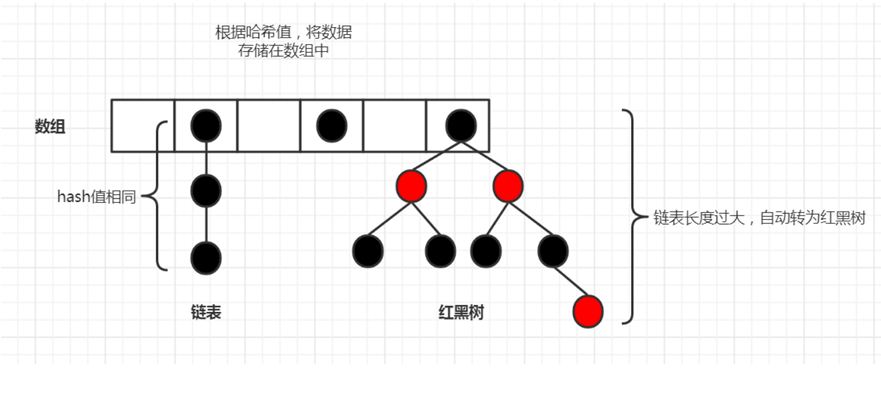

<!--
 * @Description: 
 * @Author: FallCicada
 * @Date: 2024-09-26 08:35:31
 * @LastEditors: FallCicada
 * @LastEditTime: 2024-10-10 08:31:44
-->

# 2024年秋季Java基础课用笔记

# 集合

## 数组

- 长度，长度是固定的：在创建数组时就需要指定数组长度，并且在创建后不可改变。
- 数据类型是固定的：在创建时就需要制定数组的数据类型，创建后不可改变，该数组只能存储指定数据类型的数据。
- 数组在堆空间的内存是连续的，所以当插入一个元素的时候，后面的元素需要整体移动导致效率低下。

## 集合 - 介绍

- 在Java中，集合是一种数据结构，适用于储存和
- 集合位于 `java.util`包中，提供了一系列的接口和类

  - 接口：`Collection`、`List`、`Map`
  - 类：set

## ***集合***和***数组***的区别

    1.***数组***的长度是固定的
       ***集合***的长度是可变的
    2. ***数组***中元素类型是相同的
       ***集合***中可以存储不同类型的数据
    3. ***数组***可以存放引用数据类型，基本数据类型的数据
       ***集合***只能存放引用类型的数据
    4. ***数组***是由JVM中现有的 `数据类型 + []`组合而成的，除了一个 `length`属性，和从 `object`继承的方法之外，数组就调用不到其他属性和方法
       但是集合是由 `java.util`包中提供的类和接口组合而成，`java.util包`下的多个解耦和实现类组成，定义并实现了很多方法，所以功能强大

### 集合框架体系的组成

    - 接口
      - 是整个集合框架的上层结构，，接口定义了集合中必须要有基本方法
      - 通过接口还把集合划分成了几种不同的类型，每一种集合都有自己对应的接口。
    - 实现类
      - 对于上层使用接口划分好的集合种类，每种集合的接口都会有对应的实现类。
      - 每一种接口的实现类很可能有多个，每个的实现方式也会各有不同。
    - 数据结构
      - 每个实现类都实现了接口中所定义的最基本的方法，例如对数据的存储、检索、操作等方法。但是不同的实现类，它们存储数据的方式不同，也就是使用的**数据结构**不同。

- 集合框架继承体系图:
  
- 集合的分类

  - 单列集合（Single Column Collection）
    根接口：`java.util.Collection`
    单列集合是指每个集合元素只包含一个单独的对象，它是集合框架中最简单的形式
  - 多列集合（Multiple Column Collection）
    根接口：`java.util.Map`
    多列集合是指每个集合元素由多个列（字段）组成，可以同时存储和操作多个相关的值
- 集合章节的学习的基本要求

  1. 会用集合存储数据
  2. 会从集合中存储数据
  3. 掌握每种集合的特点和应用场景

  - **Collection接口结构图：**
    
  - **Map接口结构图如下：**
    

## Collection

Collection接口是**单列**集合类的父接口，这种集合可以将数据一个一个的存放到集合中。它有两个重要的子接口，分别是

1. `java.util.List `
2. `java.util.Set`
   `Collection`是父接口，定义了子接口()的通用方法
   `Collection`接口的实现类就都可以使用这些方法
   **如图：**
   

### 方法

- `boolean add(Object obj)`:
  - 作用：将指定的对象添加到当前集合中
  - 返回值：如果添加成功，则返回true，否则返回false
  - 参数：
- `boolean addAll(Collection c)`：
  - 作用：将指定的集合中的所有元素添加到当前集合中
  - 返回值：boolean
  - 参数：Collection 集合
- `boolean remove(Object obj)`：
  - 作用：从当前集合中移除指定的元素
  - 返回值：boolean
  - 参数：Object指定要删除的元素
- `boolean removeAll(Collection c)`：
  - 作用：从当前集合中移除指定的集合中的所有元素
  - 返回值：
  - 参数：
- `boolean retainAll(Collection c)`：
  - 作用：从当前集合中移除不是c集合中的元素
  - 返回值：
  - 参数：
- `boolean contains(Object obj)`：
  - 作用：判断当前集合中是否包含该对象
  - 返回值：bollean
  - 参数：Object
- `boolean containsAll(Collection c)`：
  - 作用：判断当前集合中是否包含指定的集合中的所有元素
  - 返回值：boolean
  - 参数：Collection
- `boolean isEmpty()`：
  - 作用：判断当前集合是否为空
  - 返回值：boolean
  - 参数：无
- `void clear()`：
  - 作用：清空集合中的元素
  - 返回值：无
  - 参数：无
- `int size()`：
  - 作用：返回集合中元素的个数
  - 返回值：int
  - 参数：无
  - 注意：If this collectioncontains more than `<tt>`Integer.MAX_VALUE `</tt>` elements,returns `<tt>`Integer.MAX_VALUE `</tt>`.
- `Object[] toArray()`：
  - 作用：把集合中的元素，存储到数组中
  - 返回值：Object[]
  - 参数：无参
- `boolean equals()`：
  - 作用：判断两个集合是否相等
  - 返回值：boolean
  - 参数：无

### 集合遍历

#### `toArray()`

借助Collection接口中toArray()方法实现，方法原型为：
**遍历格式：**

```java
   //将集合转化成数组
  Object[] array = 集合引用.toArray();
  Object[] toArray();
  //遍历数组
  for (int i = 0; i < array.length; i++) {
    System.out.println(array[i]);
  }
```

#### 增强 `for`循环(`foreach`)

1. 增强for循环遍历集合，遍历数组
2. 遍历集合和遍历数组的格式一样，都是使用for循环，但是遍历集合的格式是固定的，但是遍历数组的格式不是固定的。
3. 遍历集合的格式：

```java
  for(集合数据类型 变量名 : 集合名){}
```

#### 迭代器

迭代器是集合框架提供的一种遍历集合元素的方式。通过调用集合的 `iterator() `方法可以获取一个迭代器对象，然后使用迭代器 `hasNext()`方法判断是否还有下一个元素，使用 `next()`方法获取下一个元素。
**遍历固定格式**

```java
    //1.获取迭代器对象
    Iterator<集合元素类型> iterator = 集合对象.iterator();
  
    //2.借助迭代器中hasNext()和next()方法完成遍历
    while (iterator.hasNext()) {
        //获取集合元素
        集合元素类型 变量名 = iterator.next();
  
        //对集合元素进行输出
        System.out.println(变量名);
    }
```

> 注意，这种迭代器方式获取集合中的每一个元素，是一种 `Collection`集合及其子类型集合通用的方式

**迭代器实现原理：**

1. 获取迭代器对象：集合类实现了Iterable 接口，该接口定义了一个 `iterator()` 方法，用于获取迭代器对象。迭代器对象是实现了 `Iterator`接口的具体类的实例。
2. 迭代器位置初始化：在创建迭代器对象时，迭代器的位置通常初始化为集合的起始位置。不同的集合实现可能对位置初始化进行不同的处理。
3. 遍历集合元素：通过调用迭代器对象的 `hasNext()`方法，可以判断集合中是否还有下一个元素。如果有下一个元素，可以通过 `next()`方法获取下一个元素，并将迭代器的位置后移。
4. 迭代器状态管理：迭代器对象会记录当前迭代的状态，包括当前位置、遍历过程中的操作等。这些状态可以帮助迭代器在遍历过程中正确地访问和操作集合的元素。
5. 结束迭代：当集合中没有更多元素时，迭代器的 `hasNext() `方法将返回 `false`，表示遍历结束。
   **迭代器next方法示意图:**
   

## List接口

`java.util.List` 接口继承了 `Collection` 接口，是常用的一种集合类型。`List `集合具 `Collection` 集合的特点之外，还具有自己的一些特点：

- List是一种**有序集合**
  例如，向集合中存储的元素顺序是8、2、5。那么集合中就是按照这个顺序进行存储的
- List一种**带索引**的集合
  可以通过元素的下标索引，精确查找对应的元素数据
- List集合**可以存放重复元素**
  可以把相同的数据，在List集合中多次保存

### 继承体系

返回一个包含集合中元素的数组

**List接口源码：**

```java
    package java.util;
    public interface List<E> extends Collection<E> {
    //省略...
    }
```

List接口的实现类


> 注意，这些实现类中，都已经实现了List接口、Collection接口、Iterable接口
> 中的方法，我们只要了解并能使用这些接口中的方法，就已经能够操作这些
> 集合对象了（面向接口）。
> 额外的，我们还需要了解这些常用的接口实现类，分别都是什么特点，使用
> 的什么数据结构，以及适合在什么样的场景下使用。

### 常用方法

- `void add(int index, Object ele)`
  作用: index位置插入ele元素
- `boolean addAll(int index, Collection eles)`
  作用: 从index位置开始将eles中的所有元素添加进来
- `Object get(int index)`
  作用: 返回index位置的元素
- `int indexOf(Object obj)`
  作用:返回obj在集合中首次出现的位置
- `int lastIndexOf(Object obj)`
  作用:返回obj在当前集合中末次出现的位置
- `Object remove(int index)`
  作用:移除index位置的元素
  返回值：返回移除元素
- `Object set(int index, Object ele)`
  作用:设置index位置的元素为ele
- `List subList(int fromIndex, int toIndex)`
  作用:返回从fromIndex到toIndex位置的子集合
- `ListIterator listIterator()`
  作用:返回此列表的列表迭代器（按适当顺序）
- `ListIterator listIterator(int index)`
  作用:返回列表的列表迭代器（按适当顺序）
- `Object[] toArray()`
  作用:返回一个包含集合中元素的数组

> 注意，除了这些方法之外，还有从父接口Collection中继承过来的方法

### ArrayList类

`java.util.ArrayList `是最常用的一种List类型集合，`ArrayList` 类**底层使用数组**来实现数据的存储，所以它的**特点是：增删慢，查找快。**
在日常的开发中，查询数据也是用的最多的功能，所以ArrayList是最常用的集合。
但是，如果项目中对性能要求较高，并且在集合中大量的数据做增删操作，那么 `ArrayList`就不太适合了。
`ArrayList`的案例我们之前已经写过很多，此处不在额外演示。
**位置:**java.util.ArrayList
**ArrayList源码参考：**

```java
    package java.util;
    /**
     * Resizable-array implementation of the <tt>List</tt> interface.  Implements
    * all optional list operations, and permits all elements, including
    * <tt>null</tt>. 
    * @see     LinkedList
    * @see     Vector
    * @since   1.2
    */
    public class ArrayList<E> extends AbstractList<E>implements List<E>, RandomAccess, Cloneable, 
    java.io.Serializable
    {
    //省略...
    /**
     * Default initial capacity.
     */
    private static final int DEFAULT_CAPACITY = 10;
    /**
     * Shared empty array instance used for empty instances.
     */
    private static final Object[] EMPTY_ELEMENTDATA = {};
    }
```

### LinkedList类

`java.util.LinkedList `底层**采用的数据结构是双向链表，其特点是：增删快，查找慢**
它的特点刚好和 `ArrayList `相反，所以在代码中，需要对集合中的元素做大量的增删操作的时候，可以选择使用 `LinkedList`。
注意：这里描述的快和慢，需要在大量的数据操作下，才可以体现，如果数据量不大的话，集合每一种集合的操作几乎没有任何区别。

1) **特点验证**
   实例化ArrayList、LinkedList集合对象，放入100000个元素，测试两种集合插入、查询效率！

   ```java
      package com.briup.chap08.test;
      import java.util.ArrayList;
      import java.util.LinkedList;
      import java.util.List;
      public class Test054_LinkedList {
        public static void main(String[] args) {
          //操作集合的次数
          final int NUM = 100000;
          //1.实例化集合对象
          List<String> list = new ArrayList<>();
          //List<String> list = new LinkedList<>();
          //2.开启计时，往集合种放入 100000 个元素
          long start1 = System.currentTimeMillis();
          for (int i = 0; i < NUM; i++) {
            list.add(0,"hello"+i);
          }
          long end1 = System.currentTimeMillis();
          //3.输出时长
          System.out.println(list.getClass().getSimpleName()+"插入"+NUM+"条数据耗时"+(end1-start1)+"毫秒");
          //4.开启计时，从集合种取 100000 个元素
          long start2 = System.currentTimeMillis();
          for(int i = 0; i < list.size(); i++){
            list.get(i);
          }
          long end2 = System.currentTimeMillis();
          //5.输出时长
          System.out.println(list.getClass().getSimpleName()+"检索"+NUM+"条数据耗时"+(end2-start2)+"毫秒");
        }
      }

   ```

   ```java
      //运行效果：
      //根据电脑的当前情况，每次运行的结果可能会有差异
      //以下是我的电脑运行俩次的实验结果，第一次使用ArrayList，第二次使用
      LinkedList
      ArrayList插入100000条数据耗时508毫秒
      ArrayList检索100000条数据耗时2毫秒
      LinkedList插入100000条数据耗时22毫秒
      LinkedList检索100000条数据耗时17709毫
   ```

### Vector

Vector是在JDK1.0引入的，它实现了List接口，属于Java集合框架的一部分，其**基于动态数组（Dynamic Array）实现，线程安全，Vector在功能和使用方式上和ArrayList非常相似**
ArrayList是在JDK 1.2引入的，非线程安全，但单线程环境下性能更高效，是Vector的一个非线程安全的替代品。
**Vector继承体系**如下：

**Vector部分源码：**

```java
  package java.util;
  /**
     * The {@code Vector} class implements a growable array of
     * objects. Like an array, it contains components that can be
     * accessed using an integer index.
     * @see LinkedList
     * @since   JDK1.0
   */
  public class Vector<E>
    extends AbstractList<E>
    implements List<E>, RandomAccess, Cloneable, 
  java.io.Serializable
  {
    //省略
    /** 
    * 底层借助数组存储数据
    * The array buffer into which the components of the 
    vector are
    * stored.
    */
    protected Object[] elementData;
  }
```

`Vector`内部也是采用了数组来存储数据，但是 `Vector`中的方法大多数都是线程安全的方法，所以在多线并发访问的环境中，可以使用 `Vector`来保证集合中元据操作的安全。

#### 常用方法

- `public synchronized boolean add(E e)`
  作用:将指定元素添加到此列表的末尾（可选操作）。
- `public synchronized boolean addAll(Collection<? extends E> c)`
  作用：将指定集合中的所有元素添加到此列表的末尾（可选操作）。
- `public synchronized void add(int index, E element)`
  作用：将指定元素插入此列表中的指定位置（可选操作）。
- `public synchronized E remove(int index)`
  作用：删除此列表中指定位置的元素（可选操作）。
- `public synchronized boolean remove(Object o)`
  作用：
- `public synchronized boolean removeAll(Collection<?> c)`
  作用：删除此列表包含在指定集合中的所有元素（可选操作）。
- `public synchronized boolean retainAll(Collection<?> c)`
  作用：保留此列表中在指定集合中存在的元素（可选操作）。
- `public synchronized void clear()`
  作用：清除此列表中的所有元素（可选操作）。
- `public synchronized boolean contains(Object o)`
  作用：判断此列表中是否包含指定元素。
- `public synchronized boolean containsAll(Collection<?> c)`
  作用：判断此列表中是否包含指定集合中的所有元素。

### List 小结

| 集合类     | 特点                                                 | 示例                             |
| ---------- | ---------------------------------------------------- | -------------------------------- |
| ArrayList  | 内部使用数组实现，动态调整大小。读取快，插入删除慢   | List list = new ArrayList<>();  |
| LinkedList | 内部使用双向链表实现，插入删除快，读取快             | List list = new LinkedList<>(); |
| Vector     | 线程安全的动态数组实现，操作方法同步，多线程环境安全 | List list = new Vector<>();     |

## 数据结构

### 概述

数据结构是计算机科学中研究数据组织、存储和操作的一门学科。它涉及了**如何组织和存储数据**以及如何设计和实现不同的数据操作算法和技术。常见的据结构有**线性数据结构**（含数组、链表、栈和队列等），**非线性数据结构**（树、图等）。

> 注意：不同的数据结构适用于不同的场景和问题，选择合适的数据结构可以提高算法的效率和性能。
> **Java集合框架中不同的实现类底层借助不同数据结构来存储输出，常见的数据结构有：**

1. 数组（Array）：有序集合，可以包含重复的元素，常见实现类有ArrayList、Vector
2. 链表（LinkedList）：链表是一种动态数据结构，通过节点之间的链接来组织数据。常见的链表实现类是LinkedList
3. 集合（Set）：集合是不允许包含重复元素的无序集合。常见的集合实现类有HashSet、LinkedHashSet和TreeSet
4. 映射（Map）：映射是一种键值对的集合，每个键只能对应一个值。常见的映射实现类有HashMap、LinkedHashMap和TreeMap
5. 队列（Queue）：队列是一种先进先出（FIFO）的数据结构。常见的队列实现类有LinkedList和PriorityQueue
6. 栈（Stack）：栈是一种后进先出（LIFO）的数据结构。常见的栈实现类是Stack
7. 树（Tree）：树是一种具有分层结构的数据结构，常见的树实现类有BinaryTree和BinarySearchTree

### 数组

数组（array），内存中一块连续的空间，元素数据在其中按照下标索引依次存储，比较常用的数据结构。

其特点是：通过下标索引，可以快速访问指定位置的元素，但是在数组中间位置添加数据或者删除数据会比较慢，因为数组中间位置的添加和删除元素，为了元素数据能紧凑的排列在一起，那么就会引起其后面的元素移动位置。

所以，数组查询元素较快，中间位置的插入、删除元素较慢。


> 可以看出，数组中间添加数据后，之后的数据都要依次移动位置。同理，中间位置删除的时候也是这样

### 链表

链表（linked list），是由一个一个node节点组成，每个node节点中包含两项数据：**指针域、数据域**。数据域存储了一个数据，指针域存储指向下一个node节点对象的引用（**单向链表**）。

如果是双向链表的话，指针域会存储2个引用，一个指向前一个node节点对象，另一个指向了下一个node节点对象。

单链表插入、删除节点：


##### 总结

插入和删除 不需要象数组那样 整体移动元素 所以效率高
查询第n和元素，必须从头结点开始往后遍历 所以效率低
**链表特点**：

* 查找元素慢，因为需要通过连接的节点，依次向后查找指定元素（没有直接的下标索引）
* 新增和删除元素较快，例如删除，只需要让当前node节点中的引用指向另一个节点对象即可，原来的指向的node节点就相当于删除了

> 可以看出，只需要将数据2节点中的引用，指向数据4的节点对象即可
> head表示链表的头部，tail表示链表的尾部


### 栈

栈（stack），又称堆栈，仅允许在栈的一端进行插入和删除操作，并且不允许在其他任何位置进行操作。
其特点是：**先进后出，最先存进去的元素，最后才能取出来**。
例如，薯片存在薯片桶中，我们当前只能取出最上面的一个薯片，而最早存放到薯片桶的薯片，反而是我们最后吃到的一片。

注意1. 入栈也称为压栈，把数据存(压)入到栈的顶端位置
注意2. 出栈也称为弹栈，把栈顶位置的元素取(弹)出

### 队列

队列（queue），仅允许在队列的一端进行插入，而在队列的另一端进行删除。
其特点是：**先进先出，最先存进去的元素，可以最先取出来**。
例如，火车穿过山洞的时候，第一节车厢先进去山洞的一端，并且这节车厢优先从山洞的另一端出来，后面的车厢依次从一端进入并另一端出来。
队列的入口、出口分别在队列的两端：


### 红黑树

二叉树（Binary tree）是树形结构的一个重要类型。二叉树特点是每个结点最多只能有两棵子树，且有左右之分。
二叉树顶上的叫根结点，两边被称作“左子树”和“右子树”。

二叉树中有一种叫做红黑树（Red/Black Tree），它最早被称为**平衡二叉B树**（symmetric binary B-trees），后来被称为红黑树。
红黑树是一种特殊化的平衡二叉树，它可以在进行插入和删除的时候，如果左右子数的高度相差较大，那么就通过特定操作（左旋、右旋）保持二叉查找树的平衡（动态平衡），从而获得较高的查找性能。
红黑树的每一个节点的左子树的所有数据都比自己小，而右子树的所有数据都比自己大，并且左右子树的高度近似。
**红黑树的约束：**

1. 根节点必须是黑色
2. 其他节点可以是红色的或者黑色
3. 叶子节点（特指null节点）是黑色的
4. 每个红色节点的子节点都是黑色的
5. 任何一个节点到其每一个叶子节点的所有路径上黑色节点数相同

**注意，红黑树的指定颜色的目的，是利用颜色值作为二叉树的平衡对称性的检查**
例如，从空树开始演示一个案例：
数字插入顺序为 9、8、12、7、6，对于一个节点来说，新数据如果小于本节点，会被放在左节点的位置，反之则放在右节点的位置

当插入数字6的时候，对于红黑树来说整个结构失去平衡，需要通过自旋来调整，最后结果如下：

**红黑树在线演示**
可以通过在线工具，进行节点的添加，查看红黑树的动态调整的**动画效果**，建议使用chrome浏览器打开：


### 哈希表

java中的哈希表（hash），在JDK1.8之前是采用数组+链表进行实现，根据数据的哈希值，把数据存在数组中，但是当前哈希值冲突的时候，再使用链表进行存储，那么在数组中，同一hash值的数据都存在一个链表里。

注意，之前学习过Object中hashCode方法的作用，hash值的特点以及和对象之间的关系

例如，

例如，如果数据的哈希值相同，在数组使用使用链表存储哈希值相同的几个数据


> 可以看出，当链表中元素过多，即hash值相等的元素较多时，查找的效率会变低
> **JDK1.8中，哈希表存储采用数组+链表+红黑树进行实现**，当链表长度超过阈值（8）时，将链表转换为红黑树，这样可以大大提高查找的性能。
> 例如，
> 

## Set集合

### Set概述

`java.util.Set`接口继承了 `Collection` 接口，是常用的一种集合类型。相对于之前学习的**List**集合，**Set**集合特点如下：

除了具有 `Collection` 集合的特点，还具有自己的一些特点：

- Set是一种无序的集合
- Set是一种不带下标索引的集合
- Set是一种不能存放重复数据的集合
  **Set接口继承体系：**
  
  **Set接口方法：**
  
  **Set集合实现类：**
  

重点学习的Set实现类(比较重要的两个实现类)：

* HashSet(直接实现类) 底层借助哈希表实现
* TreeSet(Set的子接口SortedSet的实现类)底层借助二叉树实现
  注意，TreeSet是Set接口的子接口SortedSet的实现类

**代码案例：**

```java
    import java.util.Iterator;
    import  java.util.Set;

    public class Test01Set {

        public static void main(String[] args) {
            //实例化一个set集合
            Set<String> set = new java.util.HashSet<>();
            //存放元素
            set.add("hello1");
            set.add("hello2");
            set.add("hello3");
            set.add("hello4");
            set.add("hello5");
            set.add("hello5");
            for (String string : set) {
                System.out.println(string + "\t");
            }
            System.out.println("\t");
            //迭代器遍历
            Iterator<String> it = set.iterator();
            while(it.hasNext()){
            Object obj = it.next();
            System.out.println(obj);
            }
        }
    }
```

**输出结果：**

```
    (base) d:\WorkSpace\FallCicada_WorkSpace>
    (base) d:\WorkSpace\FallCicada_WorkSpace> d: && cd d:\WorkSpace\FallCicada_WorkSpace && cmd /C ""C:\Program Files\Java\jdk1.8.0_241\bin\java.exe" -cp                           C:\Users\86138\AppData\Roaming\Code\User\workspaceStorage\5e64c956c6ef5aa4f47184cf76ebe205\redhat.java\jdt_ws\FallCicada_WorkSpace_1526d045\bin Test01Set "
    hello1
    hello4
    hello5
    hello2
    hello3

    hello1
    hello4
    hello5
    hello2
    hello3
```

> 通过以上代码和运行结果，可以看出Set类型集合的特点：无序、不可重复

### HashSet

`java.util.HashSet`是Set接口的实现类，它使用哈希表（Hash Table）作为其底层数据结构来存储数据。
**HashSet特点：**

* 无序性：`HashSet`中的元素的存储顺序与插入顺序无关
  `HashSet`使用哈希表来存储数据，哈希表根据元素的哈希值来确定元素的存储位置，而哈希值是根据元素的内容计算得到的，所以与插入顺序无关。
* 唯一性：`HashSet`中不允许重复的元素，即每个元素都是唯一的
* 允许null元素：`HashSet`允许存储null元素，但只能存储一个null元素，`HashSet`中不允许重复元素
* 高效性：`HashSet`的插入、删除和查找操作的时间复杂度都是O(1)
* 哈希表通过将元素的哈希值映射到数组的索引来实现快速的插入、删除和查找操作。

元素插入过程：

* 当向HashSet中插入元素时，先获取元素的hashCode()值，再检查HashSet中是否存在相同哈希值的元素，如果元素哈希值唯一，则直接插入元素
* 如果存在相同哈希值的元素，会调用元素的equals()方法来进一步判断元素是否是相同。如果相同，则不会插入重复元素；如果不同，则插入
  **方法：**
* 获取元素的的hash值
  * `hashCode`方法是 `Object`类的一个方法，
    * 作用：获取一个对象的hash值
    * 参数：无
    * 返回值 `int` ：哈希值
    * 特点：
      * 如果两个对象的hashCode不同，那么这两对象的属性值有可能相同，也有可能不同
      * 如果要用hashSet存储自定义类型的元素，需要重写hashCode方法，保证两个元素相同时，返回的hashCode值也相同
* boolean add(E e)：添加元素，如果添加成功，返回true，否则返回false
* 

**`hashCode()` 方法复习：**

* hashCode() 方法是Object类 中的一个方法，它返回一个 `int` 类型的哈希码值
* 通常情况下，`hashCode() `方法会根据对象的属性值计算一个哈希码值（重写自定义类中 `hashCode方法` ）
* 如果两个对象的hashCode值不同，则两个对象的属性值肯定不同
* 如果两个对象的hashCode值相同，则两个对象的属性值可能相同，也可能不同

### TreeSet

> **TreeSet是SortedSet（Set接口的子接口）的实现类**，它基于红黑树（RedBlack Tree）数据结构实现。
> TreeSet特点：

* 有序性：插入的元素会自动排序(注意：非插入顺序)，每次插入、删除或查询操作后，TreeSet会自动调整元素的顺序，以保持有序性。
* 唯一性：TreeSet中不允许重复的元素，即集合中的元素是唯一的。如果尝试插入一个已经存在的元素，该操作将被忽略。
* 动态性：TreeSet是一个动态集合，可以根据需要随时添加、删除和修改元素。插入和删除操作的时间复杂度为O(log n)，其中n是集合中的元素数量。
* 高效性：由于TreeSet底层采用红黑树数据结构，它具有快速的查找和插入性能。对于有序集合的操作，TreeSet通常比HashSet更高效。

#### 代码示例1:

 准备一个TreeSet集合，放入多个Integer元素，观察是否自动进行排序。

```java
    import java.util.Set;
    import java.util.TreeSet;
    public class Test073_Integer {
        public static void main(String[] args) {
            //1.实例化集合对象
            Set<Integer> set = new TreeSet<>();
            //2.添加元素
            set.add(3);
            set.add(5);
            set.add(1);
            set.add(7);
            //3.遍历
            for(Integer obj : set) {
                System.out.println(obj);
            }
        }
    }
    //输出结果：
    1
    3
    5
    7

```

> 可以看出，存进去的数字已经安从小到大进行了排序

##### 代码案例

 准备一个TreeSet集合，放入多个自定义类Person对象，观察是否自动进行排序。

```java
    import java.util.Set;
    import java.util.TreeSet;
    class Person {
        private String name;
        private int age;
        public Person() {}
        public Person(String name, int age) {
            this.name = name;
            this.age = age;
        }
        public String getName() {
            return name;
        }
        public void setName(String name) {
            this.name = name;
        }
        public int getAge() {
            return age;
        }
        public void setAge(int age) {
            this.age = age;
        }
        @Override
        public String toString() {
            return "Person [name=" + name + ", age=" + age + "]";
        }
    }
    public class Test073_Person {
        public static void main(String[] args) {
            //1.实例化TreeSet
            Set<Person> set = new TreeSet<>();
            //2.添加元素
            set.add(new Person("zs",21));
            set.add(new Person("ls",20));
            set.add(new Person("tom",19));
            //3.遍历集合
            for (Person person : set) {
                System.out.println(person);
            }
        }
    }
 //程序运行，提示异常，具体如下：
Exception in thread "main" java.lang.ClassCastException: com.briup.chap08.test.Person cannot be cast to java.lang.Comparable
 at java.util.TreeMap.compare(TreeMap.java:1290)
 at java.util.TreeMap.put(TreeMap.java:538)
 at java.util.TreeSet.add(TreeSet.java:255)
 at 
 com.briup.chap08.test.Test073_Person.main(Test073_Person.java:41)
```

**问题分析：**
根据异常提示可知错误原因是：`Person` 无法转化成 `Comparable`从而导致ClassCastException异常 。
为什么会这样呢？
TreeSet是一个有序集合，存储数据时，一定要指定元素的排序规则，有两种指定的方式，具体如下：

> **TreeSet排序规则：**
>
> * 自然排序（元素所属类型要实现 `java.lang.Comparable`接口）
> * 比较器排序

上述2个案例中，Integer存如TreeSet没有报错，是因为**Integer类已经实现自然排序**，而Person类既没有实现自然排序，也没有额外指定比较器排序规则。

1）TreeSet：自然排序
如果一个类，实现了 `java.lang.Comparable`接口，并重写了 `compareTo方法`，那么这个类的对象就是可以比较大小的。

```java
    public interface Comparable<T> {
        public int compareTo(T o);
    } 
```

**compareTo方法说明：**
`int result = this.属性.compareTo(o.属性);`

* result的值大于0，说明this比o大
* Bresult的值小于0，说明this比o小
* result的值等于0，说明this和o相等

**元素插入过程：**
当向TreeSet插入元素时，TreeSet会使用元素的 `compareTo()`方法来比较元素之间的大小关系。根据比较结果，TreeSet会将元素插入到合适的位置，以保持有序性。如果两个元素相等（`compareTo()`方法返回0），TreeSet会认为这是重复的元素，只会保留一个。
**案例展示：**
使用自然排序（**先按name升序，name相同则按age降序**）解决上述案例问题。
基础Person类：

```java
    //定义Person类，实现自然排序
    public class Person implements Comparable<Person> {
        private String name;
        private int age;
        public Person() {}
        public Person(String name, int age) {
            this.name = name;
            this.age = age;
        }
        public String getName() {
            return name;
        }
        public void setName(String name) {
            this.name = name;
        }
        public int getAge() {
            return age;
        }
        public void setAge(int age) {
            this.age = age;
        }
        @Override
        public String toString() {
            return "Person [name=" + name + ", age=" + age + "]";
        }
        //重写方法，指定比较规则：先按name升序，name相同则按age降序
        @Override
        public int compareTo(Person o) {
            //注意：字符串比较需要使用compareTo方法
            int r = name.compareTo(o.name);
            if(r == 0) {
                r = o.age - this.age;
            }
            return r;
        }
    }   
```

**测试类：**

```java
    import java.util.Set;
    import java.util.TreeSet;
    import com.briup.chap08.bean.Person;
    //自然排序测试
    public class Test073_Comparable {
        public static void main(String[] args) {
            //1.实例化TreeSet
            Set<Person> set = new TreeSet<>();
            //2.添加元素
            set.add(new Person("zs",21));
            set.add(new Person("ww",20));
            set.add(new Person("zs",21));
            set.add(new Person("tom",19));
            set.add(new Person("tom",23));
            set.add(new Person("jack",20));
            //3.遍历集合
            for (Person person : set) {
                System.out.println(person);
            }
        }
    }
    //输出结果：
    Person [name=jack, age=20]
    Person [name=tom, age=23]
    Person [name=tom, age=19]
    Person [name=ww, age=20]
    Person [name=zs, age=21]
```

排序规则(默认规则)：

1. 自然排序(默认排序)
   元素的类要实现这个接口 `java.long.Comparable`
   重写 `compareTo()`方法
   `int result = this.属性.compareTo(o.属性);`
   `return` 值如果大于0 那么 `this`比 `o`大
   `return` 值如果小于0 那么 `this`比 `o`小
   `return` 值如果等于0 那么 `this`等于 `o`
   `restult`的值不关心具体是多少，只关心正数还是负数
2. 比较器排序：
   如果要排序的对象不好去重写源码
   使用比较器去自定义排序规则
   `Set<Student> studentSet = new TreeSet<>(comp);`
   特点:
   自然排序和比较器排序同时存在，比较器排序会覆盖自然排序
   比较器可以有多个

### HashSet的一个子类 LinkedHashSet

具有高效性和唯一性，而且会保持元素插入顺序，基于哈希表和链表实现
`Set<String> set = new LinkedHashSet<>();`

##### **总结：**

| 集合类                  | 特点                                                 | 示例                           |
| ----------------------- | ---------------------------------------------------- | ------------------------------ |
| **HashSet**       | 基于哈希表实现，无序集合，不允许重复元素             | `Set set = new HashSet<>();` |
| **TreeSet**       | 基于红黑树实现，有序集合，不允许重复元素             | `Set set = new TreeSet<>();` |
| **LinkedHashSet** | 基于哈希表和链表实现，按插入顺序排序，不允许重复元素 | `Set set = newLinked<>();`   |

## map集合

  很多时候，我们会遇到成对出现的数据，例如，姓名和电话，身份证和人，IP和域名等等，这种成对出现，并且一一对应的数据关系，叫做映射。`java.util.Map<K, V>`接口，就是专门处理这种映射关系数据的集合类型。与Collection比较雪儿儿媳
  Map集合是一种用于存储键值对（key-value）映射关系的集合类。它提供了一种快速查找和访问数据的方式，其中每个键都是唯一的，而值可以重复。

### Map概述

Collection接口为单列集合的根接口，Map接口为双列集合的根接口。

Map集合与Collection集合，存储数据的形式不同：

**Map集合特点：**

* 存储元素时，必须以key-value（键值对）的方式进行
* 键唯一性：Map集合中的键是唯一的，每个键只能对应一个值
* 可重复值：Map集合中的值可以重复，不同的键可以关联相同的值
* 高效的查找和访问：通过给定键key值（唯一），可以快速获取与之对应的value值
* Map集合内部使用哈希表或红黑树等数据结构来实现高效的查找和访问

### Map接口常用方法（注意泛型K代表Key，范型V代表Value）：

```java
    V   put(K key, V value)
    //作用：把key-value存到当前Map集合中
    //参数：key value
    //返回值： V
    //注意：当key相同时，会覆盖之前的value值
    void   putAll(Map<? extends K,? extends V> m)
    //作用：把指定map中的所有key-value，存到当前Map集合中
    //参数：Map<? extends K,? extends V> m
    //返回值：无
    boolean  containsKey(Object key)
    //作用：当前Map集合中是否包含指定的key值
    //参数：
    //返回值：
    boolean  containsValue(Object value)
    //作用：当前Map集合中是否包含指定的value值
    //参数：
    //返回值：
    entrySet()
    //介绍：是map的接口方法 HashMap实现的 
    //作用：将集合中的每一组键值对封装成一个Entry类型的对象 存放在set对象中并返回
    //参数：
    //返回值：
    void   clear()
    //作用：清空当前Map集合中的所有数据
    //参数：
    //返回值：
    V   get(Object key)
    //作用：在当前Map集合中，通过指定的key值，获取对应的value
    //参数：
    //返回值：
    V      size()
    //作用：在当前Map集合中，移除指定key及其对应的value
    //参数：
    //返回值：
    boolean   remove(Object key)
    //作用：判断当前Map集合是否为空
    //参数：
    //返回值：
    int      isEmpty()
    //作用：返回当前Map集合中的元素个数（一对key-value，算一个元素数据）
    //参数：
    //返回值：
    Set<K>   keySet()
    //作用：返回Map集合中所有的key值
    //参数：
    //返回值：
    Collection<V>   values()
    //作用：返回Map集合中所有的value值
    //参数：
    //返回值：
    Set<Map.Entry<K,V>>     entrySet()
    //作用：把Map集合中的的key-value封装成Entry类型对象，再存放到set集合中，并返回
    //参数：
    //返回值：
    boolean replace(K key, V newValue)
    //作用：替换指定key对应的value值，如果key不存在，则添加
    //参数：key newValue
    //返回值：
    boolean   replace(K key, V oldValue, V newValue)
    //作用：替换指定key对应的value值，如果key不存在，则不替换
    //参数：key oldValue newValue
    //返回值：
    interface Entry<K,V> 
    //作用：Map集合的Entry类型，代表Map集合中的key-value
    //参数：
    //返回值：
  
```

##### Map集合实现类：

Java提供的Map集合实现类，常见的包括HashMap、TreeMap、LinkedHashMap等。它们在内部实现和性能方面有所不同，可以根据具体需求选择适合的实现类。


* `HashMap`：
  * 特点：底层借助哈希表实现，元素的存取顺序不能保证一致。由于要保证键的唯一、不重复，需要重写键所属类的 `hashCode()`方法、`equals()`方法(**重要，最常用**)
* `Hashtable` ：和之前List集合中的 `Vector` 的功能类似，可以在多线程环境中，保证集合中的数据的操作安全 `（线程安全）`
* `LinkedHashMap` ：该类是 `HashMap`的子类，存储数据采用的**哈希表结构+链表结构**。通过链表结构可以保证元素的存取顺序一致(**存入顺序就是取出顺序**)
* `TreeMap` ：该类是 `Map` 接口的子接口 `SortedMap`下面的实现类，和 `TreeSet`类似，它可以对key值进行排序，同时构造器也可以接收一个比较器对象作为参数。支持key值的自然排序和比较器排序俩种方式(**支持key排序**)

#### 基本方法使用案例：

```java
    import java.util.HashMap;
    import java.util.Map;
    import java.util.Map.Entry;
    import java.util.Set;
 
    public class Test081_MapBasic {
    //双列集合 存放  id-name
    public static void main(String[] args) {
        //1.创建HashMap集合对象，并添加元素
        Map<Integer,String> map = new HashMap<>();
  
        //注意，使用put方法添加键值对
        map.put(1, "zs");
        map.put(2, "ls");
        map.put(4, "rose");
        map.put(3, "jack");
        map.put(2, "lucy"); //lucy 会把 ls覆盖掉
  
        //2.输出集合元素个数
        //System.out.println(map);
        System.out.println("size: "+map.size());
  
        //3.判断key和value是否存在
        System.out.println("key 2: " + map.containsKey(2));
        System.out.println("value ls: " + map.containsValue("ls"));
        //4.根据key获取value
        String name = map.get(3);
        System.out.println("3: " + name);
        //5.根据key删除键值对
        map.remove(3);
        System.out.println(map);
    }
}
```

运行结果：

```
    size: 4
    key 2: true
    value ls: false
    3: jack
    {1=zs, 2=lucy, 4=rose}
```

### Map遍历

Map集合提供了2种遍历方式。

#### 1)第一种遍历思路

借助**Map中的keySet方法**，获取一个Set集合对象，内部包含了Map集合中所有的key，进而遍历Set集合获取每一个key值，再根据key获取对应的value。

**keySet遍历案例：**

```java
    import java.util.HashMap;
    import java.util.Map;
    import java.util.Set;
    public class Test082_Each {
    //双列集合 存放  id-name
        public static void main(String[] args) {
            //1.创建HashMap集合对象，并添加元素
            Map<Integer,String> map = new HashMap<>();
            map.put(1, "zs");
            map.put(2, "ls");
            map.put(4, "rose");
            map.put(3, "jack");
            map.put(2, "lucy"); //lucy 会把 ls覆盖掉
            //2.第一种遍历方法
            //  先获取所有key,再根据key获取value
            Set<Integer> set = map.keySet();
            for (Integer k : set) {
                //借助key获取对应的value值
                String v = map.get(k);
                System.out.println("id: " + k + " name: " + v);
            }
        }
    }
    //运行结果：
    id: 1 name: zs
    id: 2 name: lucy
    id: 3 name: jack
    id: 4 name: rose
```

#### 2)第二种遍历思路

借助**Map中的entrySet方法**，获取一个Set对象，内部包含了Map集合中所有的键值对，然后对键值对进行拆分，得到key和value进行输出。

`Map`接口源码分析

```java
    package java.util;
 
    public interface Map<K,V> {
    //省略...
  
    //获取map集合种所有的键值对
    Set<Map.Entry<K, V>> entrySet();
 
 
    //Map接口的内部接口，类似内部类
    interface Entry<K,V> {
        //Returns the key corresponding to this entry.
        K getKey();
   
        //Returns the value corresponding to this entry.  
        V getValue();
   
        //省略...
    }
  
    //省略...
 }
```

`Map`接口 `entrySet()`方法解析：将Map集合中的每一组key-value（键值对）都封装成一个 `Entry`类型对象，并且把这些个 `Entry`对象存放到Set集合中，并返回。

entrySet遍历案例：

对前面案例中的map集合对象进行遍历。

```java
    import java.util.HashMap;
    import java.util.Map;
    import java.util.Set;
    import java.util.Map.Entry;
    public class Test082_Each {
        //双列集合 存放  id-name
        public static void main(String[] args) {
            //1.创建HashMap集合对象，并添加元素
            Map<Integer,String> map = new HashMap<>();
            map.put(1, "zs");
            map.put(2, "ls");
            map.put(4, "rose");
            map.put(3, "jack");
            map.put(2, "lucy"); //lucy 会把 ls覆盖掉
            //2.第二种遍历
            //  获取所有的key-value键值对，得到一个Set集合
            Set<Entry<Integer,String>> entrySet = map.entrySet();
            //  遍历Set集合
            for (Entry<Integer, String> entry : entrySet) {
                //  拆分键值对中的key和value
                Integer key = entry.getKey();
                String value = entry.getValue();
                System.out.println("id: " + key + " name: " + value);
            }
        }
    }
    //运行结果：
    id: 1 name: zs
    id: 2 name: lucy
    id: 3 name: jack
    id: 4 name: rose
```
### HashMap

### Hashtable

### TreeMap

### LinkedHashMap

### Map小结

| 集合类        | 特点                                                                           | 示例                                                |
| ------------- | ------------------------------------------------------------------------------ | --------------------------------------------------- |
| HashMap       | 基于哈希表实现，无序键值对集合，键和值均可为null。                             | Map<String,Intege> map = new HasMap<>();            |
| TreeMap       | 基于红黑树实现，按键有序排序，键不可为null。                                   | Map <String,Integer> map = new TreeMap <>();        |
| LinkedHashMap | 基于哈希表和双向链表实现，按插入顺序排序，键和值均可为null。                   | Map<String,  Integer> map = new  LinkedHashMap<>(); |
| Hashtable     | 基于哈希表实现，键值对存储，线程安全，键无序且不允许重复，健和值都不能为null。 | Map<String, Integer> map = new Hashtable<>();       |


## Collections


## 泛型

### 介绍：

**泛型(Generics)** 是 Java 5 引入的新特性，是一个强大的特新。它允许在定义类、接口或方法中定义类型参数，这些类型参数在类实例化或方法被调用是会被具体的类型代替。使代码更加通用，提高代码的可读性和可维护性
