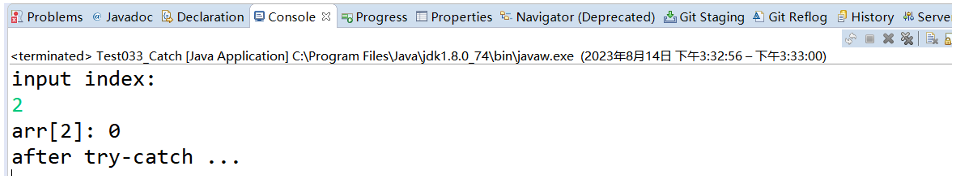

<!--
 * @Description: 
 * @Author: FallCicada
 * @Date: 2024-10-08 17:29:46
 * @LastEditors: FallCicada
 * @LastEditTime: 2024-10-10 20:19:56
-->

# 2024年秋季Java基础课用笔记

# 异常

## 异常

### 概述

程序在运行过程中，由于意外情况导致程序发生异常事件，默认情况下发生的异常会中断程序的运行。

在Java中，把常见的异常情况，都抽象成了对应的异常类型，那么每种异常类型都代表了一种特定的异常情况。

当程序中出现一种异常情况时，也会创建并抛出一个异常类型对象，这个对象就表示当前程序所出现的问题。

如图:

例如，程序中有一种异常情况是，当前使用下标从数组中取值的时候，这个下标值超过了数组下标的最大值，那么程序中就出现了异常情况，java中把这种异常情况抽象成了一个类：`java.lang.ArrayIndexOutOfBoundsException` ，将来这个类的对象，就表示程序中出现了数组下标超过边界的异常情况。

案例描述：

观察下面的情况。

```java
    //如何理解异常：
    //  程序不正常情况，统称为 异常
    public class Test011_Basic {
        public static void main(String[] args) {
            // ArithmeticException
            int a = 10 / 0;
            String s = "123";
            //: NumberFormatException
            int n = Integer.parseInt(s);
            Object obj = new Object();//new String("hello");
            //类型转换异常：ClassCastException
            s = (String)obj;
            int[] arr = {1,2,3,4};
            arr = null;
            //空指针异常：NullPointerException
            System.out.println(arr[0]);
            //数组索引越界 ArrayIndexOutOfBoundsException
            System.out.println(arr[4]); 
        }
    }
    //运行结果：
    Exception in thread "main" java.lang.ArithmeticException: / by zero
    at com.briup.chap09.Test011_Basic.main(Test01_Basic.java:9)
```

> 可以看出，当前程序出现异常情况时，会创建并抛出和该异常情况对应的异常类的对象，这个异常对象中保存了一些信息，用来表示当前程序到底发生了什么异常情况。
>
> 通过异常信息，我们可以定位异常发生的位置，以及异常发生的原因

### 异常体系

异常体系中的根类是：`java.lang.Throwable` ，该类下面有俩个子类型，`java.lang.Error` 和 `java.lang.Exception`

注意，`Throwable` 表示可以被抛出的

* `Error`，表示错误情况，一般是程序中出现了比较严重的问题，并且程序自身并无法进行处理。
* `Exception`，表示异常情况，程序中出了这种异常，大多是可以通过特定的方式进行处理和纠正的，并且处理完了之后，程序还可以继续往下正常运行。
  

> 注意，我们一般说的异常，都是指的Exception

### 异常种类

我们平时使用的异常类型，都是 `Exception` 类的子类型，它们把异常划分成了两种：

* 编译时异常
* 运行时异常

#### 编译时异常

* 继承自 `Exception` 类，也称为checked exception
* 编译器在编译期间，会主动检查这种异常，如果发现异常则必须显示处理，否则程序就会发生错误，无法通过编译,无法生成字节码文件

#### 运行时异常

* `RuntimeException` 类及其子类，也称为unchecked exception
* 编译器在编译期间，不会检查这种异常，也不要求我们去处理，但是在运行期间，如果出现这种异常则自动抛出
  

### 异常传播

如果一个方法中出现了异常的情况，系统默认的处理方式是：自动创建异常对象，并将这个异常对象抛给当前方法的调用者，并一直向上抛出，最终传递给JVM，JVM默认处理步骤有2步：

* 把异常的名称，错误原因及异常出现的位置等信息输出在了控制台
* 程序停止执行

案例：

```java
  
    public class Test02_Default {
        public static void main(String[] args) {
        System.out.println("hello");
            test1();
            System.out.println("world");
        }
  
        public static void test1(){
            test2();
        }
  
        public static void test2(){
            test3();
        }
  
        public static void test3(){
            //下面代码会抛出异常
            int a = 1/0;
        }
    }
```

运行结果：


**代码执行步骤解析：**

* 因为 `java.lang.ArithmeticException`是运行时异常，所以代码可以编译通过
* 程序运行时，先输出"hello"，然后一层一层调用，最终执行test3方法
* 行test3方法时，出现除数为0的情况，系统自动抛出异常 `java.lang.ArithmeticException`
* 码中没有对异常进行任何捕获处理，所以该异常往上传递给test2 --> test1 --> main --> JVM
* JVM虚拟机拿到异常后，输出异常相关信息，然后终止程序

## 异常抛出

### 自动抛出

Java代码中，出现了提前指定好的异常情况的时候，代码会自动创建异常对象，并且将该异常对象抛出。

例如，上述案例中执行 `int a = 1/0;` 的时候，代码会自动创建并抛出 `ArithmeticException` 类型的异常对象，来表示当前的这种异常情况。（算术异常）

又如，代码中执行 `String str = null; str.toString();` 的时候，代码会自动创建并抛出 `NullPointerException` 类型的异常对象，来表示当前这种异常情况。（空指针异常）

### 手动抛出

以上描述的异常情况，都是JVM中提前规定好的，我们不需要干预，JVM内部自己就会创建并抛出异常对象。

但是在其他的一些情况下，我们也可以手动的创建并抛出异常对象，抛出后系统也会按照默认的方式去处理。

#### **手动抛出异常固定格式：**

`throw 异常对象;`

#### 案例展示：

从键盘录入用户名和密码，如果不是"root"和"briup"，则主动抛出异常RuntimeException。

```java
    import java.util.Scanner;
    //手动抛出异常对象
    public class Test02_Throw {
        public static void main(String[] args) {
        Scanner sc = new Scanner(System.in);
        System.out.println("please input username and password: ");
        String username = sc.nextLine();
        String password = sc.nextLine();
            login(username,password);
        }
        public static void login(String name, String passwd) {
            if("root".equals(name) && "briup".equals(passwd)) {
                System.out.println("登录成功!");
            }else {
                //抛出运行时异常
                throw new RuntimeException("用户名或密码录入有误")String username = sc.nextLine();
                String password = sc.nextLine();
                login(username,password);
        }
        public static void login(String name, String passwd) {
            if("root".equals(name) && "briup".equals(passwd)) {
                System.out.println("登录成功!");
            }else {
                //抛出运行时异常
                throw new RuntimeException("用户名或密码录入有误");
            }
        }
    }
```

运行结果：

注意，此时方法中抛出的是一个运行时异常，编译器不会做出检查，所以代码可以正常的编译运行，但是运行的时候，如果用户名密码匹配失败，则抛出异常。

如果抛出的是编译时异常，则编译器会检查，代码无法通过编译，具体如下：


如果要解决上述编译问题，需要程序员修改代码，有2种方式解决：

* 声明当前方法不对该异常处理，继续抛出异常，给上一级处理
* 主动捕获异常并处理
  具体内容下一章节讲解。

## 异常处理

代码中出现了异常，除了默认的处理方式外，我们还可以手动处理异常:

* 声明继续抛出异常，借助throws关键字实现
* 捕获并处理异常，借助try、catch、finally关键字实现

### thorws

throws关键字用于在方法声明中指定该方法可能抛出的异常类型。

这个声明的目的，就是告诉方法的调用者，你调用我的这个方法的时候要小心啦，方法在运行的时候**可能**会抛出指定类型的异常。

#### 定义格式

```java
    [修饰符] 返回值类型 方法名(形参列表) throws 异常类名1,异常类名2... {
        方法体语句;
    }
```

#### 案例展示：

使用throws关键字解决上述案例中编译报错的问题。

分析上述代码可知，login方法中虽然存在编译时异常，但程序员借助throws关键字告诉编译器，login方法中如果出现Exception异常则主动抛出，传递给上一级，所以login方法可以通过编译。

> main方法中第13行之所以编译出错，是因为第13行可能会出现编译时异常，程序员必须主动处理该异常才可以：要么继续throws抛出，要么主动捕获处理（后续课程讲解）。

main方法借助throws声明抛出Exception解决异常：

**运行结果：**


#### 常见面试题：throw和throws关键字区别

`throw` 关键字：

* `throw` 关键字用于手动抛出一个异常对象。它通常用在方法体内，用于在程序的任意位置抛出一个异常
* 使用throw 关键字，可以将异常对象抛出到方法的调用者，然后由调用者处理该异常
* throw 关键字后面必须跟一个异常对象，该对象可以是Java内置的异常类，也可以是自定义的异常类的实例

`throws` 关键字：

* `throws` 关键字用于在方法签名中声明可能抛出的异常。它通常用于方法定义的位置，用于指示该方法有可能抛出指定的异常
* 使用throws 关键字，可以将异常的处理责任交给方法的调用者，即告诉调用者该方法可能会抛出指定的异常，调用者需要进行相应的异常处理。
* throws 关键字后面跟的是一个异常类或多个异常类，使用逗号分隔

> 简而言之，`throw` 关键字用于手动抛出异常，而 `throws`关键字用于声明方法可能抛出的异常。
>
> `throw`关键字将异常抛给方法的调用者，而 `throws`关键字将异常的处理责任交给方法的调用者。

### 异常方法

`Exception`中并没有定义方法，它的方法都是从Throwable 中继承过来的，器中常用的方式有：

* `printStackTrace()` ，打印输出当前发送异常的详细信息（重要）
* `getMessage()` ，返回异常对象被抛出的时候，所携带的信息，一般是异常的发生原因（重要)
* `printStackTrace(PrintWriter s)`，方法重载，可以指定字符输出流，对异常信息进行输出
* `printStackTrace(PrintStream s)`，方法重载，可以指定字节输出流，对异常信息进行输出

下一个知识点，异常捕获中，我们就会用到这几个方法。

### try...catch

`try-catch` 语句块，就是用来对指定代码，进行异常捕获处理，并且处理完成后，JVM不会停止运行，代码还可以正常的往下运行！

#### **捕获异常语法：**

```java
    try {
        可能会出现异常的代码;
    }catch(异常类型 引用名) {
        //处理异常的代码，可以是简单的输出异常信息
        //也可以使用日志进行了记录，也可以对数据进行修改纠正等操作
    
        //一般输出异常信息
        //e.printStackTrace();
    }
```

> try：该代码块中包含可能产生异常的代码
>
> catch：用来进行某种类型异常的捕获，并对捕获到的异常进行处理

#### **执行流程：**

* 程序从 try 里面的代码开始执行
* 出现异常，就会跳转到对应的 `catch`块 里面去执行
* 执行完毕之后，程序出 `catch`块，继续往下执行

#### 案例展示：

准备一个数组，从键盘录入1个索引值，输出数组在该位置上的值。

```java
    import java.util.Scanner;
 
    public class Test033_Catch {
        public static void main(String[] args) {
            Scanner sc = new Scanner(System.in);
  
            int[] arr = {3,1,0,4,6,5};
        
            try {
                System.out.println("input index: ");
                int index = sc.nextInt();
            
                int num = arr[index];
                System.out.println("arr["+index+"]: " + num);
            }catch(IndexOutOfBoundsException e) {
                System.out.println("in catch, catch异常成功...");
                e.printStackTrace();
                //测试异常类中其他几个方法
                //System.out.println(e.getMessage());
                //System.out.println(e.toString());
            }
        
            System.out.println("after try-catch ...");
        }
    }
```

运行正常效果：


运行异常效果：

观察上述输出可知，捕获异常成功，成功执行catch块中代码。

> 注意：try-catch语句处理过异常后，代码会继续往下执行，所以输出了"after try-catch ..."

上述案例中，键盘录入的如果不是整形数，而是字符串、字符或浮点数，运行效果如下：

未能捕获到对应的异常

> 原因：try-catch语句只能捕获到自己定义的异常，不能捕获到其他异常，比如：`NumberFormatException`。


### 捕获多种异常

如果try语句块中的代码可能抛出多种异常，并且是不同类型的，则可以写多个catch语句块，用来同时捕获多种类型异常。

#### **格式1：**

```java
    try {
    可能会出现异常的代码;
    }catch(异常类型1 引用名) {
        //处理异常的代码，可以是简单的输出异常信息
    }catch(异常类型2 引用名) {
        //异常处理代码
    }...{
        //异常处理代码
    }catch(异常类型n 引用名) {
        //异常处理代码
    }
```

案例展示：

上述案例优化，使可以捕获 `java.util.InputMismatchException`异常。

```java
    import java.util.InputMismatchException;
    import java.util.Scanner;
 
    public class Test034_Catchs {
        public static void main(String[] args) {
            Scanner sc = new Scanner(System.in);
  
            int[] arr = {3,1,0,4,6,5};
        
            try {
                System.out.println("input index: ");
                int index = sc.nextInt();
            
                int num = arr[index];
                System.out.println("arr["+index+"]: " + num);
            }catch(IndexOutOfBoundsException e) {
                System.out.println("in catch, 捕获数组越界异常成功...");
                e.printStackTrace();
            }catch(InputMismatchException e) {
                System.out.println("in catch, 捕获键盘录入格式有误异常成功...");
                e.printStackTrace();
            }
        
            System.out.println("after try-catch ...");
        }
    }
```

运行效果1：成功捕获数组越界异常

运行效果2：成功捕获输入不匹配异常

注意事项：

> 这种异常处理方式，要求多个catch中的异常不能相同
>
> 如果catch中的多个异常类之间有子父类关系的话，那么子类异常必须写在父类异常上面的catch块中，父类异常必须写在下面的catch块中。
>
> 因为如果父类型异常再最上面的话，下面catch语句代码，永远不会被执行。


#### **格式2：**

相对格式1，书写更加紧凑

```java
    try {
        可能会出现异常的代码;
    }catch(异常类型1|异常类型2|...|异常类型n 引用名) {
        //处理异常的代码，可以是简单的输出异常信息
    }  
```

#### 案例展示：

使用格式2对上述案例进行改造。

```java
    import java.util.InputMismatchException;
    import java.util.Scanner;
    public class Test034_Catchs {
        public static void main(String[] args) {
            Scanner sc = new Scanner(System.in);
            int[] arr = {3,1,0,4,6,5};
            try {
                System.out.println("input index: ");
                int index = sc.nextInt();
                int num = arr[index];
                System.out.println("arr["+index+"]: " + num);
            }catch(IndexOutOfBoundsException | InputMismatchException  e) {
                if(e instanceof IndexOutOfBoundsException) {
                    System.out.println("in catch, 捕获数组越界异常成功...");
                }else if(e instanceof InputMismatchException) {
                    System.out.println("in catch, 捕获键盘录入格式有误异常成功...");
                }
                e.printStackTrace();
            }
            System.out.println("after try-catch ...");
        }
    }
```

运行效果如上，略...

#### **结论**

> 实际开发中，异常的处理不会过于复杂，一般catch块中捕获Exception即可。因为Exception是最大的异常类型，由于多态的原因，Exception类型的引用e，可以捕获接收到任意类型的异常对象。

案例展示:

```java
    public class Test034_Catchs {
        public static void main(String[] args) {
            Scanner sc = new Scanner(System.in);
            int[] arr = {3,1,0,4,6,5};
        
            try {
                System.out.println("input index: ");
                int index = sc.nextInt();
            
                int num = arr[index];
                System.out.println("arr["+index+"]: " + num);
            }catch(Exception e) {
                e.printStackTrace();
            }
            System.out.println("after try-catch ...");
        }
    }
```

### finally语句

`finally` 关键字可以和 `try、catch`关键字一起使用，固定搭配为：`try - catch - finally` ，它可以保证指定 `finally`中的代码一定会执行，无论是否发生异常！

固定格式：

```
     try {
        可能出现异常的代码
    }catch(异常类型 引用名) {
        异常捕获后操作代码
    }finally {
        离开try或catch块前，必须要执行的代码
    }
```

`finally` 块的主要作用：

资源释放：在 `try` 块中打开的资源（例如文件、数据库连接、网络连接等）可以在 `finally `块中关闭或释放，以确保资源的正确释放，即使在发生异常的情况下也能够执行释放操作。

清理操作：`finally` 块可以用于执行一些清理操作，例如关闭打开的流、释放锁、取消注册监听器等。

异常处理的补充：`finally`块可以用于在 `try`块和 `catch`块之后执行一些必要的操作，例如记录日志、发送通知等。

示例代码：

运行下面程序，观察产生异常时、不产生异常时，finally代码块执行效果。

```java
    public class Test035_Finally {
        public static void main(String[] args) {
            Scanner sc = new Scanner(System.in);
        
            try {
                System.out.println("请录入两个整数：");
                int a = sc.nextInt();
                int b = sc.nextInt();
                int n = a / b;
                System.out.println("n: " + n);
            }catch(Exception e) {
                e.printStackTrace();
                System.out.println("即将离开catch块 ...");
            }finally {
                //无论try块中是否发生异常，finally块中的代码都会被执行
                System.out.println("in finally 代码块 ...");
            }
        
            System.out.println("after try-catch-finally ...");
        }
    }
```

正常运行:

异常执行：


#### 常见面试题：

观察下面代码，说明第7行输出的r为什么？

```java
    public class Test036_Question {
        public static void main(String[] args) {
            int r = getNum(10,0);
        
            System.out.println("r: " + r);
        }
        public static int getNum(int a, int b) {
            int n = 0;
            try {
            n = a / b;
            }catch(Exception e) {
                e.printStackTrace();
                n = 20;
                //先建立返回通道，放入 n当前的值 20，在最终返回前，再去调用finally
                return n;
            }finally {
                //System.out.println("in finally, n: " + n);    
    //20        
                n = 30;
                //System.out.println("in finally,最后 n: " + n);
    //30        
            }
            return n
        }
      
    }
  
```

#### 答:

这段 Java 代码中有一个 `getNum` 方法，该方法尝试将两个整数相除，并处理可能发生的除以零异常。在第7行，实际上看到的是 `main` 方法中输出的结果 `r`。要理解为什么 `r` 是某个特定值，需要分析 `getNum` 方法的行为。

在 `getNum` 方法中，如果 `b` 为零，那么执行 `a / b` 将会抛出一个 `ArithmeticException`。在这个例子中，因为传递给 `getNum` 方法的参数是 `10` 和 `0`，所以确实会抛出异常，然后控制转移到了 `catch` 块。

在 `catch` 块内，异常被捕获，并且变量 `n` 被设置为 `20`。然后通过 `return n;` 返回这个值。注意，在 `return` 语句之前有一个 `finally` 块。在 `finally` 块中，`n` 的值被修改成了 `30`，但是这个改变不会影响已经决定要返回的值。一旦 `return` 语句被执行，即将返回的值就已经确定了，之后的任何对这个变量的操作都不会影响到这个返回值。

因此，尽管在 `finally` 块中 `n` 的值被改为了 `30`，但是由于 `return n;` 在 `catch` 块中已经执行，并且此时 `n` 的值为 `20`，因此返回给 `main` 方法中的 `r` 的值将是 `20`。

综上所述，第7行输出的 `r` 应该是 `20`。

### 基础概念理解

示例:

```java
    package chapter06;
    public class Java02_Exception {
        public static void main(String[] args) {

            // TODO 异常
            /*

            异常处理语法

            TODO try : 尝试
            TODO catch : 捕获
                        捕捉多个异常的时候，需要先捕捉范围小的异常，然后再捕捉范围大的异常
            TODO finally :  最终  无论是否出现异常，都会执行
            try{
                可能会出现异常的代码
                如果出现异常，那么JVM会将一场进行封装，形成一个异常类，然后这个异常抛出
                所有异常对象都可以抛出
            } catch ( 抛出的一场对象 对象引用 ) {
                异常的解决方案
            } catch () {

            } finally {
                最终执行的代码逻辑
            }
            */
            int i = 0 ;
            int j = 0 ;
            try {
                i = 10 ;
                j = 10 / i;
            } catch (Exception e){
                e.getMessage() ; //错误的消息
                e.getCause();
                e.printStackTrace();
                System.out.println("除数不能为0");
            } finally {
                System.out.println("最终执行的代码");
            }
            System.out.println(j);
        }

    }
```

## 作業

### 1°

```java
public class ReturnExceptionDemo  {
    public static void methodA() throws Exception {
        try {
            System.out.println("进入方法A");
            throw new Exception("制造异常");
        } finally {
            System.out.println("用A方法的finally");
        }
    }
    public static int methodB() {
        try {
            System.out.println("进入方法B");
            return 1;
        } finally {
            System.out.println("用B方法的finally");
            return 2;
        }
    }
    public static void main(String[] args) {
        try {
            methodA();
        } catch (Exception e) {
            System.out.println(e.getMessage());
        }
            int i = methodB();
            System.out.println(i);
    }
}
```

这段 Java 代码包含两个方法：`methodA` 和 `methodB`，以及 `main` 方法来调用它们。

#### methodA

```java
public static void methodA() throws Exception {
    try {
        System.out.println("进入方法A");
        throw new Exception("制造异常");
    } finally {
        System.out.println("用A方法的finally");
    }
}
```

1. **进入方法A**：这行代码会在方法开始时打印出来。
2. **制造异常**：这行代码会立即抛出一个 `Exception`，导致 `try` 块内的后续代码不再执行。
3. **用A方法的finally**：不论是否发生异常，这行代码都会执行（假设没有更严重的异常导致 JVM 终止）。

#### methodB

```java
public static int methodB() {
    try {
        System.out.println("进入方法B");
        return 1;
    } finally {
        System.out.println("用B方法的finally");
        return 2;
    }
}
```

1. **进入方法B**：这行代码会在方法开始时打印出来。
2. **返回1**：这行代码会返回 `1`，但在 `return` 之前会执行 `finally` 块。
3. **用B方法的finally**：这行代码会执行，同时 `finally` 块内的 `return 2;` 会覆盖前面 `return 1;` 的效果，最终返回值为 `2`。

#### main 方法

```java
public static void main(String[] args) {
    try {
        methodA();
    } catch (Exception e) {
        System.out.println(e.getMessage());
    }
    int i = methodB();
    System.out.println(i);
}
```

1. **methodA()**：调用 `methodA`，它会抛出异常并被 `catch` 捕获。
2. **e.getMessage()**：打印出异常的消息。
3. **methodB()**：调用 `methodB`，它会返回 `2`（如上分析）。
4. **i**：将 `methodB` 的返回值赋给 `i` 并打印出来。

#### 预期输出

根据上述分析，程序的预期输出是：

```
进入方法A
用A方法的finally
制造异常
进入方法B
用B方法的finally
2
```

### 2°

```java
public class Return1 {
    public static void main(String[] args) {
        int i = new Return1().testReturn1();
        System.out.println(i);
    }
    
    private int testReturn1() {
        int i = 1;
        try {
            i++;
            System.out.println("try:" + i);
            return i;
        } 
        finally {
            i++;
            System.out.println("finally:" + i);
        }
    }
}
```

这段 Java 代码定义了一个名为 `Return1` 的类，其中包含一个 `main` 方法和一个 `testReturn1` 方法。

#### main 方法

```java
public static void main(String[] args) {
    int i = new Return1().testReturn1();
    System.out.println(i);
}
```

1. 创建一个新的 `Return1` 类实例。
2. 调用 `testReturn1()` 方法，将返回值存储在变量 `i` 中。
3. 打印变量 `i` 的值。

#### testReturn1 方法

```java
private int testReturn1() {
    int i = 1;
    try {
        i++;
        System.out.println("try:" + i);
        return i;
    } 
    finally {
        i++;
        System.out.println("finally:" + i);
    }
}
```

这个方法首先初始化一个局部变量 `i` 为 `1`，然后进入 `try` 块：

1. **i++**：将 `i` 的值增加到 `2`。
2. **System.out.println("try:" + i)**：打印 `"try:2"`。
3. **return i**：准备返回 `i` 的值，但是在返回之前，会执行 `finally` 块中的代码。

在 `finally` 块中：

1. **i++**：再次将 `i` 的值增加，现在 `i` 变为 `3`。
2. **System.out.println("finally:" + i)**：打印 `"finally:3"`。

虽然在 `finally` 块中改变了 `i` 的值，但是 `return` 语句已经决定了要返回的值。当从 `try` 块返回时，`return` 语句指定的值不会受到 `finally` 块中对 `i` 的修改的影响。因此，最终返回的值仍然是 `try` 块中 `return` 语句指定的值，即 `2`。

#### 预期输出

根据上述分析，程序的预期输出应该是：

```
try:2
finally:3
2
```

这是因为：

- `try` 块中的 `System.out.println("try:" + i)` 会输出 `"try:2"`。
- `finally` 块中的 `System.out.println("finally:" + i)` 会输出 `"finally:3"`。
- 最终返回并打印的 `i` 的值是 `2`，而不是 `finally` 块中修改后的 `3`。

### 3°

```java
import java.util.ArrayList;
import java.util.List;
public class Return2 {
    public static void main(String[] args) {
        System.out.println(testTest03());
        }
        private static List<Integer> testTest03() {
            List<Integer> list = new ArrayList<>();
        try {
            list.add(1);
            System.out.println("try:" +list);
            return list;
        } finally {
            list.add(3);
            System.out.println("finally:" +list);
        }
    }
}
```

这段 Java 代码创建了一个名为 `Return2` 的类，其中包含一个 `main` 方法用于启动程序，以及一个静态方法 `testTest03` 用于测试返回一个 `List<Integer>`。

让我们逐步分析这段代码：

#### main 方法

```java
public static void main(String[] args) {
    System.out.println(testTest03());
}
```

1. 调用 `testTest03()` 方法。
2. 打印 `testTest03()` 方法的返回值。

#### testTest03 方法

```java
private static List<Integer> testTest03() {
    List<Integer> list = new ArrayList<>();
    try {
        list.add(1);
        System.out.println("try:" + list);
        return list;
    } finally {
        list.add(3);
        System.out.println("finally:" + list);
    }
}
```

这个方法首先创建了一个新的 `ArrayList<Integer>` 实例 `list`，然后进入 `try` 块：

1. **list.add(1)**：向 `list` 中添加元素 `1`，此时 `list` 包含 `[1]`。
2. **System.out.println("try:" + list)**：打印 `"try:[1]"`。
3. **return list**：准备返回 `list`，但是在返回之前会执行 `finally` 块中的代码。

在 `finally` 块中：

1. **list.add(3)**：向 `list` 中添加元素 `3`，此时 `list` 包含 `[1, 3]`。
2. **System.out.println("finally:" + list)**：打印 `"finally:[1, 3]"`。

由于 `list` 是一个对象引用，当 `testTest03` 方法返回 `list` 时，返回的是指向同一个 `ArrayList` 对象的引用。这意味着即使在 `finally` 块中修改了 `list`，返回的 `list` 也会反映这些修改。

#### 预期输出

根据上述分析，程序的预期输出应该是：

```
try:[1]
finally:[1, 3]
[1, 3]
```

具体步骤如下：

1. `try` 块执行后，输出 `"try:[1]"`。
2. `finally` 块执行后，输出 `"finally:[1, 3]"`。
3. `main` 方法中打印 `testTest03()` 的返回值，即 `[1, 3]`。

这个顺序表明了 `finally` 块在 `return` 语句执行之后被调用，但是list是引用型变量,数据存储在堆中,return时list为[1],但是在方法运行结束后return时,他引用的地址所指引的堆内存已经变成了[1,3],所以最终返回的是[1,2].

### 4°

```java
public class Return3 {
    public static void main(String[] args) {
        System.out.println(testTest04());
        }
        private static String testTest04() {
        String a = "hello";
        try {
        a += "!";
        System.out.println("try:" + a);
        return a;
        } finally {
        a += "world";
        System.out.println("finally:" +a);
        }
    }
}
```

这段 Java 代码定义了一个名为 `Return3` 的类，其中包含一个 `main` 方法用于启动程序，以及一个静态方法 `testTest04` 用于处理字符串并返回结果。

让我们逐步分析这段代码：

#### main 方法

```java
public static void main(String[] args) {
    System.out.println(testTest04());
}
```

1. 调用 `testTest04()` 方法。
2. 打印 `testTest04()` 方法的返回值。

#### testTest04 方法

```java
private static String testTest04() {
    String a = "hello";
    try {
        a += "!"; // a 现在等于 "hello!"
        System.out.println("try:" + a); // 输出 "try:hello!"
        return a; // 准备返回 a 的值，在返回之前会执行 finally 块
    } finally {
        a += "world"; // a 现在等于 "hello!world"
        System.out.println("finally:" + a); // 输出 "finally:hello!world"
    }
}
```

这个方法首先初始化一个字符串变量 `a` 为 `"hello"`，然后进入 `try` 块：

1. **a += "!"**：将字符串 `"!"` 追加到 `a` 的末尾，使 `a` 变为 `"hello!"`。
2. **System.out.println("try:" + a)**：打印 `"try:hello!"`。
3. **return a**：准备返回 `a` 的值，但是在返回之前会执行 `finally` 块中的代码。

在 `finally` 块中：

1. **a += "world"**：将字符串 `"world"` 追加到 `a` 的末尾，使 `a` 变为 `"hello!world"`。
2. **System.out.println("finally:" + a)**：打印 `"finally:hello!world"`。

由于 `a` 是一个基本类型的包装类型（即 `String`），它是不可变的对象。这意味着在 `finally` 块中对 `a` 的修改实际上是创建了一个新的字符串对象，并让 `a` 引用这个新对象。

然而，`return` 语句已经决定了要返回的值是在 `try` 块中构造的那个字符串，即 `"hello!"`。因此，尽管在 `finally` 块中修改了 `a` 的值，但是 `return` 语句已经确定了返回值，所以 `finally` 块中的修改不会影响返回值。

#### 预期输出

根据上述分析，程序的预期输出应该是：

```
try:hello!
finally:hello!world
hello!
```

具体步骤如下：

1. `try` 块执行后，输出 `"try:hello!"`。
2. `finally` 块执行后，输出 `"finally:hello!world"`。
3. `main` 方法中打印 `testTest04()` 的返回值，即 `"hello!"`。

这表明虽然在 `finally` 块中改变了 `a` 的值，但是 `return` 语句已经决定了返回的字符串值为 `"hello!"`。

## 自定义异常
### 应用场景
JavaAPI中已经存在的异常类，都是当年sun公司，提前定义好的，它们分别表示着某一种已知的异常情况。

但是，在我们开发的系统中，大多数业务功能里面总会出现一些新的异常情况，而这些异常情况，当年sun公司定义异常类型的时候，肯定是想不到的.

例如，在学生信息管理系统中，学生的年龄设置为负数、学生的成绩大于了100分，用户登录时候的密码不正确、用户访问某些接口时候的权限不足等情况，在系统中都是异常情况，而这些异常类型在JavaAPI中都是没有的。

所以，在实际开发中，我们会自定义一些异常的类型，用来表示上面描述的那些异常情况，这样做的好处就是，我们通过观察系统的运行日志，就可以很快的知道当前系统是发生了什么事情，才导致出了这些异常情况

### 自定义异常
* 如果要自定义一个编译时异常类型，就自定义一个类，并继承 `Exception`
* 如果要自定义一个运行时异常类型，就自定义一个类，并继承 `RuntimeException`

定义步骤：

1. 定义异常类
2. 写继承关系
3. 提供空参构造
4. 提供带参构造

例如，自定义编译时异常类型，通过名字可知，这是在用户登录期间发生异常时，应该创建并抛出的异常类型
```java
    public class LoginExceptin extends Exception{
        public LoginExceptin() {
        
        }
        public LoginExceptin(String message) {
            super(message);
        }
    }
```

#### 代码案例：
准备一个Student学生类，包含数据成员age，其取值范围为[4,79]，如果setAge时参数取值不在该范围中，则抛出自定义运行时异常类型`AgeOutRangeException` 对象。
```java
    class Student {
        private String name;
        private int age;
        public String getName() {
            return name;
        }
        public void setName(String name) {
            this.name = name;
        }
        public int getAge() {
            return age;
        }
        public void setAge(int age) {
        //设置age取值范围[4,79]
            if(age < 3 || age > 80) {
                //System.out.println("年龄不在有效范围");
                //程序员 主动抛出异常：
                //  throw 异常对象;
                throw new AgeOutRangeException("年龄不在有效范围");
                //return;
            } 
            this.age = age;
        }
    
        @Override
        public String toString() {
            return "Student [name=" + name + ", age=" + age + "]";
        }
    }
 
    //自定义异常，属于运行时异常，年龄不在有效范围异常
    class AgeOutRangeException extends RuntimeException {
        public AgeOutRangeException() {}
        
        public AgeOutRangeException(String message) {
            super(message);
        }
    }
    
    public class Test04_AgeException {
        public static void main(String[] args) {
            Student s1 = new Student();
            s1.setName("zs");
            s1.setAge(21);
            System.out.println(s1);
            
            System.out.println("--------------");
            Student s2 = new Student();
            try {
                s2.setName("tom");
                s2.setAge(221);
            }catch(AgeOutRangeException e) {
                e.printStackTrace();
            }
            System.out.println(s2);
        }
    }
```
运行效果：


## 断言

断言（`assert`），是JDK1.4的时候，增加的一个关键字。用它可以在程序中，确认一些关键性条件必须是成立的，否则会抛出`AssertionError` 类型的错误。（**了解即可**）

注意，断言（`assert` ）并不是用来代替`if` 判断的，而是确认系统中的一些**关键性条件是必须成立**的，所以`assert` 和`if` 并不冲突，并且还可以通过给JVM传参数，来控制断言（`assert` ）是否生效。

断言（assert）的使用方式：

```java
    assert 布尔表达式;
    //或者
    assert 布尔表达式 : "错误信息";
```

>当布尔表达式为true时，断言通过，否则抛出AssertionError类型错误
>
>所以，assert后面的布尔表达式必须true才行。（也就是说条件必须成立）

案例展示：
```java
    public class Test05_Assert {
        public static void main(String[] args) {
            test(0);
        }
        
        public static void test(int a) {
            assert a!=0 : "参数a的值不能为0";
            
            int b = 10;
            int c = b/a;
            
            System.out.println(c);  
        }
    }
```
运行效果：

发现断言没有生效

**原因分析：**

默认情况下，JVM没有开启断言功能，需要通过给JVM传参打开此项功能需要使用 `-enableassertions` 或者 `-ea` JVM参数例如，`java -ea com.briup.demo.Test`

使用ecpilse或sts运行时:


此时的运行结果为：因为断言要求参数a不能为0，但实际参数传的为0


>如果去掉-ea参数的话，那么断言（assert）语句，在JVM执行代码的时候，会被直接忽略的