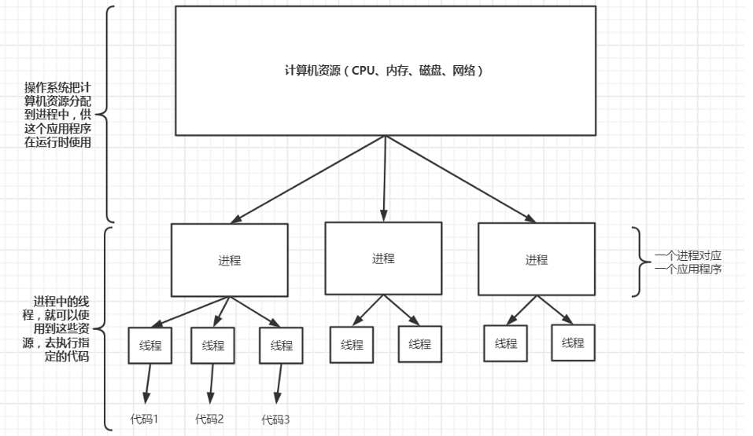
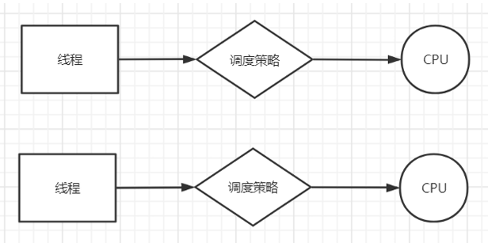
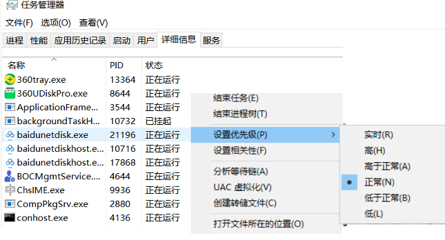
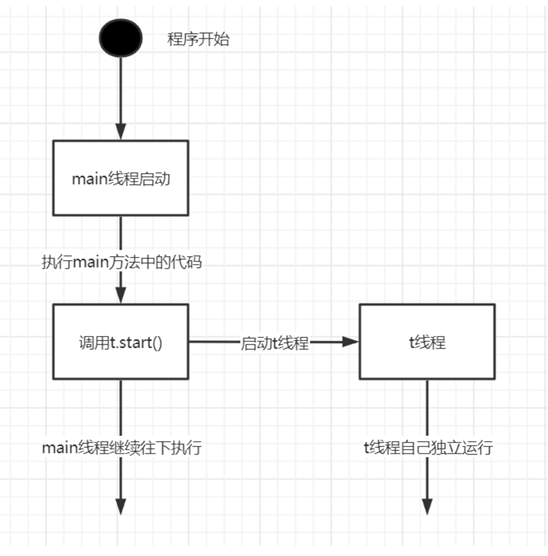
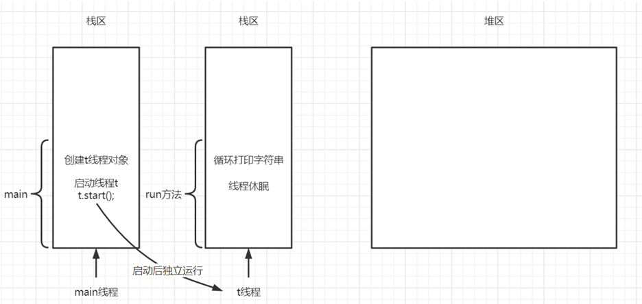
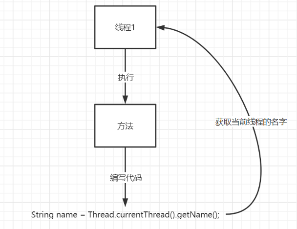
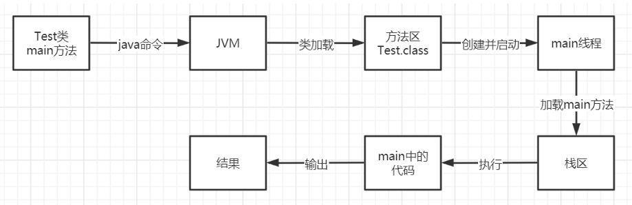

<!--
 * @Description: 
 * @Author: FallCicada
 * @Date: 2024-10-10 11:06:30
 * @LastEditors: FallCicada
 * @LastEditTime: 2024-10-11 11:32:43
 * @: 無限進步
-->

# 多线程

## 进程线程

### 进程

进程指一个内存中运行的应用程序，它是系统运行程序的基本单位。

一个程序从创建、运行到消亡，这样整个过程就是一个进程。

一个操作系统中可以同时运行多个进程，每个进程运行时，系统都会为其分配独立的内存空间。

在操作系统中，启动一个应用程序的时候，会有一个或多个进程同时被创建，这些进程其实就表示了当前这个应用程序，在系统中的资源使用情况以及程序运行的情况。如果关闭这个进程，那么对应的应用程序也就关闭了。

### 线程

线程是进程中的一个执行单元，负责当前进程中程序的执行，一个进程中至少有一个线程，一个进程中也可以有多个线程，此时这个应用程序就可以称之为多线程程序。

`<font color=red>`**结论：一个程序运行后至少有一个进程，一个进程中可以包含一个(main线程)或多个线程！**`</font>`

当一个进程中启动了多个线程去分别执行代码（同时完成多个功能）的时候，这个程序就是多线程程序，内存等资源使用情况如下：


`<font color = red>`JVM是多线程的吗？`</font>`

是，JVM可以在运行程序的同时，进行GC垃圾回收，同一时刻做不同事情。案例:

```java
    public class Test01_JVM {
    public static void main(String[] args) throws 
        InterruptedException {
        for(int i = 1; i < 1000000; i++) 
            new Test(i);
            //main线程休眠3s
            Thread.sleep(3000);
            System.err.println("main end...");
        }
    }
    class Test {
        int n;
        public Test(int n) { 
            this.n = n;
        }
        //当GC进行垃圾回收指定对象的时候，对象的finalize方法会被自动调用
        @Override
        protected void finalize() throws Throwable {
            System.out.println("Test被销毁, n: " + n);
            super.finalize();
        }
    }
```

## 并发并行

* **并发**：指两个或多个事件在**同一个时间段内**发生

  线程的**并发**执行，是指在一个时间段内（微观），`<font color=red>`俩个或多个线程，使用同一个CPU交替运行。`</font>`


* 并行：指两个或多个事件在**同一时刻**发生（同时发生）

  线程的**并行**执行，是指在同一时刻，俩个或多个线程，`<font color = red>`各自使用一个CPU同时运行。`</font>`



> 如果计算机是单核CPU的话，那么同一时刻只能有一个线程使用CPU来执行代码
>
> 如果计算机是多核CPU的话，那么同一时刻有可能是俩个线程同时使用不同的CPU执行代码

`<font color=red>`注意：当前章节讨论的是并发多线程。`</font>`

**补充内容：**

> 如果我们的计算机是多核的，在程序中编写了俩个线程，然后启动并运行它们，计算机会用一个CPU运行还是两个CPU去运行，我们无法知道也无法控制，因为计算机内核中有专门的资源调度算法负责资源的分配，我们从应用程序的层面无法干涉。

## 线程调度

### 时间片

并发多线程只有一个CPU，某个微观时刻，当指定线程拥有CPU的使用权，则该线程代码就可以执行，而其他线程阻塞等待。

一个线程不可能一直拥有CPU的使用权，不可能一直执行下去，它拥有CPU执行的时间是很短的，微秒纳秒级别，这个时间段我们就称之为CPU时间片。

线程执行时如果一个时间片结束了，则该线程就会停止运行，并交出CPU的使用权，然后等待下一个CPU时间片的分配。

在宏观上，一段时间内，我们感觉俩个线程在同时运行代码，其实在微观中，这俩个线程在使用一个CPU的时候，它们是交替着运行的，每个线程每次都是运行一个很小的时间片，然后就交出CPU使用权，只是它们俩个交替运行的速度太快了，给我们的感觉，好像是它们俩个线程在同时运行。

<!DOCTYPE html>

<html lang="zh-cn">
<head>
    <meta charset="UTF-8">
    <meta name="viewport" content="width=device-width, initial-scale=1.0">
    <title>淡绿背景示例</title>
 
    <style>
        .light-green-background {
            background-color: #ccffcc; /* 设置背景颜色为淡绿色 */
        }
    </style>
</head>
<body>
    <p class="light-green-background">
        思考，生活中还有哪些是因为速度太快，从而通过我们的眼睛“欺骗”了我们的情况？
    </p>
</body>
</html>

#### 调度方式

当俩个或多个线程使用一个CPU来运行代码的时候，在操作系统的内核中，就会有相应的算法来控制线程获取CPU时间片的方式，从而使得这些线程可以按照某种顺序来使用CPU运行代码，这种情况被称为线程调度。常见线程调度有：

* 时间片轮转

  所有线程轮流使用 CPU 的使用权，平均分配每个线程占用 CPU 的时间。
* 抢占式调度

  系统会让优先级高的线程优先使用 CPU（提高抢占到的概率），但是如果线程的优先级相同，那么会随机选择一个线程获取当前CPU的时间片



> JVM中的线程，使用的为抢占式调度。

## 线程创建

`java.lang.Thread` 是java中的线程类，所有线程对象都必须是 `Thread`类或其子类的实例。

每个线程的作用，就是完成我们给它指定的任务，实际上就是执行一段我们指定的代码。我们只需要在 `Thread` 类的子类中重写 `run` 方法，完成相应的功能。

### 方法

| 方法名       | 说明                                        |
| ------------ | ------------------------------------------- |
| void run()   | 在线程开启后，此方法将被调用执行            |
| void start() | 使此线程开始执行，Java虚拟机会调用run方法() |
 
Java中通过继承Thread类来创建并启动一个新的线程的步骤如下：
 
* 定义`Thread` 类的子类，重写`run()` 方法，`run()` 方法中的代码就是线程的执行任务
* 创建`Thread` 子类对象（可以是匿名内部类对象），这个对象就代表一个要独立运行的新线程
* 调用线程对象的`start()` 方法来启动该线

### 案例
```java
    //1.子类继承父类Thread，并重写run方法（指定线程的执行任务）
    class MyThread extends Thread {
        //2.重写run方法
        @Override
        public void run() {
            for (int i = 0; i < 10; i++) {
                System.out.println("in run, hello thread");
                try {
                    //让当前执行代码的线程睡眠1000毫秒
                    Thread.sleep(1000);
                } catch (InterruptedException e) {
                    e.printStackTrace();
                }
            }
        }
    }
    public class Test04_Thread {
        public static void main(String[] args) throws Exception {
            //3.创建线程类对象
            Thread t = new MyThread();
            //4.调用start方法启动线程
            t.start();
            for (int i = 0; i < 10; i++) {
                System.out.println("in main, hello");
                //当前执行代码的线程睡眠500毫秒
                Thread.sleep(500);
            }
        }
    }
```
此过程中,main线程和t线程之间的关系时:



>可以看出，main线程在执行main方法的过程中，创建并启动了t线程，并且t线程启动后，和main线程就没有关系了，这时候main线程和t线程都是自己独立的运行，并且他们俩个是要争夺CUP的时间片（使用权）

**以上代码在内存中的情况：**



注意1，之前所提到的栈区，又被称为方法调用栈，是线程专门执行方法中代码的地方，并且每一个线程，都有自己独立的栈空间，和别的线程相互不影响

注意2，最先启动的线程是主线程（main线程），因为它要执行程序的入口main方法，在主线程中，创建并且启动了t线程，启动之后main线程和t线程将各自独立运行，并且争夺CPU的时间片

注意3，线程启动之后（调用start方法），会开始争夺CPU的时间片，然后自动执行run方法，如果子类对象重写了，那么就调用到重写后的run方法

注意4，堆区是对所有线程共享的，每个线程中如果创建了对象，那么对象就会存放到堆区中

注意5，线程对象t被创建出来的时候，它还只是一个普通的对象，但是当调用了t.start()方法之后，线程对象t可以说才真正的“现出原形”：开辟了单独的栈空间，供线程t调用方法使用

<!DOCTYPE html>

<html lang="zh-cn">
<head>
    <meta charset="UTF-8">
    <meta name="viewport" content="width=device-width, initial-scale=1.0">
    <title>淡绿背景示例</title>
    <style>
        .light-green-background {
            background-color: #ccffcc; /* 设置背景颜色为淡绿色 */
        }
    </style>
</head>
<body>
    <p class="light-green-background">
       思考，多线程比单线程的优势在哪里？我们一般会把什么样的代码交给多线程去执行处理？
    </p>
</body>
</html>

## 匿名内部类
使用匿名内部类的形式来创建子线程：
```java
    public class Test05_Thread {
        public static void main(String[] args) {
            Thread t1 = new Thread() {
                // 重写run方法
                @Override
                public void run() {
                    System.out.println("in thread1 run...");
                    
                    //每隔1s输出一次
                    for (int i = 0; i < 10; i++) {
                        System.out.println("thread1 run ");
                        
                        //思考：为什么异常不能抛出?
                        try {
                            Thread.sleep(1000);
                        } catch (InterruptedException e) {
                            e.printStackTrace();
                        }
                    }
                }
            };
        
            t1.start();
        }
    }
```
 实际开发中，这样的方式更常见，书写简洁，推荐使用。
 
## 线程名称
### 默认
不管是主线程，还是我们创建的子线程，都是有名字的。默认情况下，主线程的名字为`main` ，main线程中创建出的子线程，它们名字命名规则如下：
```java
//JavaAPI-Thread构造器源码
    public Thread() {
        init(null, null, "Thread-" + nextThreadNum(), 0);
    }
```
其中，`"Thread-" + nextThreadNum()` 就是在拼接出这个线程默认的名字，`比如第一个子线程Thread-0，第二个为Thread-1，第三个为Thread-2，以此类推.

### 获取当前对象

`public static native Thread currentThread();`

注意，这里说的当前线程，指的是<font color = red>执行当前方法的线程。</font>

### 获取线程名：

`public final String getName();`

### 常见用法：

`String name = Thread.currentThread().getName();`



### 案例:
```java
    public static void main(String[] args) {
        Thread thread = Thread.currentThread();
        System.out.println("当前线程对象: " + thread);

        String name = thread.getName();
        System.out.println("线程名称: " + name);

        Thread t = new Thread() {
            @Override
            public void run() {
                Thread th = Thread.currentThread();
                System.out.println("in run, 当前线程对象: " + th);
                System.out.println("in run, 当前线程名称：" + 
                th.getName());
            }
        };
        t.start();
        // 思考：下一行输出结果是什么？
        //t.run();
    }
    //运行结果为：
    当前线程对象: Thread[main,5,main]
    线程名称: main
    in run, 当前线程对象: Thread[Thread-0,5,main]
    in run, 当前线程名称：Thread-0
```
### 设置线程名：

* 通过线程对象设置线程名
  
    `public final synchronized void setName(String name);`
* 创建对象时，设置线程名

    `public Thread(String name);`

    `public Thread(Runnable target, String name)`
    
```java
    public static void main(String[] args) {
        Thread thread = Thread.currentThread();
        //第一种设置方式
        thread.setName("MAIN线程");
        System.out.println("线程名称: " + thread.getName());
        //第二种设置方式
        Thread t = new Thread("子线程t") {
            @Override
            public void run() {
                System.out.println("in run, 线程名称：" + Thread.currentThread().getName());
            }
        };
        t.start();
    }
```

## main线程
使用`Java`命令来运行一个类的时候，首先会启动JVM（进程），JVM会创建一个名字叫做`main` 的线程，来执行类中的程序入口（main方法）

### 案例
```java
    public static void main(String[] args) {
        //获取执行当前方法的线程对象
        Thread currentThread = Thread.currentThread();
        System.out.println("执行当前方法的线程名字为："+currentThread.getName());
    }
    //运行结果：
    执行当前方法的线程名字为：main
```
>所以，我们写在main方法中的代码，其实都是由名字叫做main的线程去执行的

上面代码使用`java` 命令运行的过程是：

1. 使用java命令运行Test类，会先启动JVM
2. 应用类加载器通过CLASSPATH环境变量配置的路径，找到Test.class文件，并加载到方法区。

    注意：这里会同时生产一个Class类型对象，来代表这个Test类型，并且会优先处理类中的静态代码（静态属性、静态方法、静态代码块）
3. JVM创建并启动一个名字叫做main的线程
4. main线程将Test中的main方法加载到栈区中
5. 在栈里面，main线程就可以一行行的执行方法中的代码了
6. 如果在执行代码中，遇到了方法调用，那么线程会继续把被调用的方法，加载到栈中（压栈操作），然后执行栈顶这个最新添加进来的方法，**栈顶**方法执行完，就释放（出栈操作），然后在进行执行当前最新的栈顶方法（之前我们画过栈里面的方法调用图，例如在异常的学习过程中）

7. 代码执行过程输出执行结果
8. 当前是单线程程序，main线程结束了，JVM就停止了
9.  如果是多线程程序，那么JVM要等所有线程都结束了才会停止

Runnable
Runnable接口是线程的第二种实现方式，它比Thread接口更灵活，因为Runnable接口没有start方法，所以Runnable接口不能直接启动线程，需要借助Thread类来完成。

第二种创建线程对象的方式：**借助`Runnable`接口的实现类完成**。

`java.lang.Runnable`，该接口中只有一个抽象方法`run`
```java
 //JavaAPI-Runnable接口源码
    public interface Runnable {
        public abstract void run();
    }
```

其实`Thread`类也是`Runnable` 接口的实现类，其代码结构大致为：
```java
    //JavaAPI-Thread类源码分析
    public class Thread implements Runnable {
        /* What will be run. */
        private Runnable target;
        public Thread() {
            //...
        }
        public Thread(Runnable target) {
            this.target = target;
            //..
        }
        @Override
        public void run() {
            if (target != null) {
                target.run();
            }
        }
    }
 ```
 

# 线程同步
Java中提供了线程同步的机制，来解决上述的线程安全问题。

Java中实现线程同步，主要借助`synchronized` 关键字实现。

### 线程同步方式：
* 同步代码块
* 同步方法
* 锁机机制

## 同步代码块
### 格式
```java
    //Object类及其子类对象都可以作为 线程同步锁对象 使用
    synchronized(mutex锁对象) {
        //需要同步操作的代码
        //...
    }
    //所有线程必须使用同一个锁对象
```
注意：
* 所有线程必须使用同一个锁对象
* 所有线程都必须要参与线程同步

### 案例：

#### 抢票
##### 抢票类
```java
/**
 * ITicketRunable
 */
    public class ITicketRunnable implements Runnable {
        // 总票数 50
        private int num = 50;
        //新建锁对象给同步代码块使用
        Object mutex = new Object();
        @Override
        public void run() {
            while (true) {
                synchronized (mutex) {
                    //TODO 同步代码块
                    // 1. 线程抢占资源，上锁
                    //  进入代码块执行
                    // 2. 其他线程抢不到资源，陷入阻塞状态
                    // 3. 第一步的线程执行结束，释放资源，解锁
                    // 4. 三个线程抢占资源，重新上锁 
                    //需要同步的代码
                    if (num <= 0) {
                        break;
                    }

                    String name = Thread.currentThread().getName();
                    System.out.println(name + "正在卖票，第" + num + "张票。");
                    // 每隔50ms销售一张票
                    num--;
                    try {
                        Thread.sleep(50);
                    } catch (Exception e) {
                        e.printStackTrace();
                    }
                    //线程执行完同步代码后，会自动释放锁 - 解锁
                    //需要同步的内容结束 - 结束
                    //或者 break return 也会离开代码块
                }
            }
        }
    }
```
##### 测试类
```java
    /**
     * Test07
     */
    public class Test07 {

        public static void main(String[] args) {
            ITicketRunnable t = new ITicketRunnable();
            // 创建售票窗口
            Thread t1 = new Thread(t, "售票口1");
            Thread t2 = new Thread(t, "售票口2");
            Thread t3 = new Thread(t, "售票口3");

            t1.start();
            t2.start();
            t3.start();
        }
    }
```
**输出结果：**
```
Picked up JAVA_TOOL_OPTIONS: -Dfile.encoding=UTF-8
售票口1正在卖票，第50张票。
售票口1正在卖票，第49张票。
售票口1正在卖票，第48张票。
售票口1正在卖票，第47张票。
售票口1正在卖票，第46张票。
售票口1正在卖票，第45张票。
售票口1正在卖票，第44张票。
售票口1正在卖票，第43张票。
售票口1正在卖票，第42张票。
售票口1正在卖票，第41张票。
售票口1正在卖票，第40张票。
售票口1正在卖票，第39张票。
售票口1正在卖票，第38张票。
售票口1正在卖票，第37张票。
售票口1正在卖票，第36张票。
售票口1正在卖票，第34张票。
售票口1正在卖票，第33张票。
售票口1正在卖票，第32张票。
售票口1正在卖票，第31张票。
售票口1正在卖票，第30张票。
售票口1正在卖票，第29张票。
售票口1正在卖票，第28张票。
售票口1正在卖票，第27张票。
售票口1正在卖票，第26张票。
售票口1正在卖票，第25张票。
售票口1正在卖票，第24张票。
售票口1正在卖票，第23张票。
售票口2正在卖票，第22张票。
售票口2正在卖票，第21张票。
售票口2正在卖票，第20张票。
售票口2正在卖票，第19张票。
售票口2正在卖票，第18张票。
售票口3正在卖票，第17张票。
售票口3正在卖票，第16张票。
售票口3正在卖票，第15张票。
售票口3正在卖票，第14张票。
售票口2正在卖票，第13张票。
售票口2正在卖票，第12张票。
售票口2正在卖票，第11张票。
售票口2正在卖票，第10张票。
售票口1正在卖票，第9张票。
售票口1正在卖票，第8张票。
售票口1正在卖票，第7张票。
售票口1正在卖票，第6张票。
售票口1正在卖票，第5张票。
售票口1正在卖票，第4张票。
售票口1正在卖票，第3张票。
售票口1正在卖票，第2张票。
售票口2正在卖票，第1张票。
```

## 同步方法
使用synchronized修饰的方法，就叫做同步方法，其固定格式如下:
```java
    public [static] synchronized 返回值类型 同步方法() {
        可能会产生线程安全问题的代码 
    }
```
注意事项：
* 同步方法可以是普通成员方法，也可以是`static`静态方法
* 普通成员同步方法，默认锁对象为`this`，即当前方法的调用对象
  * 普通方法的锁对象：`this`，即当前方法的调用对象
* `static`静态同步方法，默认锁对象是当前类的字节码对象（一个类有且只有一个）
  * 静态同步方法的锁：对象`Class`字节码对象，即`Class.class`


# 线程通信
通过synchronized关键字，**可保证线程在执行的过程中不会被其他线程打断，但无法保证线程的执行次序。**比如上述案例中，我们可以保证t1线程输出"好好学习"时，不会被t2线程打断，但无法保证t1、t2两个线程执行的次序。如果想要控制线程输出次序，则需要学习线程通信技术。

## 1）概念理解 

### 线程间通信：
多个线程并发执行时, 在默认情况下CPU是随机切换线程的，当我们需要多个线程来共同完成一件任务，并且我们希望它们有规律的执行，那么多线程之间就需要一些协调通信，以此来帮我们达到多线程共同操作一份数据。

### 等待唤醒机制：
多个线程在处理同一个资源，并且任务不同时，需要线程通信来帮助解决线程之间对同一个变量的使用或操作。 就是多个线程在操作同一份数据时， 避免对同一共享变量的争夺。也就是我们需要通过一定的手段使各个线程能有效的利用资源。而这种手段即—— 等待唤醒机制。

## 2）wait和notify 

Object类中有三个方法：`wait()`、`notify()`、`notifyAll()`

继承与`Object`类，所以，任何对象都可以调用这三个方法。
    
当一个对象mutex在synchrnized同步代码块中，被当成锁对象，该对象可以调用这些方法

当一个对象，在线程同步的代码中，充当锁对象的时候，在`synchronized`同步的代码块中，就可以调用这个锁对象的这三个方法了。

### **三个关键点（注意事项）：**
* 任何对象中都一定有这三个方法
* 只有对象作为**锁对象**的时候，才可以调用
* 只有在**同步的代码块中**，才可以调用

其他情况下，调用一个对象的这三个方法，都会报错！

### 等待唤醒机制详解：

这是多个线程间的一种**协作**机制。谈到线程我们经常想到的是线程间的**竞争（race）**，比如去争夺锁，但这并不是故事的全部，线程间也会有协作机制。就好比在公司里你和你的同事们，你们可能存在晋升时的竞争，但更多时候你们是一起合作以完成某些任务。

在一个线程进行了规定操作后，就进入等待状态（**wait()**）， 等待其他线程执行完指定代码过后再将其唤醒（**notify()**）;在有多个线程进行等待时， 如果需要，可以使用 notifyAll()来唤醒所有的等待线程。

wait/notify 就是线程间的一种协作机制。

方法详解：
等待唤醒机制用于解决线程间通信的问题的，使用到的3个方法的含义如下：
1. wait：线程不再活动，不再参与调度，进入 wait set 中，因此不会浪费 CPU 资源，也不会去竞争锁了，这时的线程状态即是 WAITING。它还要等着别的线程执行一个**特别的动作**，也即是“**通知（notify）**”在这个对象上等待的线程从wait set 中释放出来，重新进入到调度队列（ready queue）中
2. notify：则选取所通知对象的 wait set 中的一个线程释放；例如，餐馆有空位置后，等候就餐最久的顾客最先入座。
3. notifyAll：则释放所通知对象的 wait set 上的全部线程。
   
>注意：
>
>哪怕只通知了一个等待的线程，被通知线程也不能立即恢复执行，因为它当初中断的地方是在同步块内，而此刻它已经不持有锁，所以**它需要再次尝试去获取锁**（很可能面临其它线程的竞争），成功后才能在当初调用 wait 方法之后的地方恢复执行。
>
>总结：
>
>* 如果能获取锁，线程就从 WAITING 状态变成 RUNNABLE 状态；
>* 否则，从 wait set 出来，又进入 entry set，线程就从 WAITING 状态又变成 BLOCKED 状态

注意事项：
1. wait方法与notify方法必须要由同一个锁对象调用因为：对应的锁对象可以通过notify唤醒使用同一个锁对象调用的wait方法后的线程。
2. wait方法与notify方法是属于Object类的方法的因为：锁对象可以是任意对象，而任意对象的所属类都是继承了Object类的。
3. wait方法与notify方法必须要在同步代码块或者是同步方法中使用因为：必须要通过锁对象调用这2个方法

