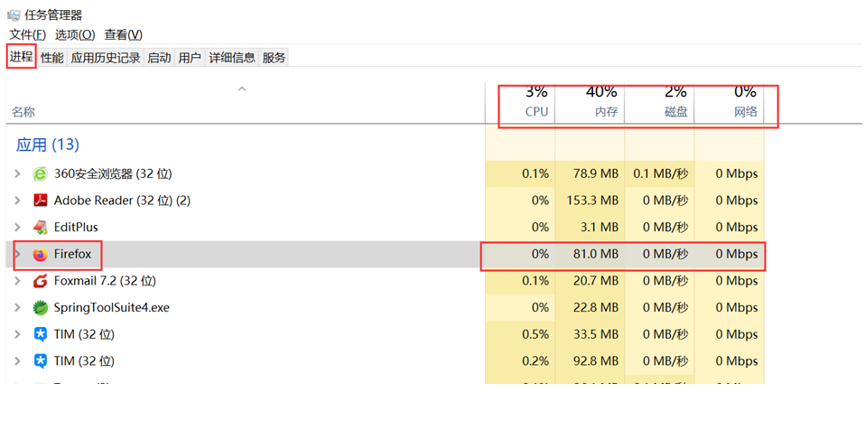
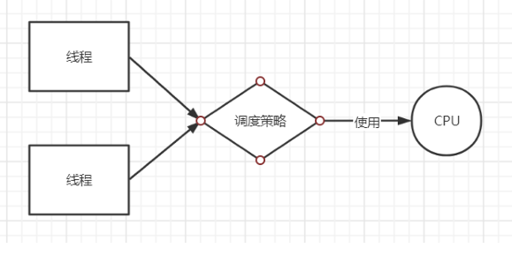

<!--
 * @Description: 
 * @Author: FallCicada
 * @Date: 2024-10-10 11:06:30
 * @LastEditors: FallCicada
 * @LastEditTime: 2024-10-10 15:03:38
 * @: 無限進步
-->
# 多线程
## 进程线程 
### 进程
进程指一个内存中运行的应用程序，它是系统运行程序的基本单位。

一个程序从创建、运行到消亡，这样整个过程就是一个进程。

一个操作系统中可以同时运行多个进程，每个进程运行时，系统都会为其分配独立的内存空间。

在操作系统中，启动一个应用程序的时候，会有一个或多个进程同时被创建，这些进程其实就表示了当前这个应用程序，在系统中的资源使用情况以及程序运行的情况。如果关闭这个进程，那么对应的应用程序也就关闭了。

### 线程
线程是进程中的一个执行单元，负责当前进程中程序的执行，一个进程中至少有一个线程，一个进程中也可以有多个线程，此时这个应用程序就可以称之为多线程程序。

<font color=red>**结论：一个程序运行后至少有一个进程，一个进程中可以包含一个(main线程)或多个线程！**</font>

当一个进程中启动了多个线程去分别执行代码（同时完成多个功能）的时候，这个程序就是多线程程序，内存等资源使用情况如下：


<font color = red>JVM是多线程的吗？</font>

是，JVM可以在运行程序的同时，进行GC垃圾回收，同一时刻做不同事情。案例:
```java
    public class Test01_JVM {
    public static void main(String[] args) throws 
        InterruptedException {
        for(int i = 1; i < 1000000; i++) 
            new Test(i);
            //main线程休眠3s
            Thread.sleep(3000);
            System.err.println("main end...");
        }
    }
    class Test {
        int n;
        public Test(int n) { 
            this.n = n;
        }
        //当GC进行垃圾回收指定对象的时候，对象的finalize方法会被自动调用
        @Override
        protected void finalize() throws Throwable {
            System.out.println("Test被销毁, n: " + n);
            super.finalize();
        }
    }
```
##  并发并行
* **并发**：指两个或多个事件在**同一个时间段内**发生
  
    线程的**并发**执行，是指在一个时间段内（微观），<font color=red>俩个或多个线程，使用同一个CPU交替运行。</font>



* 并行：指两个或多个事件在**同一时刻**发生（同时发生）
  
    线程的**并行**执行，是指在同一时刻，俩个或多个线程，<font color = red>各自使用一个CPU同时运行。</font>
  
