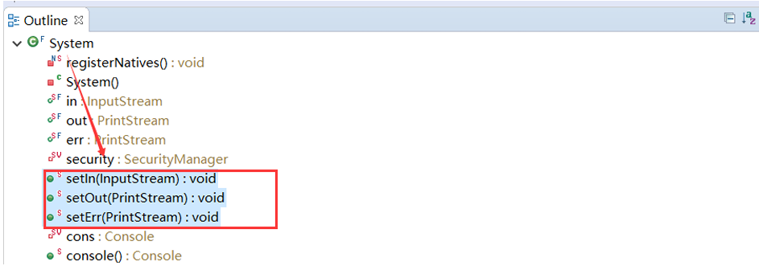
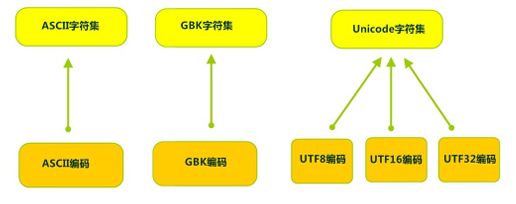
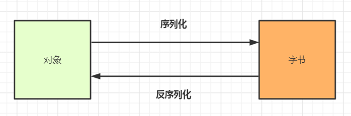

<!--
 * @Description: 
 * @Author: FallCicada
 * @Date: 2024-10-12 09:53:57
 * @LastEditors: FallCicada
 * @LastEditTime: 2024-10-15 14:59:05
 * @: 無限進步
-->
# File类、IO流

## File类

### 概述

`java.io.File` 类是文件和目录路径名的抽象表示，主要用于文件和目录的创建、查找和删除等操作。

* input  I 输入     文件、内存或网络 流向程序
* output O 输出     程序流向 文件、内存或者网络  
* streams 流 形容的是数据在设备与设备之间流动传输
    * 字节流    以字节（byte）为单位
    * 字符流    以字符（char）为单位
* 分类
  * 字节输入流  InputStream
  * 字节输出流  OutputStream
  * 字符输入流  Reader
  * 字符输出流  Writer
* 分类
  * 字节流
        字节输入流  InputStream 是所有字节输入流的抽象父类
        字节输出流  OutputStream是所有字节输出流的抽象父类
        一般在操作数据时，往往是使用一对，一个负责读取数据，一个负责写数据，都是使用这两个父类的子类对象。
        一切的数据文件（文本、图片、音频、视频），在计算机中，都是以二进制数字的形式保存，都是一个个的字节，所以在传输数据时，字节流可以传输任意类型数据
        明确无论使用什么流，最终底层都是二进制数据
* IO流按照功能活粉的分类
  * 节点流（原始流）
        节点流（Node Streams）是最基本的 IO 流，直接与数据源或目标进行交互，但
缺乏一些高级功能。
    * `FileInputStream` 和 `FileOutputStream`(字节流)：用于读取和写入文件的字节流。
    * `FileReader` 和 `FileWriter`(字符流)：用于读取和写入文件的字符流
    * `ByteArrayInputStream` 和 `ByteArrayOutputStream`(字节数组流)：用于读取和写入字节数组的流
    * `CharArrayReader` 和 `CharArrayWriter`(字符数组流)：用于读取和写入字符数组的流（省略，与ByteArray字节流类似，可自学）
  * 增强流（包装流）：
    * 其在节点流的基础上提供了额外的功能和操作
    * 增强流提供了更高级的操作和便利性，使得 IO 操作更加方便、高效和灵活
    * 增强流通过装饰器模式包装节点流，可以在节点流上添加缓冲、字符编码转换、对象序列化等功能
  * 缓冲流
    在 Java 的 I/O 流中，缓冲思想是一种常见的优化技术，用于提高读取和写入数据的效率。它通过在内存中引入缓冲区（Buffer）来减少实际的 I/O 操作次数，从而提高数据传输的效率。
    
    缓冲思想的基本原理是将数据暂时存储在内存中的缓冲区中，然后按照一定的块大小进行读取或写入操作。相比于直接对磁盘或网络进行读写操作，使用缓冲区可以减少频繁的 I/O 操作，从而提高效率。
* 方法：
      read()
        返回值 int 
        参数 空 
        用处： 每次读取1个字节 当读到文件末尾返回-1
      read(bytes)
        返回值 int 
        参数 bytes数组 
        用处： 第一次就将读到的字节存入数组中，返回值是读取到的字节数
        如果多次读取，最后一次读取到文件末尾返回-1
      read(bytes, 3, 5);
        读取字节流，输出的结果向后偏移3个字节[0,0,0,97,98,99,]
        读取5个字节 如果读取成功 则返回实际长度
        如果返回-1 读取到文件的末尾
    创建FileOutputStream的时候，如果文件不存在，会自动创建，但是路径中的目录不存在，会抛出异常（FileNotFoundException）
    方法：
      write(bytes, 0, 3);
    文件追加  
      FileOutputStream(path,true);
    内存输出流
      使用内存流可以操作内存中字节数组中的数据，所以内存字节流也叫字节数组流
      ByteArrayOutputStream
      ByteArrayInputStream

#### 构造方法
1. `File(String pathname)`：根据一个路径名创建一个File对象。
2. `File(String parent, String child)`：根据父目录路径名和子路径名创建一个File对象。
3. `File(URI uri)`：根据一个抽象路径名创建一个File对象。

```java
    package java.io;
    public class File implements Serializable, Comparable<File>{
        //通过将给定路径名字符串来创建新的 File实例
        public File(String pathname) {
            if (pathname == null) {
                throw new NullPointerException();
            }
                this.path = fs.normalize(pathname);
                this.prefixLength = fs.prefixLength(this.path);
            }
            //从**父抽象路径名和子路径名字符串**创建新的 File实例
        public File(String parent, String child) {
            //省略...
        }
        public File(File parent, String child) {
            //省略...
        }
            //省略...
    }
```
#### 实例对象
```java
    package com.briup.chap11.test;
 
    import java.io.File;
    
    public class Test011_File {
        public static void main(String[] args) {
            // 文件路径名
            String pathname = "D:\\aaa.txt";
            File file1 = new File(pathname);
    
            // 文件路径名
            String pathname2 = "D:\\aaa\\bbb.txt";
            File file2 = new File(pathname2);
    
            // 通过父路径和子路径字符串
            String parent = "D:\\aaa";
            String child1 = "bbb.txt";
            File file3 = new File(parent, child1);
    
            // 通过父级File对象和子路径字符串
            File parentDir = new File("D:\\aaa");
            String child2 = "bbb.txt";
            File file4 = new File(parentDir, child2);
        }
    }
```
>小贴士
>
>   1. 一个File对象代表硬盘中实际存在的一个文件或者目录。
>   2. 无论该路径下是否存在文件或者目录，都不影响File对象的创建。

### 使用
#### 路径获取
```java
    //File绝对路径名字符串
    public String getAbsolutePath();
    //File文件构造路径
    public String getPath();
    //File文件或目录的名称
    public String getName();
    //File文件或目录的长度
    public long length();
```

#### 代码案例
```java
    import java.io.File;
 
public class Test012_File {
    public static void main(String[] args) {
        //针对文件
        File f = new File("D:/aaa/Test1101_File.java");
        //返回此File的绝对路径名字符串
        System.out.println("文件绝对路径:" + f.getAbsolutePath());
        //将此File转换为路径名字符串
        System.out.println("文件构造路径:" + f.getPath());
        //返回由此File表示的文件或目录的名称
         System.out.println("文件名称:" + f.getName());
        //返回由此File表示的文件的长度
        System.out.println("文件长度:" + f.length() + "字节");
        //针对目录
        File f2 = new File("D:/aaa");
        System.out.println("目录绝对路径:" + 
        f2.getAbsolutePath());
        System.out.println("目录构造路径:" + f2.getPath());
        System.out.println("目录名称:" + f2.getName());
        System.out.println("目录长度:" + f2.length());
    }
}
        //输出结果
        文件绝对路径:D:\aaa\Test1101_File.java
        文件构造路径:D:\aaa\Test1101_File.java
        文件名称:Test1101_File.java
        文件长度:650字节
        目录绝对路径:D:\aaa
        目录构造路径:D:\aaa
        目录名称:aaa
        目录长度:0
```
> API中说明：length()，表示文件的长度。但是File对象表示目录，则返回值未指定。

2）路径操作
* 绝对路径：从盘符开始的路径，这是一个完整的路径。
* 相对路径：相对于项目目录的路径，这是一个便捷的路径，开发中经常使用 


### 缓冲流
<font color=red>注意：从本章开始，后面讲解的IO流，大多数都为增强流。</font>

#### 1）缓冲思想 

在 Java 的 I/O 流中，缓冲思想是一种常见的优化技术，用于提高读取和写入数据的效率。它通过在内存中引入缓冲区（Buffer）来减少实际的 I/O 操作次数，从而提高数据传输的效率。

缓冲思想的基本原理是将数据暂时存储在内存中的缓冲区中，然后按照一定的块大小进行读取或写入操作。相比于直接对磁盘或网络进行读写操作，使用缓冲区可以减少频繁的 I/O 操作，从而提高效率。

##### 缓冲流概述：
缓冲流（Buffered Streams）也叫高效流，是一种非常有用的增强流，提供了缓冲功能，可以提高 IO 操作的效率。

缓冲流它们通过在内存中创建一个缓冲区，将数据暂时存储在缓冲区中，然后批量读取或写入数据，减少了频繁的磁盘或网络访问，从而提高了读写的性能。

##### 缓冲流理解：
生活案例：你需要从楼下小超市买30颗鸡蛋
* 文件节点流逐个字节传输

   跟老板约定好，通过一条专门的运输通道(电梯)来运输鸡蛋，老板每次往电梯里放1个鸡蛋，你在9楼电梯口等着拿鸡蛋)，运输30个鸡蛋，需要电梯上下30次。
* 缓冲增强流传输数据

    仍旧通过原来的运输通道(电梯)来运输鸡蛋，但对电梯做增强：里面放了个小篮子(能装20颗鸡蛋)。第一次老板往篮子里装鸡蛋，装20个篮子满了，让电梯上楼，你取走全部鸡蛋；第二次老板往篮子里装剩下的10颗鸡蛋，让电梯上楼，你取走，所有鸡蛋全部传输完成。相对之前，这种方式电梯只需要上下2次，传输效率大大提高。
    
##### 常用缓冲流
    
* `BufferedInputStream` 缓冲字节输入流
* `BufferedOutputStream` 缓冲字节输出流
* `BufferedReader` 缓冲字符输入流
* `BufferedWriter` 缓冲字符输出    

#### 2）缓存字节流 
* `public BufferedInputStream(InputStream in)` ：创建一个 新的缓冲输入流。 
* `public BufferedOutputStream(OutputStream out)`： 创建一个新的缓冲输出流。


### 标准流
在 Java 中，标准流（Standard Streams）是指三个预定义的流对象，用于处理标准输入、标准输出和标准错误。这些标准流在 Java 中是自动创建的，无需显式地打开或关闭。

以下是 Java 中的标准流：
1. 标准输入流（`System.in`）
 
    它是一个字节流（InputStream），用于从标准输入设备（通常是键盘）读取数据。可以使用 `Scanner` 或 `BufferedReader` 等类来读取标准输入流的数据。
    
2. 标准输出流（`System.out`）

    它是一个字节流（PrintStream），用于向标准输出设备（通常是控制台）输出数据。可以使用 `System.out.println()` 或 `System.out.print()`等方法来输出数据到标准输出流。
    
3. 标准错误流(`System.err`)

    也是一个字节流（PrintStream），用于向标准错误设备（通常是控制台）输出错误信息。与标准输出流相比，标准错误流通常用于输出错误、警告或异常信息。

我们可以借助`System类中的setXxx`方法 修改标准输入输出流的源头和目的地。

###### PrintStream打印流：

`PrintStream`是一个字节流，也是一个增强流，相对于普通节点流，它提供了一系列便捷的方法，可以方便地输出各种数据类型的值到输出流。它提供了一系列的 `print` 和 `println` 方法，可以输出各种数据类型的值，并自动转换为字符串形式。通常用于向标准输出流（`System.out`）输出数据。

### 转换流

#### 1） 字符编码和字符集
计算机中储存的信息都是用二进制数表示的，而我们在屏幕上看到的数字、英文、标点符号、汉字等字符是二进制数转换之后的结果。

按照某种规则，将字符存储到计算机中，称为**编码** 。然后将存储在计算机中的二进制数按照某种规则解析显示出来，称为**解码** 。

比如说，按照A规则存储，同样按照A规则解析，那么就能显示正确的文本符号。但如果按照A规则存储，按照B规则解析，就会导致乱码现象。

* **字符编码**`Character Encoding` : 一套自然语言字符与二进制数（码点）之间的对应规则。
* **字符集** `Charset` ：也叫编码表。是一个系统支持的所有字符的集合，包括各国家文字、标点符号、图形符号、数字等。

计算机要准确的存储和识别各种字符集符号，需要进行字符编码，一套字符集必然至少有一套字符编码。常见字符集有ASCII字符集、GBK字符集、Unicode字符集等



可见，当指定了**编码**，它所对应的**字符集**自然就指定了，所以**编码**才是我们最终要关心的。

#### 2） 编码引出的问题
`FileReader` 读取项目中的文本文件。由于软件的设置，都是默认的`UTF-8` 编码，所以没有任何问题。但是，当读取Windows系统中创建的文本文件时，由于Windows系统的默认是GBK编码，就会出现乱码。


### 对象流
#### 1）序列化机制 
Java 提供了一种对象序列化的机制，可以将对象和字节序列之间进行转换
* 序列化
 
    程序中，可以用一个字节序列来表示一个对象，该字节序列包含了对象的类型、对象中的数据等。如果这个字节序列写出到文件中，就相当于在文件中持久保存了这个对象的信息
* 反序列化
 
    相反的过程，从文件中将这个字节序列读取回来，在内存中重新生成这个对象，对象的类型、对象中的数据等，都和之前的那个对象保持一致。（注意，这时候的对象和之前的对象，内存地址可能是不同的）
    
如图：


>完成对象的序列化和反序列化，就需要用到对象流了

#### 2）对象流介绍 
* `java.io.ObjectOutputStream`(序列化)

    将Java对象转换为字节序列，并输出到内存、文件、网络等地方
    
* `java.io.ObjectInputStream`(反序列化)
 
    从内存、文件、网络等地方读取出对象的字节序列，并生成对应的对象